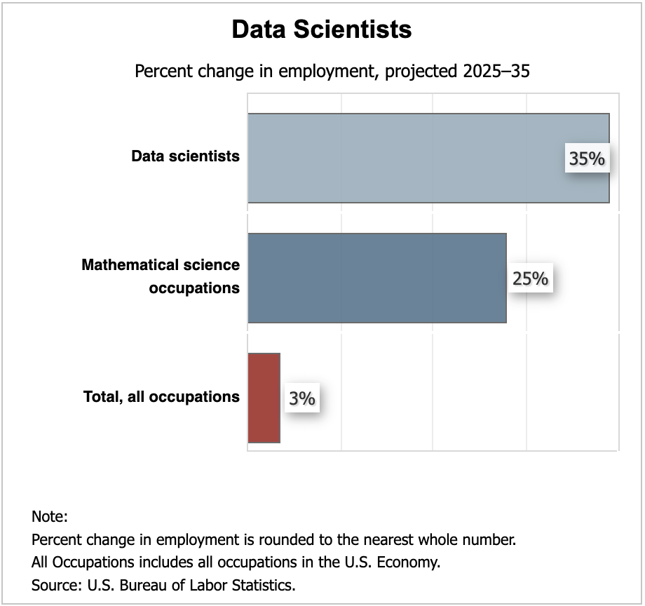

# Overview

::: {.callout-tip}
### Learning objectives
After this lecture you should be able to

- **describe** the stages common to data science and ETL pipelines, and
**locate** where statistical learning sits within them,
- **distinguish** the roles of data analyst, data scientist, and data engineer,
- **classify** a learning problem as supervised, unsupervised, or
semi-supervised according to whether the response is observed,
- **distinguish** regression from classification by the type of response, and
**identify** the assessment measure used for each, and
- **describe** the bias-variance tradeoff and **explain** how bias, variance,
and irreducible error combine to determine expected test error as flexibility
increases.
:::

## Outline

- Data Pipelines
- Data Roles
- Statistical Learning

## Tidyverse - Data Science Pipeline

[](https://tidyverse.tidyverse.org/articles/paper.html)

## Altexsoft - ETL Pipeline

[](https://www.altexsoft.com/blog/data-pipeline-components-and-types/)

## MonteCarlo.AI - Data Pipeline

[](https://montecarlo.ai/blog-data-pipeline-architecture-explained)

## Geeks for Geeks - Data Science Pipeline

[](https://www.geeksforgeeks.org/data-science/whats-data-science-pipeline/)

## Data Analyst vs Scientist vs Engineer

[{width=80%}](https://techedo.com/blog/data-analyst-vs-data-scientist-vs-data-engineer/)

## BLS - Data Scientist Outlook

[{width=60%}](https://www.bls.gov/ooh/math/data-scientists.htm#tab-6)


## Statistical Learning

|Learning|Response|
|--------|:--------|
|Supervised|Observed|
|Unsupervised|Not observed|
|Semi-supervised|Observed for some data|


## Supervised learning

|            | Regression         | Classification | 
|------------|:-------------------|:-----------------------|
| Response   | Quantitative       | Qualitative            |
| Prediction | Number             | Category               |
| Assessment | Mean squared error | Misclassification rate |


## Bias-variance tradeoff

```{r bias-variance-tradeoff}
#| echo: false
#| message: false
#| warning: false
library("tidyverse")

d <- tibble(
    x = seq(0, 1, length.out = 100),
    `Irreducible Error` = 0.3
  ) |>
  mutate(
    Variance = x^2,
    Bias = rev(Variance),
    `Expected Test Error` = Bias + Variance + `Irreducible Error`
  ) |>
  pivot_longer(
    cols = -x,
    names_to = "Error Type",
    values_to = "Error"
  ) |>
    mutate(
      `Error Type` = factor(
        `Error Type`,
        levels = c(
          "Bias",
          "Variance",
          "Irreducible Error",
          "Expected Test Error"
        )
      )
    )

ggplot(
    d,
    aes(x = x, y = Error, color = `Error Type`, linetype = `Error Type`)
  ) +
  geom_line(linewidth = 2) +
  labs(
    x = "Model Flexibility",
    y = "Error"
  ) +
  scale_linetype_manual(
    values = c(
      "Expected Test Error" = "solid",
      "Bias" = "dotdash",
      "Variance" = "dashed",
      "Irreducible Error" = "dotted"
    ),
    labels = c(
      'Bias' = expression(Bias^2)
    )
  ) +
  scale_color_manual(
    values = c(
      "Expected Test Error" = "#E41A1C",
      "Bias" = "#377EB8",
      "Variance" = "#4DAF4A",
      "Irreducible Error" = "#984EA3"
    ),
    labels = c(
      'Bias' = expression(Bias^2)
    )
  ) +
  theme_bw(
    base_size = 20
  ) +
  theme(
    # Remove tick marks and labels
    axis.ticks.x = element_blank(),
    axis.text.x = element_blank(),
    axis.ticks.y = element_blank(),
    axis.text.y = element_blank(),

    legend.key.width = unit(2.5, "cm")
  )
```

## Conclusion

Statistical learning is the modeling stage of a larger pipeline.
However the stages are drawn, data must be imported, cleaned, transformed, and
explored before anything is modeled, and the results must be communicated
afterward.
Those stages are also what distinguish the data roles: a data engineer builds
and maintains the infrastructure that collects and delivers the data,
a data analyst summarizes and reports on the data that arrives, and a data
scientist builds the models in between.

We classify a learning problem first by whether the response is observed:
*supervised* when it is, *unsupervised* when it is not, and *semi-supervised*
when it is observed for only some of the data.
Within supervised learning, the type of response decides the rest.
A quantitative response makes the problem a *regression*, the prediction a
number, and the assessment a mean squared error.
A qualitative response makes the problem a *classification*, the prediction a
category, and the assessment a misclassification rate.

Whichever it is, we still have to choose how flexible a method to use, and that
choice is a tradeoff.
As flexibility increases, the squared bias of our estimate decreases while its
variance increases, and underneath both sits an irreducible error that no
method removes because it comes from the randomness in the response itself.
The sum of the three is the expected test error, and because one piece falls
while another rises, that sum is typically U-shaped: the best method is neither
the least nor the most flexible one available.

Next lecture develops these ideas for a quantitative response.
We write down the model we are estimating, distinguish the training MSE from
the test MSE, and decompose the expected test MSE into the three pieces plotted
above.

