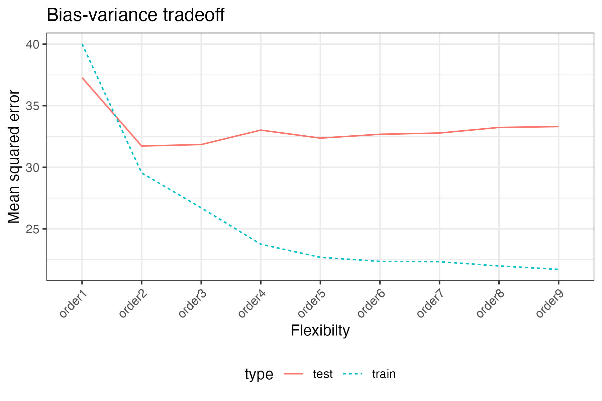

# Regression

::: {.callout-tip}
### Learning objectives
After this lecture you should be able to

- **identify** a regression problem by its response variable, and **write** the
model $Y_i = f(X_i) + \epsilon_i$ with its assumptions on $\epsilon_i$,
- **distinguish** prediction from understanding as the goal of an analysis, and
**explain** what each goal is willing to sacrifice,
- **define** training MSE and test MSE, and **explain** why the training MSE is
the wrong quantity to minimize,
- **interpret** the U-shaped relationship between model flexibility and test MSE,
and
- **state** the bias-variance decomposition of the expected test MSE and
**identify** which of its three terms no model can reduce.
:::

## Response variables

For regression models, our response variable is quantitative, continuous values.

::: {.callout-note collapse="true"}
### For example,
- Salary
- Yield
- Score
- Concentration
:::

## True Model

The non-linear regression model of interest is

$$Y_i = f(X_i) + \epsilon_i$$
where, for observation $i$, 

- $Y_i$ is the response variable,
- $X_i = (X_{i1},\ldots,X_{ip})$ is the collection of explanatory variables, and
- $\epsilon_i$ is the error with $E[\epsilon_i] = 0$, $Var[\epsilon_i] = \sigma^2$, and independent of $X_i$.

### Goal
Based on data $(x_i, y_i)$ for $i=1,\ldots,n$, 
obtain an estimate of the function, $\hat{f}()$.

## Prediction vs Understanding

Prediction: we don't care about interpretation, we just want the model that fits the best

Understanding: we would like the model to fit well, but are willing to sacrifice
some fit to have a model that is simple to understand

::: {.callout-note collapse="true"}
### For example,
- Compared to a high school diploma, having a bachelor's degree increases starting salary by $20,000. 
- A master’s degree in data science typically yields a 5% to 25% salary increase compared to a bachelor’s degree. 
- After adjusting for age, gender, and other factors, 
the average salary of a data scientist is $X higher than that of a software engineer.
:::

## Model Evaluation

When prediction is the goal, we evaluate the model through its mean squared error:

$$\text{Training MSE}
= \frac{1}{n} \sum_{i=1}^n (y_i - \hat{y}_i)^2 
= \frac{1}{n} \sum_{i=1}^n \left[y_i - \hat{f}(x_i)\right]^2$$
as written, this is the *training MSE* since we used the same data to estimate
$\hat{f}$ as we used to compute the MSE.

We are actually more interested in how well our model fits *test* data, 
i.e. data that were not used to estimate $\hat{f}$. 
Thus, we typically estimate the *expected test MSE*:

$$\text{Test MSE}
= E\left[\left(Y - \hat{f}(X)\right)^2\right]\approx \frac{1}{m} \sum_{i=1}^m \left[\tilde{y}_i - \hat{f}(\tilde{x}_i)\right]^2$$
and we refer to this simply as the *test MSE*.

## Bias-variance Tradeoff

Using this [Regression script](20-regression.R),
we create this plot that has the model flexibility on the x-axis and the test
MSE on the y-axis.

## Bias-variance Tradeoff (Mathematically)

Over different training data sets, we want to reduce the *expected test MSE*, 
which can be decomposed as follows:

$$E\left[\left(Y-\hat{f}(X)\right)^2\right] 
= Var\left[\hat{f}(X)\right] + Bias\left[\hat{f}(X)\right]^2 + Var[\epsilon]$$
where 

- $Var[\hat{f}(X)]$ is the variance
- $Bias[\hat{f}(X)]$ is the bias
- $Var[\epsilon]$ is the irreducible error

## Conclusion

A regression problem is one whose response is quantitative,
and we write it as $Y_i = f(X_i) + \epsilon_i$, where the errors have mean zero
and constant variance $\sigma^2$ and are independent of the explanatory
variables.
The function $f$ is unknown, and our job is to estimate it by $\hat{f}$ from
the $n$ observed pairs $(x_i, y_i)$.
What we want from $\hat{f}$ depends on the goal.
Prediction asks only that $\hat{f}$ predict a future response well and will
accept a model no one can describe;
understanding gives up some of that accuracy for a form of $\hat{f}$ we can
state in a sentence.

When prediction is the goal we judge $\hat{f}$ by a mean squared error,
but it matters which one.
The training MSE averages the squared errors over the same data used to
estimate $\hat{f}$, so it credits the model for fitting noise it has already
seen and keeps falling as we make the model more flexible.
The test MSE averages those same squared errors over data held out from
estimation;
it is the quantity we actually want to be small, and it typically falls and
then rises as flexibility increases.

The decomposition
$E\left[\left(Y-\hat{f}(X)\right)^2\right] = Var\left[\hat{f}(X)\right] + Bias\left[\hat{f}(X)\right]^2 + Var[\epsilon]$
says where that U comes from.
A more flexible method follows the shape of the true $f$ more closely, which
lowers the bias, but it also responds more to whichever training data it was
given, which raises the variance;
a less flexible method does the reverse.
Those first two terms are the *reducible* error, the part a better choice of
method can shrink.
The third, $Var[\epsilon] = \sigma^2$, is the *irreducible* error: even knowing
$f$ exactly, the response still varies around it, so no model and no amount of
data pushes the expected test MSE below $\sigma^2$.

Next lecture asks these same questions of a qualitative response.
Classification replaces the predicted number with a predicted category and the
mean squared error with an error rate,
but the distinction between training and test performance, and the
bias-variance tradeoff behind it, carry over unchanged.
