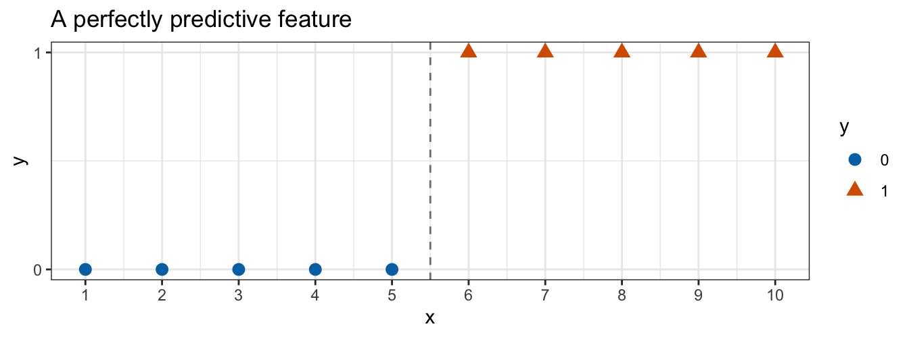
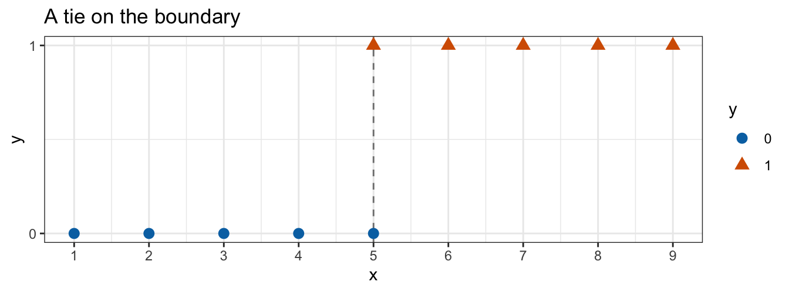
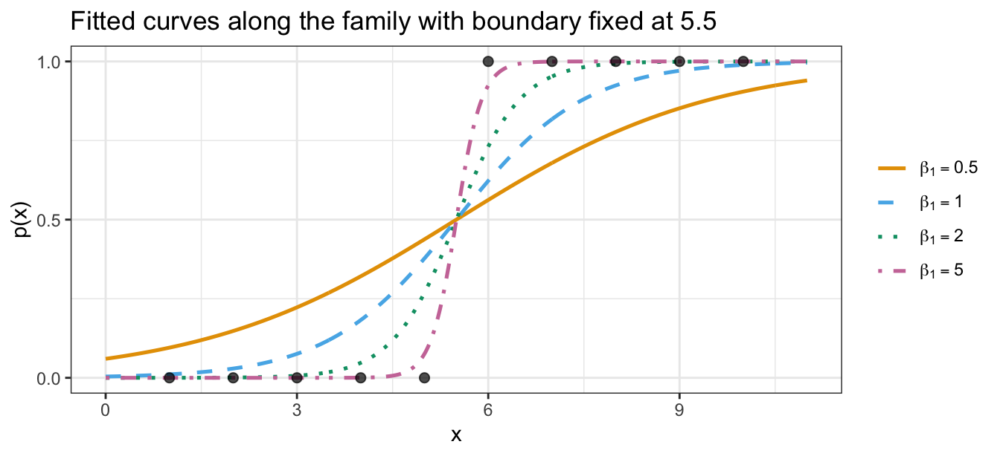
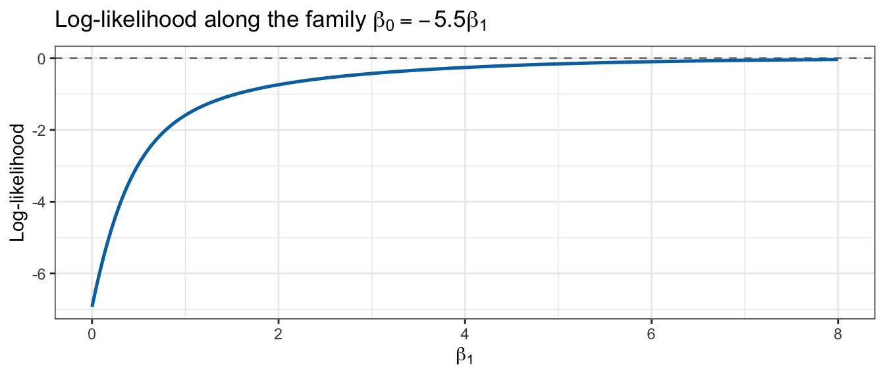
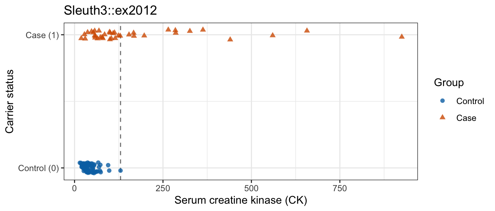

## Today

<!-- derived-from: 04-classification/40-problems-in-logistic-regression.qmd @ 6e953b3 -->

- Complete and quasi-complete separation
- Log-likelihood with no finite maximizer
- Diagnosing separation
- Separation vs. one extreme observation
- Responses when separation occurs
- Distributional statements and which assumptions transfer

## Separation

- Least squares: a formula

$$\widehat\beta = (\mathbf{X}^\top \mathbf{X})^{-1}\mathbf{X}^\top y$$

- Maximum likelihood: $\widehat\beta$ is the maximizer of $\ell(\beta)$ — no formula
- A function need not have a maximizer

## Perfectly predictive feature



## Perfectly predictive feature

```
Warning: glm.fit: algorithm did not converge
Warning: glm.fit: fitted probabilities numerically 0 or 1 occurred
```

```

Call:
glm(formula = y ~ x, family = "binomial", data = toy)

Coefficients:
            Estimate Std. Error z value Pr(>|z|)
(Intercept)   -245.8   337834.2  -0.001    0.999
x               44.7    61172.1   0.001    0.999

(Dispersion parameter for binomial family taken to be 1)

    Null deviance: 1.3863e+01  on 9  degrees of freedom
Residual deviance: 7.8648e-10  on 8  degrees of freedom
AIC: 4

Number of Fisher Scoring iterations: 25
```

## Complete and quasi-complete separation

**Complete separation**

$$\begin{aligned} x_i b &> 0 \ \text{ for every } i \text{ with } y_i = 1, \\ x_i b &< 0 \ \text{ for every } i \text{ with } y_i = 0 \end{aligned}$$

- $x_i = (1, x_{i1}, \ldots, x_{ip})$ — feature row for observation $i$
- $b$ — any coefficient vector in $\mathbb{R}^{p+1}$
- $y_i \in \{0, 1\}$ — observed response
- A condition on the **data**, not on a fitted model

## Complete and quasi-complete separation

**Quasi-complete separation**

$$\begin{aligned} x_i b &\ge 0 \ \text{ for every } i \text{ with } y_i = 1, \\ x_i b &\le 0 \ \text{ for every } i \text{ with } y_i = 0 \end{aligned}$$

- For some $b \ne 0$, with equality for at least one observation
- Some observations sit exactly on the boundary
- None sits on the wrong side

## Tied feature values



- Two observations at $x = 5$ with opposite responses
- Dashed line passes *through* them — no gap left

## Tied feature values

$$b = (-5\beta_1, \beta_1), \qquad \beta_1 > 0$$

- $x = 5$: $\beta_1(5 - 5) = 0$
- $x_i > 5$: $x_i b > 0$
- $x_i < 5$: $x_i b < 0$
- Weak inequalities hold for all ten; strict ones fail for two
- **Quasi-complete separation**

## Tied feature values

```
Warning: glm.fit: fitted probabilities numerically 0 or 1 occurred
```

```

Call:
glm(formula = yq ~ xq, family = "binomial", data = quasi)

Coefficients:
            Estimate Std. Error z value Pr(>|z|)
(Intercept)   -98.16   39288.59  -0.002    0.998
xq             19.63    7857.72   0.002    0.998

(Dispersion parameter for binomial family taken to be 1)

    Null deviance: 13.8629  on 9  degrees of freedom
Residual deviance:  2.7726  on 8  degrees of freedom
AIC: 6.7726

Number of Fisher Scoring iterations: 21
```

## Tied feature values

$$\widehat\beta_0 / \widehat\beta_1 = -5$$

- To machine precision
- Iteration walks out along $b = (-5\beta_1, \beta_1)$, stops at an arbitrary point

## Tied feature values

- One warning — `algorithm did not converge` does not fire
- 21 Fisher scoring iterations — short of the default maximum of 25
- `quasi_glm$converged`: TRUE
- **A reported convergence is not evidence that an estimate is trustworthy**

## Tied feature values

- Fitted probability at $x = 5$ stays at $\text{logistic}(0) = 0.5$

$$-2\left[\log(0.5) + \log(0.5)\right] = 2.7726$$

- Residual deviance 2.7726, not essentially zero
- Complete separation: deviance falls to zero
- Quasi-complete: deviance falls to what the boundary ties contribute

## Maximum likelihood failure

$$\ell(\beta_0, \beta_1) = \sum_{i=1}^n \left\{ y_i (\beta_0 + \beta_1 x_i) - \log\left(1 + e^{\beta_0 + \beta_1 x_i}\right) \right\}$$

- Restrict to $\beta_0 = -5.5\beta_1$ — boundary fixed at $x = 5.5$
- $\eta_i = \beta_1(x_i - 5.5)$

## Maximum likelihood failure

$$\frac{d\ell}{d\beta_1} = \sum_{i=1}^n (x_i - 5.5)\left(y_i - p_i\right)$$

- $y_i = 1 \Rightarrow x_i - 5.5 > 0$ and $y_i - p_i > 0$
- $y_i = 0 \Rightarrow x_i - 5.5 < 0$ and $y_i - p_i < 0$
- Both cases: positive product

$$\frac{d\ell}{d\beta_1} > 0 \quad \text{for every finite } \beta_1$$

## Maximum likelihood failure

- $\ell < 0$ for every finite $\beta_1$
- As $\beta_1 \to \infty$, $\ell \to 0$
- **Supremum of $0$, attained only in the limit**
- No finite $\widehat\beta$ maximizes $\ell$
- `glm()` reports wherever the iteration stopped; SEs grow as the curvature flattens

## Maximum likelihood failure



## Maximum likelihood failure

| $\beta_1$ | $\ell(\beta_1)$ | $L(\beta_1)$ |
|:---------:|:---------------:|:------------:|
|    0.0    |     -6.931      |    0.001     |
|    0.5    |     -2.950      |    0.052     |
|    1.0    |     -1.590      |    0.204     |
|    2.0    |     -0.739      |    0.477     |
|    5.0    |     -0.159      |    0.853     |
|    8.0    |     -0.036      |    0.964     |

## Maximum likelihood failure



## Muscular dystrophy carrier screening



- `Sleuth3::ex2012` — carrier status vs. serum creatine kinase (`CK`)
- Groups overlap heavily below the dashed line
- Not separated under either definition

## Muscular dystrophy carrier screening

```
Warning: glm.fit: fitted probabilities numerically 0 or 1 occurred
```

```
               Estimate Std. Error   z value     Pr(>|z|)
(Intercept) -3.96219273  0.6719084 -5.896924 3.703413e-09
CK           0.05073407  0.0106958  4.743364 2.101984e-06
```

- Same warning as the toy example — different reason (`converged`: TRUE, 7 iterations)

## Muscular dystrophy carrier screening

| CK  | Group | $\widehat\eta$|          $1 - \widehat p$|
|:---:|:-----:|----------:|---------------------:|
| 925 | Case  |       43.0| $2.2 \times 10^{-16}$|
| 657 | Case  |       29.4| $1.8 \times 10^{-13}$|
| 560 | Case  |       24.4| $2.4 \times 10^{-11}$|
| 440 | Case  |       18.4|  $1.1 \times 10^{-8}$|
| 363 | Case  |       14.5|  $5.3 \times 10^{-7}$|

## Muscular dystrophy carrier screening

$$1 - \text{logistic}(\widehat\eta) = \frac{e^{-\widehat\eta}}{1 + e^{-\widehat\eta}}$$

- One woman's $\widehat\eta = 42.97 \Rightarrow$ true gap $2.2 \times 10^{-19}$
- No double holds a probability that close to 1
- `glm()` clamps the linear predictor before inverting the link
- `fitted()` never leaves $[2.2 \times 10^{-16},\ 1 - 2.2 \times 10^{-16}]$

## Muscular dystrophy carrier screening

- Each $+10$ units of `CK` $\times\ 1.66$ odds of carrier (95% CI 1.35–2.05)
- Estimate finite, SE small relative to it, converged
- Warning here: one extreme observation, not a failed estimator

## Recognizing separation

- `glm.fit: algorithm did not converge` — close to conclusive
- `glm.fit: fitted probabilities numerically 0 or 1 occurred` — not conclusive alone; separation always produces it

## Recognizing separation

- A coefficient absurd on the feature's own scale — odds ratio $e^{44.7}$ per unit
- SE far larger than the coefficient: $z \approx 0$, $p$-value near 1
- Residual deviance essentially zero (complete) or small (quasi-complete)
- `fitted()` numerically 0 or 1 on the separated side

## Recognizing separation

- Compare $|\widehat\beta_j|$ against its SE — one line, settles the question
- `fit$converged` — informative only when `FALSE`
- Quasi-complete separation can report convergence and still leave no usable estimate

## Available responses

- **Collect more data** — separation is a property of a sample, not of the population
- **Simplify the model** — drop or merge the feature or level causing it
- **Use the fit for what it can still support** — separation destroys the *coefficient*, not necessarily the *classification*

## Linear regression problems revisited

Six potential problems from the flexibility lecture:

- Non-linearity, correlated errors, non-constant variance
- Outliers, high-leverage points, collinearity

Separation: **no** counterpart — least squares evaluates a formula

## Linear regression problems revisited

$$Y_i \mid x_i \stackrel{ind}{\sim} N\left(x_i\beta, \sigma^2\right), \qquad i = 1, \ldots, n$$

- $Y_i$ — response for observation $i$
- $x_i = (1, x_{i1}, \ldots, x_{ip})$ — $i$th row of $\mathbf{X}$
- $\beta = (\beta_0, \beta_1, \ldots, \beta_p)^\top$ — coefficient vector; $x_i\beta$ — linear predictor
- $\sigma^2$ — variance around the linear predictor

## Linear regression problems revisited

Four assumptions in one line:

- **Independence** — the $\mathrm{ind}$ over the $\sim$
- **Constant variance** — $Var[Y_i \mid x_i] = \sigma^2$, no $i$ subscript
- **Linearity** — $E[Y_i \mid x_i] = x_i\beta$
- **Normality** — normally distributed around its mean

## Linear regression problems revisited

$$Y_i \mid x_i \stackrel{ind}{\sim} \text{Bernoulli}\left(p(x_i)\right), \qquad \log\left(\frac{p(x_i)}{1 - p(x_i)}\right) = x_i\beta$$

- $p(x_i) = P(Y_i = 1 \mid x_i)$ — probability of the event for observation $i$
- Normal $\to$ Bernoulli; identity link $\to$ logit

## Linear regression problems revisited

Four assumptions after the substitution:

- **Independence** — still assumed; can still fail
- **Constant variance** — not assumed; $Var[Y_i \mid x_i] = p(x_i)[1 - p(x_i)]$ follows from the Bernoulli
- **Linearity** — still assumed, of the log-odds
- **Normality** — gone, replaced by the Bernoulli

## Independence

- Bernoulli log-likelihood is a sum over observations — because they were assumed independent
- No $\epsilon_i$: **correlated observations**, not correlated errors
- Positively correlated observations carry less information than their count suggests
- Every standard error from `glm()` too small

## Independence

- **Time** — a patient at successive visits, a stock's daily direction
- **Space** — counties, plots in a field, weather stations
- **Clustering** — students within schools, patients within hospitals, repeated measurements on the same subject

## Independence

**Add features that explain the source of the correlation**

- A cluster-identifying factor
- A time index or trend
- The spatial coordinates
- Responses independent given the features

## Variance

- Linear regression: $Var[Y_i \mid x_i] = \sigma^2$ — assumed; check for a fan shape in residuals vs. fitted
- Logistic regression:

$$Var[Y_i \mid x_i] = p(x_i)\left[1 - p(x_i)\right]$$

- A consequence of Bernoulli, not an extra assumption; no $\sigma^2$
- A residual plot that fans out is not evidence against the model

## Variance

Aggregated data: $m_i$ trials per row

$$Y_i \mid x_i \stackrel{ind}{\sim} \text{Binomial}(m_i, p(x_i))$$

- Variance $m_i p(x_i)[1 - p(x_i)]$
- **Overdispersion** — spread of the $Y_i$ around their fitted means exceeds that

## Variance

Overdispersion: usually a symptom of failed independence

- Positively correlated trials within a row — same school, same clutch of eggs, same subject
- Adds covariance terms independence would have set to zero
- Unmodeled features that vary within a row: same excess

## Linearity

$$\log\left(\frac{p(x_i)}{1 - p(x_i)}\right) = x_i\beta$$

- Can fail
- Interactions — a feature's log-odds slope depends on another feature
- Polynomial and step-function columns — bend within a single feature
- Fit the more flexible model, test the added coefficients

## Collinearity, leverage, and outliers

- Carry over in substance
- Collinearity: $\text{SE}(\widehat\beta_j)$ inflates, $z$-test loses power
- Unusual feature value: still disproportionate pull
- Disagreeing response: still distorts the fit
- Arithmetic does not carry over: $H = \mathbf{X}(\mathbf{X}^\top \mathbf{X})^{-1}\mathbf{X}^\top$, studentized residuals, Cook's distance

## Conclusion

- Complete and quasi-complete separation
- Supremum without a finite maximizer
- Separation signature
- Coefficient table, not the warning
- Distributional statements
- Independence: time, space, clustering
- Overdispersion
- Collinearity, leverage, outliers: concepts, not formulas
