## Today

<!-- derived-from: 04-classification/50-lda.qmd @ 63ba15d -->

- Bayes' theorem
- LDA, one feature and several
- Comparison with logistic regression

# Motivation

## Credit card default data

ISLR2::Default · analyzed in the logistic regression lectures

| Default | Customers | Proportion | Mean balance (\$) | SD of balance (\$) | Zero balances |
|:-------:|:---------:|:----------:|:-----------------:|:------------------:|:-------------:|
|   No    |   9,667   |   0.9667   |        804        |        456         |      499      |
|   Yes   |    333    |   0.0333   |       1,748       |        341         |       0       |

::: notes
The data run through the whole lecture.
:::

## Balance within each class

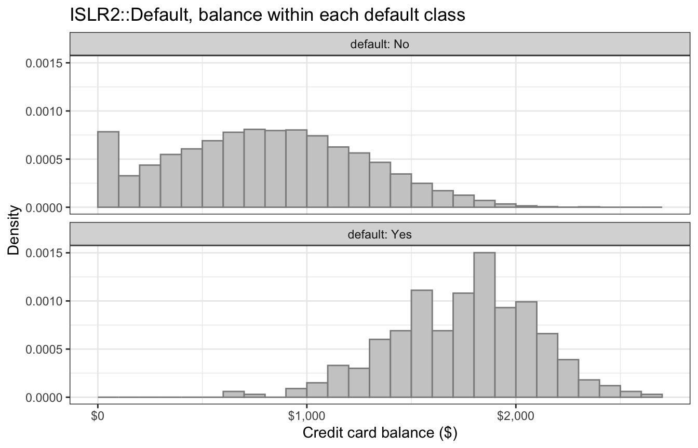

## Balance, all customers

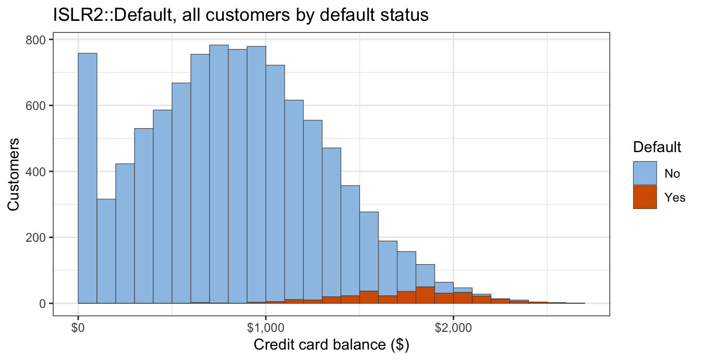

## Bayes' theorem and Bayes classifier

$$p_k(x) = P(Y = k \mid X = x) = \frac{\pi_k f_k(x)}{\sum_{l=1}^K \pi_l f_l(x)} \propto \pi_k f_k(x)$$

- $\pi_k$ — prior
- $f_k(x)$ — class density
- $p_k(x)$ — posterior

$$\widehat y(x) = \arg\max_k\, p_k(x)$$

# One Feature

## Fitted Gaussian densities

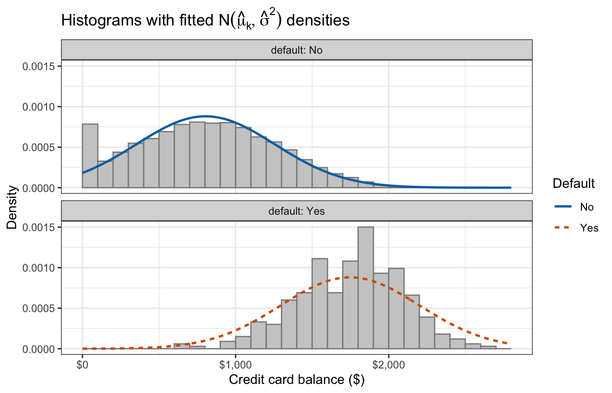

::: notes
The start of 13.2: the histograms with the fitted $N(\widehat\mu_k, \widehat\sigma^2)$ over them.
:::

## Gaussian model and parameter estimation

::: {style="font-size: 0.85em"}
$$P(Y = k) = \pi_k, \qquad X \mid Y = k \sim N\left(\mu_k, \sigma^2\right), \qquad k = 1, \ldots, K$$
:::

Same $\sigma^2$ in every class

::: {style="font-size: 0.7em"}
$$\widehat\pi_k = \frac{n_k}{n}, \qquad \widehat\mu_k = \frac{1}{n_k}\sum_{i:\, y_i = k} x_i, \qquad \widehat\sigma^2 = \frac{1}{n - K}\sum_{k=1}^K \sum_{i:\, y_i = k}\left(x_i - \widehat\mu_k\right)^2$$
:::

Closed-form estimates: proportions, means, pooled variance

## Discriminant function {.smaller}

$$\delta_k(x) = \left(\log \pi_k - \frac{\mu_k^2}{2\sigma^2}\right) + \frac{\mu_k}{\sigma^2}\, x$$

Linear in $x$

Decision boundary: where the two discriminants are equal, $\delta_1(x) = \delta_2(x)$

$$\log\left(\frac{p_2(x)}{1 - p_2(x)}\right) = \delta_2(x) - \delta_1(x) = \underbrace{\log\frac{\pi_2}{\pi_1} - \frac{\mu_2^2 - \mu_1^2}{2\sigma^2}}_{\beta_0} + \underbrace{\frac{\mu_2 - \mu_1}{\sigma^2}}_{\beta_1}\, x$$

$$x^* = \frac{\mu_1 + \mu_2}{2} + \frac{\sigma^2}{\mu_2 - \mu_1}\log\frac{\pi_1}{\pi_2}$$

## Prior-weighted densities

Equal priors put the boundary at the midpoint; the small prior for Yes moves it toward the defaulters' mean

::: {.panel-tabset}

### Equal priors

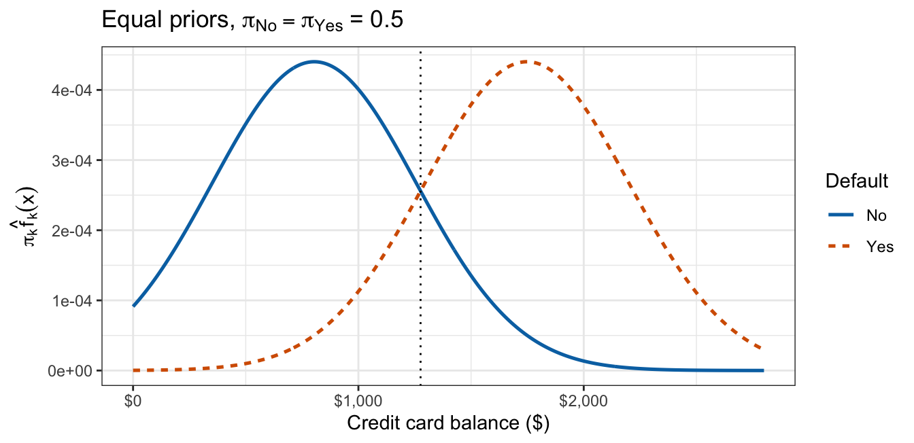

### Estimated priors

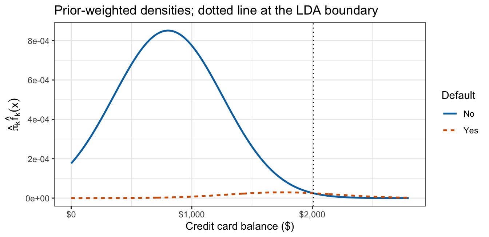

### Discriminant functions

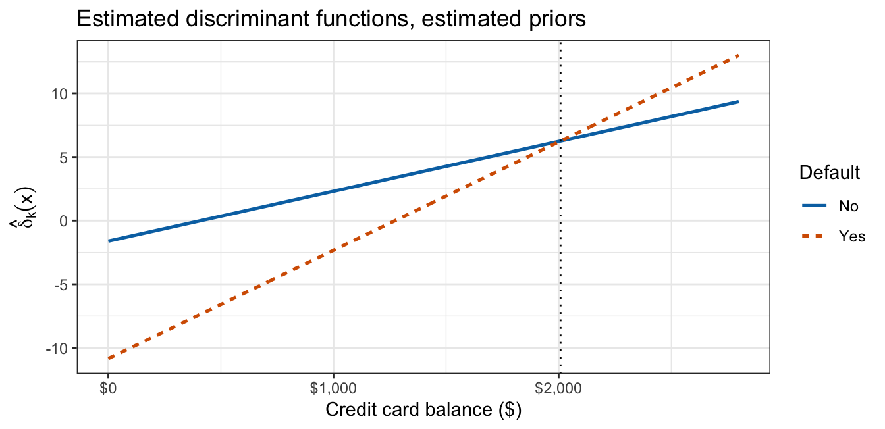

:::

## Fitting one-feature LDA

:::: {.columns}
::: {.column width="52%"}
```r
library("ISLR2")
fit <- MASS::lda(default ~ balance,
                 data = Default)

fit$prior     # pi-hat_k
fit$means     # mu-hat_k
fit$scaling   # coefficients of
              # linear discriminants

predict(fit,
        data.frame(balance = 1500)
       )$posterior
```
:::
::: {.column width="48%"}
```
> fit$prior
    No    Yes 
0.9667 0.0333 

> fit$means
      balance
No   803.9438
Yes 1747.8217

> fit$scaling
                LD1
balance 0.002206916

> predict(...)$posterior
         No       Yes
1 0.9119783 0.0880217
```
:::
::::

# Multiple Features

## Balance and income

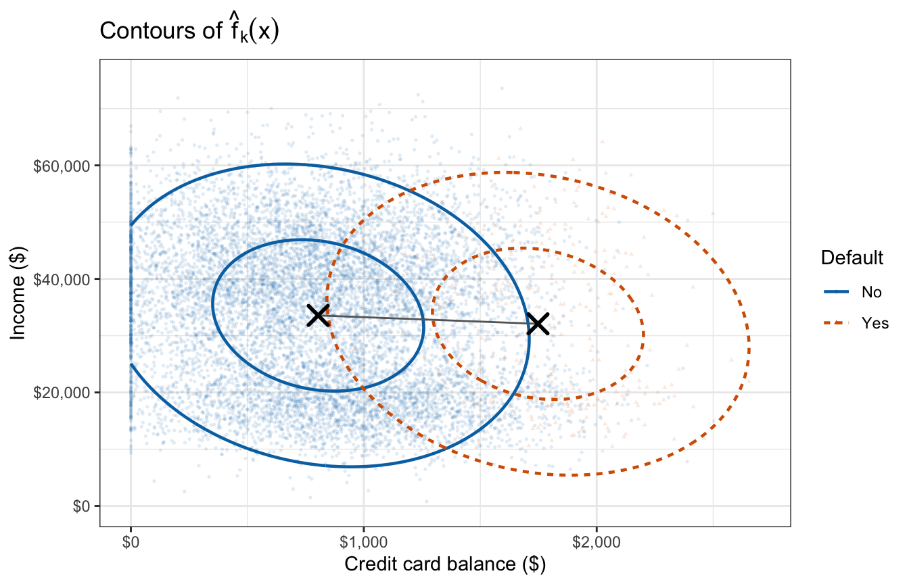

::: notes
The start of 13.3; the same image is the first tab of slide 18.
:::

## Multivariate Gaussian model

::: {style="font-size: 0.85em"}
$$P(Y = k) = \pi_k, \qquad X \mid Y = k \sim N_p\left(\mu_k, \Sigma\right), \qquad k = 1, \ldots, K$$
:::

Shared $\Sigma$

::: {style="font-size: 0.85em"}
$$\widehat\mu_k = \frac{1}{n_k}\sum_{i:\, y_i = k} x_i, \qquad \widehat\Sigma = \frac{1}{n - K}\sum_{k=1}^K \sum_{i:\, y_i = k}\left(x_i - \widehat\mu_k\right)\left(x_i - \widehat\mu_k\right)^\top$$
:::

Pooled over classes with divisor $n - K$

## Matrix-form discriminant

$$\delta_k(x) = \left(\log \pi_k - \frac{1}{2}\mu_k^\top \Sigma^{-1} \mu_k\right) + x^\top \Sigma^{-1} \mu_k$$

$$\log\left(\frac{p_2(x)}{1 - p_2(x)}\right) = \delta_2(x) - \delta_1(x) = \beta_0 + x^\top\beta$$

Still linear in $x$; a hyperplane, a line when $p = 2$

## Fitted densities and priors

Boundary through the crossings of the prior-weighted contours

::: {.panel-tabset}

### Fitted densities


### Equal priors

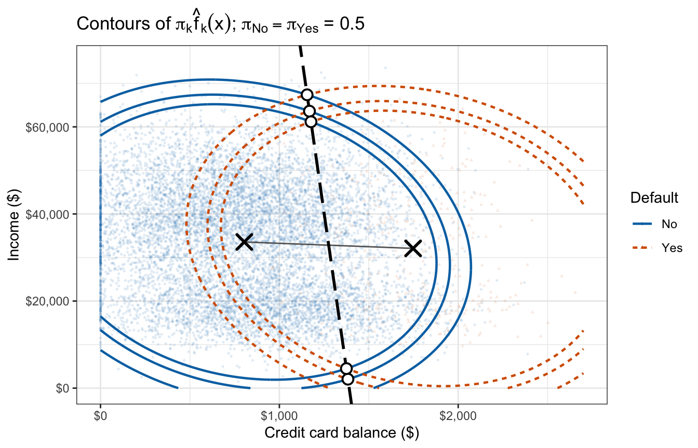

### Estimated priors

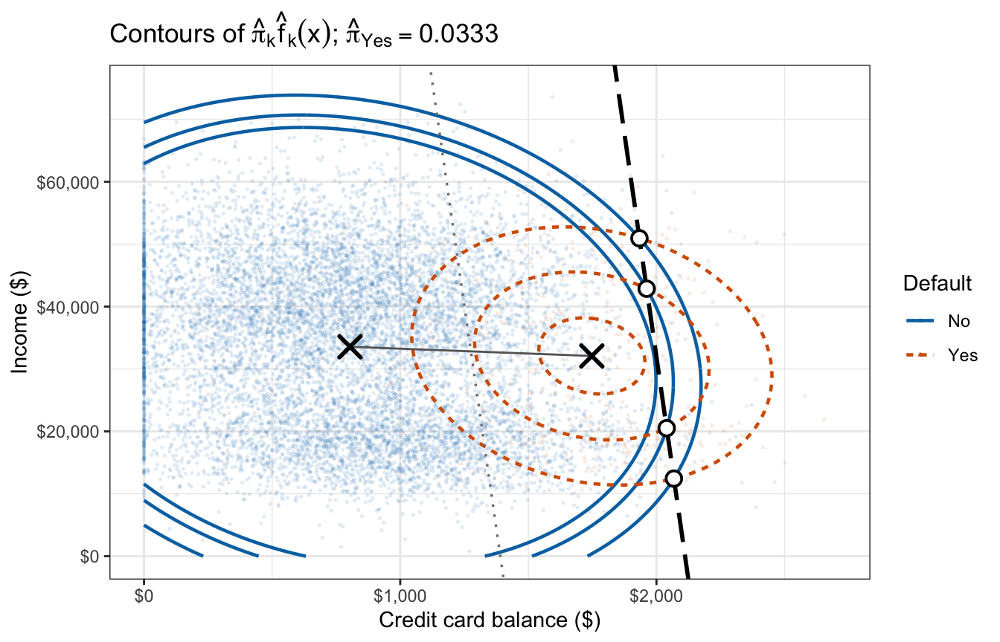

:::

::: notes
The first tab repeats slide 15's image, which is fine here because it keeps the tabs in one flow.
:::

## Fitting multiple-feature LDA

:::: {.columns}
::: {.column width="52%"}
```r
fit2 <- MASS::lda(
  default ~ balance + income,
  data = Default)

fit2$prior
fit2$means
fit2$scaling

predict(fit2,
        data.frame(balance = 1500,
                   income = 40000)
       )$posterior
```
:::
::: {.column width="48%"}
```
> fit2$prior
    No    Yes 
0.9667 0.0333 

> fit2$means
      balance   income
No   803.9438 33566.17
Yes 1747.8217 32089.15

> fit2$scaling
                 LD1
balance 2.230835e-03
income  7.793355e-06

> predict(...)$posterior
         No        Yes
1 0.9006332 0.09936682
```
:::
::::

# Comparison to Logistic Regression

## Simple logistic regression comparison

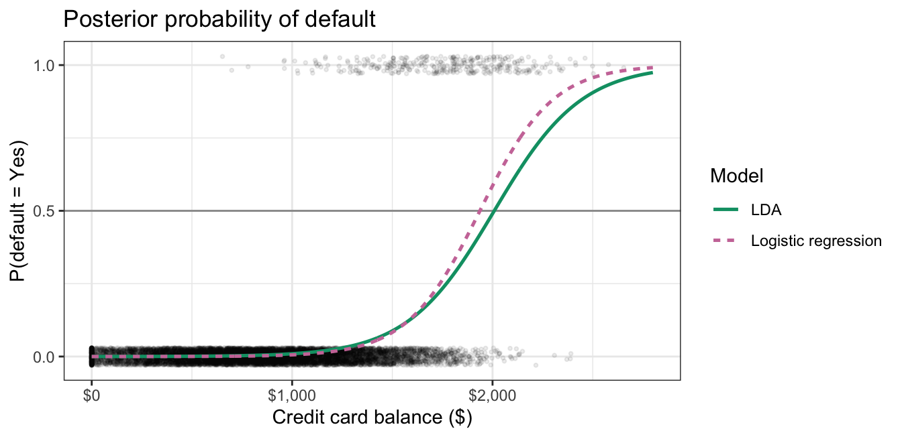

## Multiple logistic regression comparison

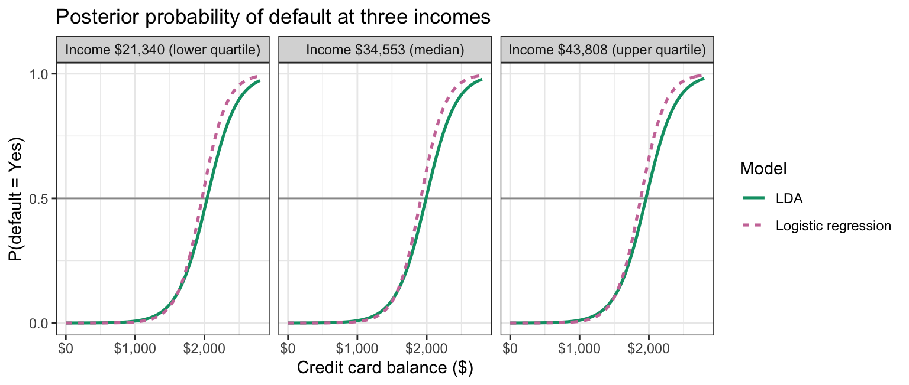

## Student strata

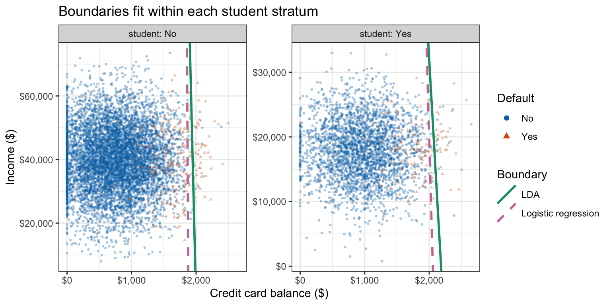

## Conclusion

- Bayes' theorem
- Generative classifier
- LDA
- Discriminant function
- Linear boundary
