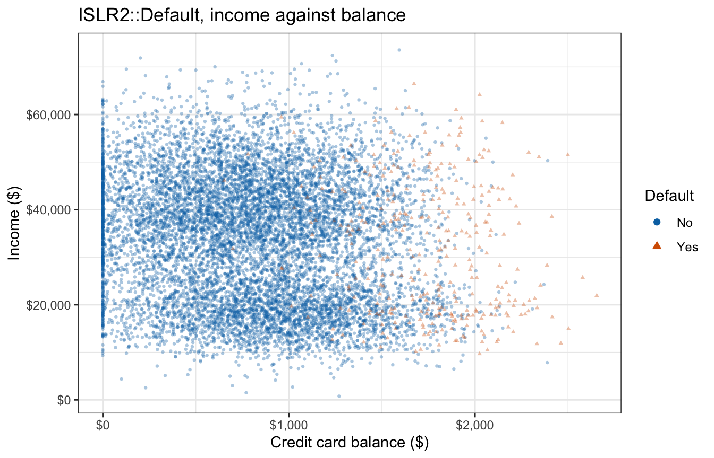
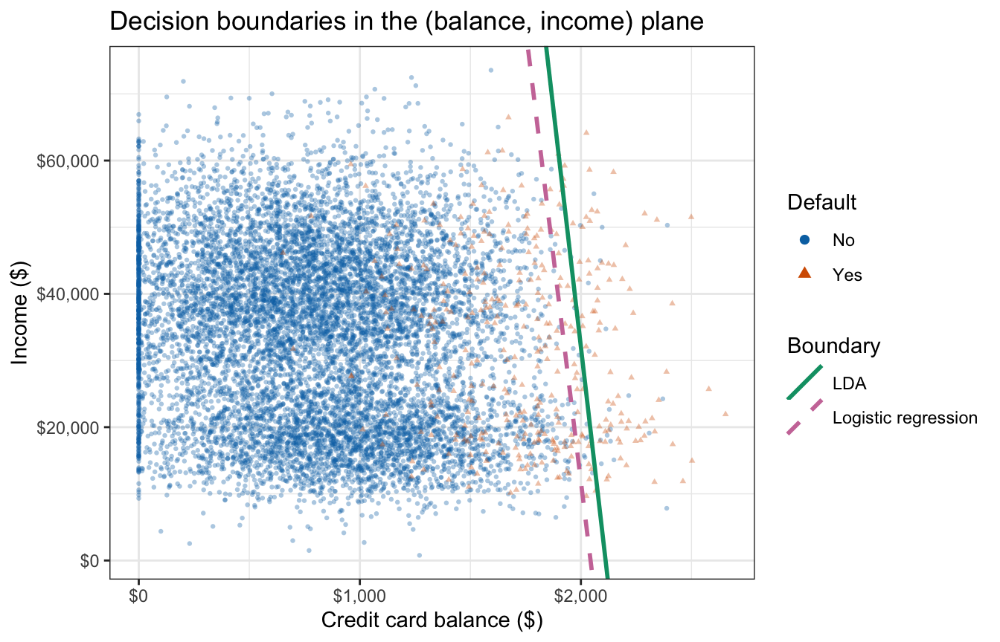
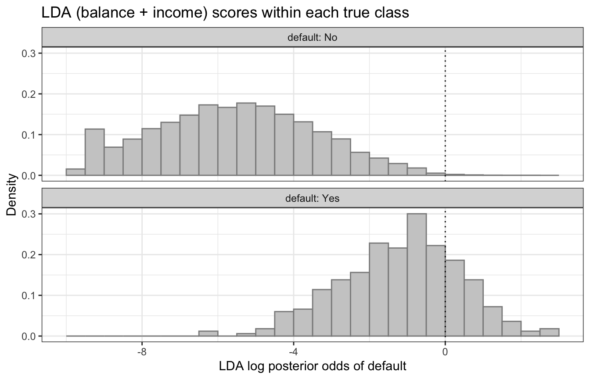
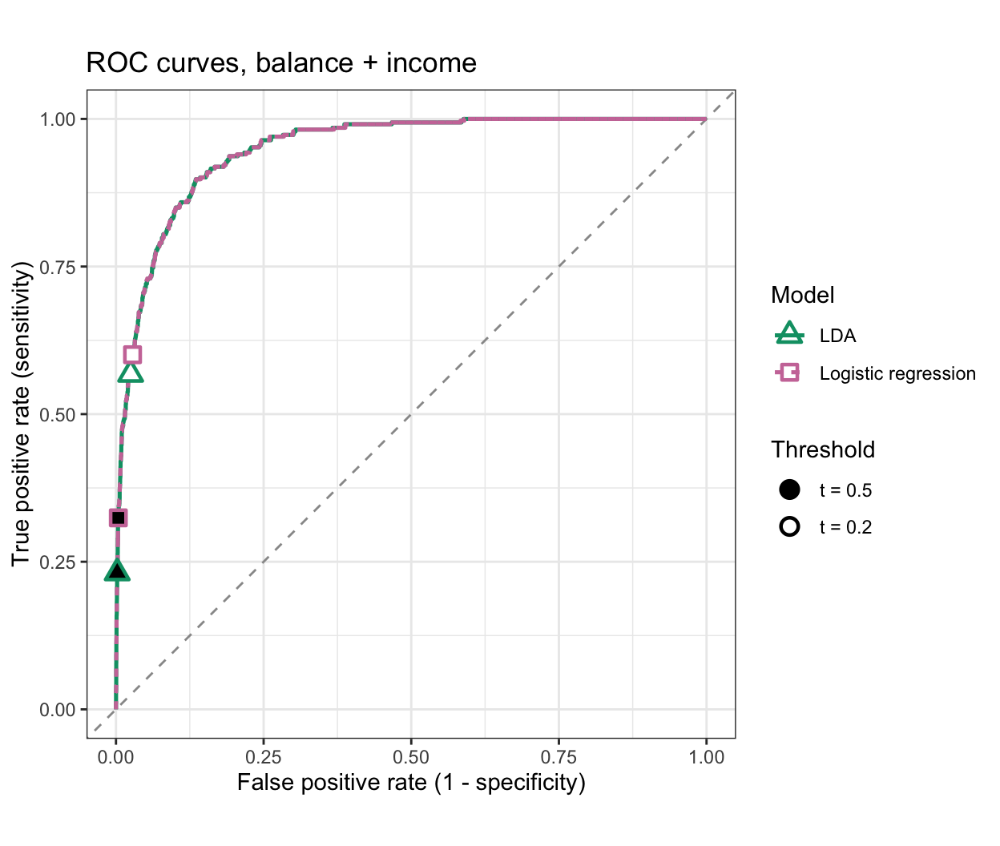
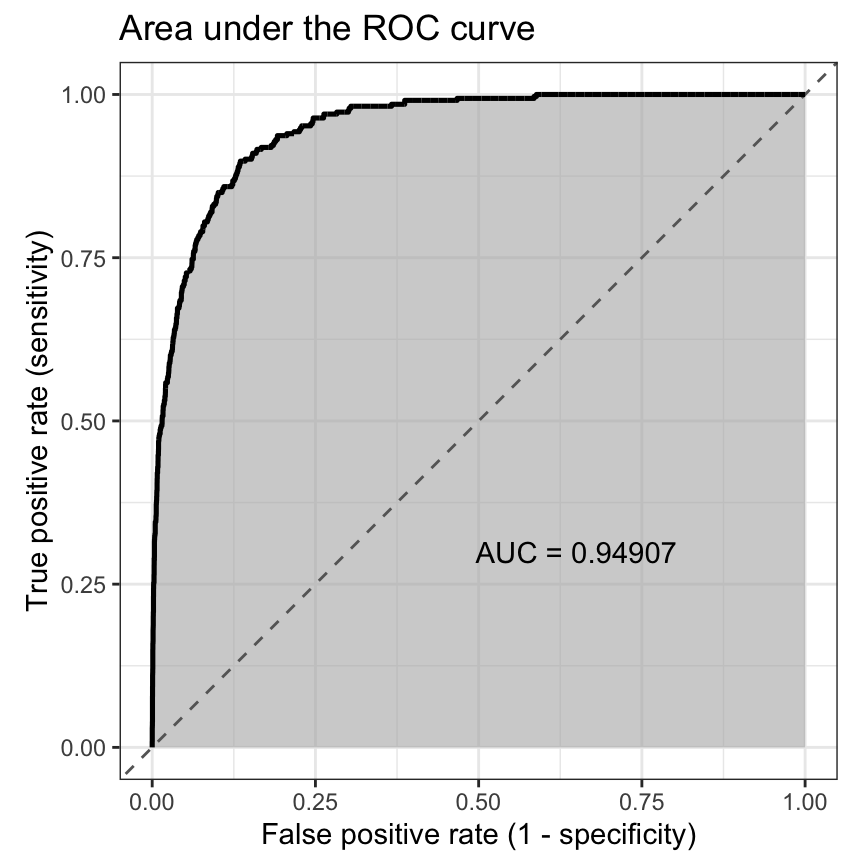
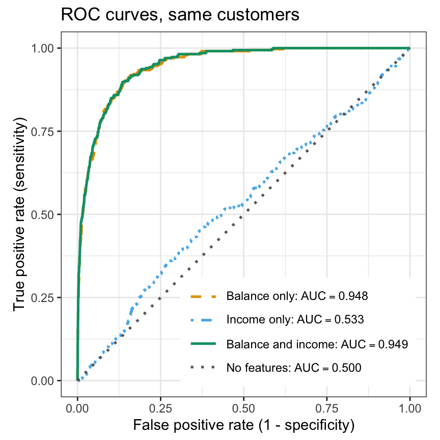
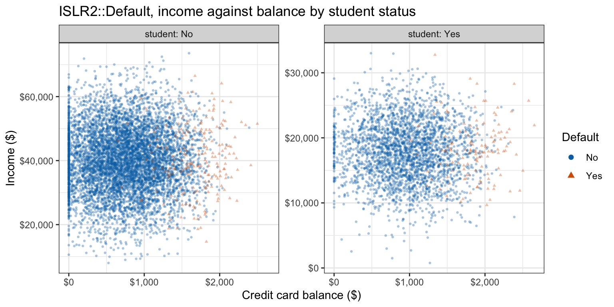

## Today

<!-- derived-from: 04-classification/55-classifier-evaluation.qmd @ 76564d8 -->

- Credit card classifiers
- Confusion matrix
- Sensitivity and specificity
- Threshold choice
- ROC curve
- AUC
- Student strata

::: notes
Distilled from the chapter's three learning objectives. Multiple classes is not on the agenda because it is optional.
:::

# Credit Card Classifiers

## Credit card default data

ISLR2::Default · Who defaults? Which mistakes? Separate models for students?

| Default | Customers | Proportion | Mean balance (\$) | SD of balance (\$) | Zero balances |
|:-------:|:---------:|:----------:|:-----------------:|:------------------:|:-------------:|
|   No    |   9,667   |   0.9667   |        804        |        456         |      499      |
|   Yes   |    333    |   0.0333   |       1,748       |        341         |       0       |

::: notes
The question the chapter asks, in three parts: how well LDA and logistic regression identify the customers who will default, which kinds of mistake they make, and whether separate models for students and non-students do better. The data are the ones from the LDA lecture, so this is the same table. Only 333 of 10,000 customers defaulted, which matters for every error rate that follows.
:::

## Income and balance



::: notes
Optional. The chapter's closing sentence of the data subsection: income runs across nearly the whole range for both classes. The next slide draws the same cloud with the boundaries.
:::

## Fitted classifiers



::: notes
The LDA lecture fit four classifiers (LDA and logistic regression, each with balance alone and with balance and income). Each gives every customer a posterior probability, and this lecture evaluates those probabilities as scores. The two boundaries are nearly vertical and close together, logistic regression's slightly to the left; many defaulters lie to the left of both. The figure shows only the two-feature classifiers' boundaries.
:::

# Classifier Evaluation

## LDA scores within each class



::: notes
The opening figure of the section. The defaulters' scores sit well to the right of the non-defaulters' but the histograms overlap, so defaulters to the left of a threshold are missed and non-defaulters to its right are false alarms. The chapter quotes the share of each class on the wrong side of 0: 76.9% of defaulters score at or below 0, and 0.2% of non-defaulters above it.
:::

## Confusion matrix

|Truth    | Predicted positive  | Predicted negative  |
|:--------|:-------------------:|:-------------------:|
|Positive | True positive (TP)  | False negative (FN) |
|Negative | False positive (FP) | True negative (TN)  |

Positive: the class of interest · predict positive when $\widehat p(x) > t$

::: {.fragment}
Error rate: $(FP + FN)/n$
:::

::: notes
With two classes call the class of interest positive; a threshold t turns probabilities into classes. TP and FN are the positives on the right and left of the dotted line on the previous slide, FP and TN the negatives. The diagonal is the correct classifications.
:::

## Credit card confusion matrix

|Truth | Predicted Yes | Predicted No | Total |
|:-----|:-------------:|:------------:|:-----:|
|Yes   |      77       |     256      |  333  |
|No    |      20       |    9,647     | 9,667 |

LDA, balance and income · $t = 0.5$ · training counts

::: {.fragment}
Error rate 2.76%, against 3.33% for predicting No for everyone
:::

::: {.fragment}
256 of the 276 errors are missed defaulters
:::

::: notes
The error rate is small because the 9,667 non-defaulters dominate it, even though most errors are missed defaulters. These are training error rates, optimistic for new customers, as the classification lecture discussed; estimating test error from the training data alone is the resampling unit.
:::

## Sensitivity and specificity

$$\text{Sensitivity} = \frac{TP}{TP + FN}, \qquad \text{Specificity} = \frac{TN}{TN + FP}$$

::: {.fragment}
Sensitivity: positives caught, the true positive rate

Specificity: negatives left alone, the true negative rate
:::

::: {.fragment}
Credit card: sensitivity 23.1%, specificity 99.8%
:::

::: notes
Dividing each row of the confusion matrix by its total gives two rates that condition on the true class; their complements are the false negative rate and the false positive rate (1 minus specificity). For the credit card customers the classifier flags 77 of the 333 who defaulted and correctly leaves alone 9,647 of the 9,667 who did not.
:::

# Classification Threshold

## Classification threshold

```{=html}
<script type="ojs-define">
{"contents":[{"name":"threshold_rates","value":{"t":[0,0,0,0,0.005,0.005,0.005,0.005,0.01,0.01,0.01,0.01,0.015,0.015,0.015,0.015,0.02,0.02,0.02,0.02,0.025,0.025,0.025,0.025,0.03,0.03,0.03,0.03,0.035,0.035,0.035,0.035,0.04,0.04,0.04,0.04,0.045,0.045,0.045,0.045,0.05,0.05,0.05,0.05,0.055,0.055,0.055,0.055,0.06,0.06,0.06,0.06,0.065,0.065,0.065,0.065,0.07,0.07,0.07,0.07,0.075,0.075,0.075,0.075,0.08,0.08,0.08,0.08,0.085,0.085,0.085,0.085,0.09,0.09,0.09,0.09,0.095,0.095,0.095,0.095,0.1,0.1,0.1,0.1,0.105,0.105,0.105,0.105,0.11,0.11,0.11,0.11,0.115,0.115,0.115,0.115,0.12,0.12,0.12,0.12,0.125,0.125,0.125,0.125,0.13,0.13,0.13,0.13,0.135,0.135,0.135,0.135,0.14,0.14,0.14,0.14,0.145,0.145,0.145,0.145,0.15,0.15,0.15,0.15,0.155,0.155,0.155,0.155,0.16,0.16,0.16,0.16,0.165,0.165,0.165,0.165,0.17,0.17,0.17,0.17,0.175,0.175,0.175,0.175,0.18,0.18,0.18,0.18,0.185,0.185,0.185,0.185,0.19,0.19,0.19,0.19,0.195,0.195,0.195,0.195,0.2,0.2,0.2,0.2,0.205,0.205,0.205,0.205,0.21,0.21,0.21,0.21,0.215,0.215,0.215,0.215,0.22,0.22,0.22,0.22,0.225,0.225,0.225,0.225,0.23,0.23,0.23,0.23,0.235,0.235,0.235,0.235,0.24,0.24,0.24,0.24,0.245,0.245,0.245,0.245,0.25,0.25,0.25,0.25,0.255,0.255,0.255,0.255,0.26,0.26,0.26,0.26,0.265,0.265,0.265,0.265,0.27,0.27,0.27,0.27,0.275,0.275,0.275,0.275,0.28,0.28,0.28,0.28,0.285,0.285,0.285,0.285,0.29,0.29,0.29,0.29,0.295,0.295,0.295,0.295,0.3,0.3,0.3,0.3,0.305,0.305,0.305,0.305,0.31,0.31,0.31,0.31,0.315,0.315,0.315,0.315,0.32,0.32,0.32,0.32,0.325,0.325,0.325,0.325,0.33,0.33,0.33,0.33,0.335,0.335,0.335,0.335,0.34,0.34,0.34,0.34,0.345,0.345,0.345,0.345,0.35,0.35,0.35,0.35,0.355,0.355,0.355,0.355,0.36,0.36,0.36,0.36,0.365,0.365,0.365,0.365,0.37,0.37,0.37,0.37,0.375,0.375,0.375,0.375,0.38,0.38,0.38,0.38,0.385,0.385,0.385,0.385,0.39,0.39,0.39,0.39,0.395,0.395,0.395,0.395,0.4,0.4,0.4,0.4,0.405,0.405,0.405,0.405,0.41,0.41,0.41,0.41,0.415,0.415,0.415,0.415,0.42,0.42,0.42,0.42,0.425,0.425,0.425,0.425,0.43,0.43,0.43,0.43,0.435,0.435,0.435,0.435,0.44,0.44,0.44,0.44,0.445,0.445,0.445,0.445,0.45,0.45,0.45,0.45,0.455,0.455,0.455,0.455,0.46,0.46,0.46,0.46,0.465,0.465,0.465,0.465,0.47,0.47,0.47,0.47,0.475,0.475,0.475,0.475,0.48,0.48,0.48,0.48,0.485,0.485,0.485,0.485,0.49,0.49,0.49,0.49,0.495,0.495,0.495,0.495,0.5,0.5,0.5,0.5],"rate":["Overall error rate","Sensitivity (true positive rate)","Specificity (true negative rate)","False positive rate (1 - specificity)","Overall error rate","Sensitivity (true positive rate)","Specificity (true negative rate)","False positive rate (1 - specificity)","Overall error rate","Sensitivity (true positive rate)","Specificity (true negative rate)","False positive rate (1 - specificity)","Overall error rate","Sensitivity (true positive rate)","Specificity (true negative rate)","False positive rate (1 - specificity)","Overall error rate","Sensitivity (true positive rate)","Specificity (true negative rate)","False positive rate (1 - specificity)","Overall error rate","Sensitivity (true positive rate)","Specificity (true negative rate)","False positive rate (1 - specificity)","Overall error rate","Sensitivity (true positive rate)","Specificity (true negative rate)","False positive rate (1 - specificity)","Overall error rate","Sensitivity (true positive rate)","Specificity (true negative rate)","False positive rate (1 - specificity)","Overall error rate","Sensitivity (true positive rate)","Specificity (true negative rate)","False positive rate (1 - specificity)","Overall error rate","Sensitivity (true positive rate)","Specificity (true negative rate)","False positive rate (1 - specificity)","Overall error rate","Sensitivity (true positive rate)","Specificity (true negative rate)","False positive rate (1 - specificity)","Overall error rate","Sensitivity (true positive rate)","Specificity (true negative rate)","False positive rate (1 - specificity)","Overall error rate","Sensitivity (true positive rate)","Specificity (true negative rate)","False positive rate (1 - specificity)","Overall error rate","Sensitivity (true positive rate)","Specificity (true negative rate)","False positive rate (1 - specificity)","Overall error rate","Sensitivity (true positive rate)","Specificity (true negative rate)","False positive rate (1 - specificity)","Overall error rate","Sensitivity (true positive rate)","Specificity (true negative rate)","False positive rate (1 - specificity)","Overall error rate","Sensitivity (true positive rate)","Specificity (true negative rate)","False positive rate (1 - specificity)","Overall error rate","Sensitivity (true positive rate)","Specificity (true negative rate)","False positive rate (1 - specificity)","Overall error rate","Sensitivity (true positive rate)","Specificity (true negative rate)","False positive rate (1 - specificity)","Overall error rate","Sensitivity (true positive rate)","Specificity (true negative rate)","False positive rate (1 - specificity)","Overall error rate","Sensitivity (true positive rate)","Specificity (true negative rate)","False positive rate (1 - specificity)","Overall error rate","Sensitivity (true positive rate)","Specificity (true negative rate)","False positive rate (1 - specificity)","Overall error rate","Sensitivity (true positive rate)","Specificity (true negative rate)","False positive rate (1 - specificity)","Overall error rate","Sensitivity (true positive rate)","Specificity (true negative rate)","False positive rate (1 - specificity)","Overall error rate","Sensitivity (true positive rate)","Specificity (true negative rate)","False positive rate (1 - specificity)","Overall error rate","Sensitivity (true positive rate)","Specificity (true negative rate)","False positive rate (1 - specificity)","Overall error rate","Sensitivity (true positive rate)","Specificity (true negative rate)","False positive rate (1 - specificity)","Overall error rate","Sensitivity (true positive rate)","Specificity (true negative rate)","False positive rate (1 - specificity)","Overall error rate","Sensitivity (true positive rate)","Specificity (true negative rate)","False positive rate (1 - specificity)","Overall error rate","Sensitivity (true positive rate)","Specificity (true negative rate)","False positive rate (1 - specificity)","Overall error rate","Sensitivity (true positive rate)","Specificity (true negative rate)","False positive rate (1 - specificity)","Overall error rate","Sensitivity (true positive rate)","Specificity (true negative rate)","False positive rate (1 - specificity)","Overall error rate","Sensitivity (true positive rate)","Specificity (true negative rate)","False positive rate (1 - specificity)","Overall error rate","Sensitivity (true positive rate)","Specificity (true negative rate)","False positive rate (1 - specificity)","Overall error rate","Sensitivity (true positive rate)","Specificity (true negative rate)","False positive rate (1 - specificity)","Overall error rate","Sensitivity (true positive rate)","Specificity (true negative rate)","False positive rate (1 - specificity)","Overall error rate","Sensitivity (true positive rate)","Specificity (true negative rate)","False positive rate (1 - specificity)","Overall error rate","Sensitivity (true positive rate)","Specificity (true negative rate)","False positive rate (1 - specificity)","Overall error rate","Sensitivity (true positive rate)","Specificity (true negative rate)","False positive rate (1 - specificity)","Overall error rate","Sensitivity (true positive rate)","Specificity (true negative rate)","False positive rate (1 - specificity)","Overall error rate","Sensitivity (true positive rate)","Specificity (true negative rate)","False positive rate (1 - specificity)","Overall error rate","Sensitivity (true positive rate)","Specificity (true negative rate)","False positive rate (1 - specificity)","Overall error rate","Sensitivity (true positive rate)","Specificity (true negative rate)","False positive rate (1 - specificity)","Overall error rate","Sensitivity (true positive rate)","Specificity (true negative rate)","False positive rate (1 - specificity)","Overall error rate","Sensitivity (true positive rate)","Specificity (true negative rate)","False positive rate (1 - specificity)","Overall error rate","Sensitivity (true positive rate)","Specificity (true negative rate)","False positive rate (1 - specificity)","Overall error rate","Sensitivity (true positive rate)","Specificity (true negative rate)","False positive rate (1 - specificity)","Overall error rate","Sensitivity (true positive rate)","Specificity (true negative rate)","False positive rate (1 - specificity)","Overall error rate","Sensitivity (true positive rate)","Specificity (true negative rate)","False positive rate (1 - specificity)","Overall error rate","Sensitivity (true positive rate)","Specificity (true negative rate)","False positive rate (1 - specificity)","Overall error rate","Sensitivity (true positive rate)","Specificity (true negative rate)","False positive rate (1 - specificity)","Overall error rate","Sensitivity (true positive rate)","Specificity (true negative rate)","False positive rate (1 - specificity)","Overall error rate","Sensitivity (true positive rate)","Specificity (true negative rate)","False positive rate (1 - specificity)","Overall error rate","Sensitivity (true positive rate)","Specificity (true negative rate)","False positive rate (1 - specificity)","Overall error rate","Sensitivity (true positive rate)","Specificity (true negative rate)","False positive rate (1 - specificity)","Overall error rate","Sensitivity (true positive rate)","Specificity (true negative rate)","False positive rate (1 - specificity)","Overall error rate","Sensitivity (true positive rate)","Specificity (true negative rate)","False positive rate (1 - specificity)","Overall error rate","Sensitivity (true positive rate)","Specificity (true negative rate)","False positive rate (1 - specificity)","Overall error rate","Sensitivity (true positive rate)","Specificity (true negative rate)","False positive rate (1 - specificity)","Overall error rate","Sensitivity (true positive rate)","Specificity (true negative rate)","False positive rate (1 - specificity)","Overall error rate","Sensitivity (true positive rate)","Specificity (true negative rate)","False positive rate (1 - specificity)","Overall error rate","Sensitivity (true positive rate)","Specificity (true negative rate)","False positive rate (1 - specificity)","Overall error rate","Sensitivity (true positive rate)","Specificity (true negative rate)","False positive rate (1 - specificity)","Overall error rate","Sensitivity (true positive rate)","Specificity (true negative rate)","False positive rate (1 - specificity)","Overall error rate","Sensitivity (true positive rate)","Specificity (true negative rate)","False positive rate (1 - specificity)","Overall error rate","Sensitivity (true positive rate)","Specificity (true negative rate)","False positive rate (1 - specificity)","Overall error rate","Sensitivity (true positive rate)","Specificity (true negative rate)","False positive rate (1 - specificity)","Overall error rate","Sensitivity (true positive rate)","Specificity (true negative rate)","False positive rate (1 - specificity)","Overall error rate","Sensitivity (true positive rate)","Specificity (true negative rate)","False positive rate (1 - specificity)","Overall error rate","Sensitivity (true positive rate)","Specificity (true negative rate)","False positive rate (1 - specificity)","Overall error rate","Sensitivity (true positive rate)","Specificity (true negative rate)","False positive rate (1 - specificity)","Overall error rate","Sensitivity (true positive rate)","Specificity (true negative rate)","False positive rate (1 - specificity)","Overall error rate","Sensitivity (true positive rate)","Specificity (true negative rate)","False positive rate (1 - specificity)","Overall error rate","Sensitivity (true positive rate)","Specificity (true negative rate)","False positive rate (1 - specificity)","Overall error rate","Sensitivity (true positive rate)","Specificity (true negative rate)","False positive rate (1 - specificity)","Overall error rate","Sensitivity (true positive rate)","Specificity (true negative rate)","False positive rate (1 - specificity)","Overall error rate","Sensitivity (true positive rate)","Specificity (true negative rate)","False positive rate (1 - specificity)","Overall error rate","Sensitivity (true positive rate)","Specificity (true negative rate)","False positive rate (1 - specificity)","Overall error rate","Sensitivity (true positive rate)","Specificity (true negative rate)","False positive rate (1 - specificity)","Overall error rate","Sensitivity (true positive rate)","Specificity (true negative rate)","False positive rate (1 - specificity)","Overall error rate","Sensitivity (true positive rate)","Specificity (true negative rate)","False positive rate (1 - specificity)","Overall error rate","Sensitivity (true positive rate)","Specificity (true negative rate)","False positive rate (1 - specificity)","Overall error rate","Sensitivity (true positive rate)","Specificity (true negative rate)","False positive rate (1 - specificity)","Overall error rate","Sensitivity (true positive rate)","Specificity (true negative rate)","False positive rate (1 - specificity)","Overall error rate","Sensitivity (true positive rate)","Specificity (true negative rate)","False positive rate (1 - specificity)","Overall error rate","Sensitivity (true positive rate)","Specificity (true negative rate)","False positive rate (1 - specificity)","Overall error rate","Sensitivity (true positive rate)","Specificity (true negative rate)","False positive rate (1 - specificity)","Overall error rate","Sensitivity (true positive rate)","Specificity (true negative rate)","False positive rate (1 - specificity)","Overall error rate","Sensitivity (true positive rate)","Specificity (true negative rate)","False positive rate (1 - specificity)","Overall error rate","Sensitivity (true positive rate)","Specificity (true negative rate)","False positive rate (1 - specificity)","Overall error rate","Sensitivity (true positive rate)","Specificity (true negative rate)","False positive rate (1 - specificity)","Overall error rate","Sensitivity (true positive rate)","Specificity (true negative rate)","False positive rate (1 - specificity)","Overall error rate","Sensitivity (true positive rate)","Specificity (true negative rate)","False positive rate (1 - specificity)","Overall error rate","Sensitivity (true positive rate)","Specificity (true negative rate)","False positive rate (1 - specificity)","Overall error rate","Sensitivity (true positive rate)","Specificity (true negative rate)","False positive rate (1 - specificity)","Overall error rate","Sensitivity (true positive rate)","Specificity (true negative rate)","False positive rate (1 - specificity)","Overall error rate","Sensitivity (true positive rate)","Specificity (true negative rate)","False positive rate (1 - specificity)","Overall error rate","Sensitivity (true positive rate)","Specificity (true negative rate)","False positive rate (1 - specificity)","Overall error rate","Sensitivity (true positive rate)","Specificity (true negative rate)","False positive rate (1 - specificity)","Overall error rate","Sensitivity (true positive rate)","Specificity (true negative rate)","False positive rate (1 - specificity)","Overall error rate","Sensitivity (true positive rate)","Specificity (true negative rate)","False positive rate (1 - specificity)"],"value":[0.9667,1,0,1,0.4366,0.990990990990991,0.54867073549188,0.45132926450812,0.3219,0.981981981981982,0.667632150615496,0.332367849384504,0.2595,0.96996996996997,0.732595427743871,0.267404572256129,0.2194,0.942942942942943,0.77500775835316,0.22499224164684,0.1915,0.936936936936937,0.804075721526844,0.195924278473156,0.1697,0.918918918918919,0.827247336298748,0.172752663701252,0.1527,0.90990990990991,0.845143270921692,0.154856729078308,0.1383,0.897897897897898,0.860453087824558,0.139546912175442,0.1275,0.873873873873874,0.872452674045723,0.127547325954277,0.1177,0.858858858858859,0.883107479052446,0.116892520947554,0.1081,0.84984984984985,0.893348505223958,0.106651494776042,0.1002,0.834834834834835,0.902037860763422,0.097962139236578,0.0932,0.81981981981982,0.909796213923658,0.0902037860763422,0.0875,0.804804804804805,0.916209785869453,0.0837902141305472,0.0823,0.798798798798799,0.921795800144823,0.0782041998551775,0.0784,0.786786786786787,0.926243922623358,0.0737560773766421,0.074,0.777777777777778,0.931105823937106,0.0688941760628944,0.0714,0.765765765765766,0.9342091652012,0.0657908347988,0.069,0.747747747747748,0.937312506465294,0.0626874935347057,0.0662,0.732732732732733,0.940726181855798,0.059273818144202,0.0642,0.72972972972973,0.942898520740664,0.0571014792593358,0.0608,0.726726726726727,0.946519085548774,0.0534809144512258,0.0591,0.720720720720721,0.948484535016034,0.0515154649839661,0.057,0.714714714714715,0.950863763318506,0.0491362366814937,0.0549,0.705705705705706,0.953346436329782,0.0466535636702182,0.0535,0.687687687687688,0.955415330505845,0.0445846694941554,0.0517,0.681681681681682,0.957484224681908,0.0425157753180925,0.0501,0.672672672672673,0.959449674149167,0.0405503258508327,0.0487,0.672672672672673,0.960897900072411,0.0391020999275887,0.0479,0.657657657657658,0.962242681286852,0.0377573187131478,0.0467,0.645645645645646,0.963897796627702,0.0361022033722975,0.0452,0.63963963963964,0.965656356677356,0.0343436433226441,0.0439,0.627627627627628,0.967414916727009,0.0325850832729906,0.0433,0.618618618618619,0.968345919106238,0.0316540808937623,0.0419,0.606606606606607,0.970207923864694,0.0297920761353057,0.0413,0.603603603603604,0.970932036826316,0.0290679631736837,0.0402,0.594594594594595,0.97238026274956,0.0276197372504396,0.0393,0.588588588588589,0.973518154546395,0.0264818454536051,0.0387,0.576576576576577,0.974552601634426,0.0254473983655736,0.0384,0.567567567567568,0.975173269887245,0.0248267301127547,0.0375,0.564564564564565,0.976207716975277,0.0237922830247232,0.0369,0.558558558558559,0.977035274645702,0.0229647253542982,0.0357,0.558558558558559,0.97827661115134,0.0217233888486604,0.0348,0.555555555555556,0.979311058239371,0.020688941760629,0.0347,0.543543543543544,0.979828281783387,0.0201717182166132,0.0341,0.531531531531532,0.980862728871418,0.0191372711285818,0.0336,0.531531531531532,0.981379952415434,0.018620047584566,0.0336,0.525525525525526,0.98158684183304,0.0184131581669598,0.0322,0.522522522522523,0.983138512465087,0.0168614875349126,0.0322,0.507507507507508,0.983655736009103,0.0163442639908968,0.0314,0.507507507507508,0.984483293679528,0.0155167063204718,0.0312,0.495495495495495,0.985103961932347,0.0148960380676528,0.0306,0.492492492492492,0.985828074893969,0.0141719251060308,0.0299,0.48948948948949,0.986655632564394,0.0133443674356056,0.029,0.486486486486487,0.987690079652426,0.0123099203475743,0.0286,0.48048048048048,0.988310747905245,0.0116892520947554,0.0281,0.477477477477477,0.988931416158064,0.0110685838419364,0.0277,0.474474474474474,0.989448639702079,0.0105513602979208,0.0274,0.468468468468468,0.989965863246095,0.0100341367539051,0.0274,0.453453453453453,0.990483086790111,0.00951691320988934,0.0272,0.444444444444444,0.991000310334126,0.00899968966587361,0.0274,0.429429429429429,0.991310644460536,0.00868935553946415,0.0271,0.429429429429429,0.991620978586945,0.00837902141305469,0.027,0.42042042042042,0.992034757422158,0.00796524257784215,0.027,0.405405405405405,0.992551980966174,0.00744801903382641,0.0272,0.399399399399399,0.992551980966174,0.00744801903382641,0.0273,0.393393393393393,0.992655425674977,0.00734457432502322,0.0272,0.384384384384384,0.993069204510189,0.00693079548981068,0.0272,0.375375375375375,0.993379538636599,0.00662046136340122,0.0271,0.372372372372372,0.993586428054205,0.00641357194579495,0.0271,0.366366366366366,0.993793317471811,0.00620668252818868,0.0273,0.357357357357357,0.993896762180615,0.00610323781938549,0.0271,0.348348348348348,0.99441398572463,0.00558601427536987,0.0269,0.345345345345345,0.99472431985104,0.0052756801489604,0.0265,0.345345345345345,0.995138098686252,0.00486190131374775,0.0265,0.342342342342342,0.995241543395055,0.00475845660494467,0.0265,0.339339339339339,0.995344988103859,0.00465501189614148,0.0268,0.33033033033033,0.995344988103859,0.00465501189614148,0.0268,0.33033033033033,0.995344988103859,0.00465501189614148,0.0265,0.327327327327327,0.995758766939071,0.00424123306092894,0.0263,0.324324324324324,0.996069101065481,0.00393089893451948,0.0263,0.324324324324324,0.996069101065481,0.00393089893451948,0.0262,0.324324324324324,0.996172545774284,0.0038274542257164,0.0263,0.321321321321321,0.996172545774284,0.0038274542257164,0.0262,0.321321321321321,0.996275990483087,0.00372400951691321,0.0262,0.315315315315315,0.996482879900693,0.00351712009930694,0.0264,0.306306306306306,0.996586324609496,0.00341367539050375,0.0265,0.303303303303303,0.996586324609496,0.00341367539050375,0.0268,0.294294294294294,0.996586324609496,0.00341367539050375,0.0268,0.294294294294294,0.996586324609496,0.00341367539050375,0.0268,0.285285285285285,0.996896658735906,0.00310334126409439,0.027,0.276276276276276,0.997000103444709,0.0029998965552912,0.0272,0.27027027027027,0.997000103444709,0.0029998965552912,0.0273,0.267267267267267,0.997000103444709,0.0029998965552912,0.0273,0.261261261261261,0.997206992862315,0.00279300713768493,0.0274,0.258258258258258,0.997206992862315,0.00279300713768493,0.0272,0.252252252252252,0.997620771697528,0.00237922830247228,0.0272,0.246246246246246,0.997827661115134,0.00217233888486601,0.0272,0.243243243243243,0.997931105823937,0.00206889417606293,0.0276,0.231231231231231,0.997931105823937,0.00206889417606293]}},{"name":"threshold_marks","value":[0.2,0.5]}]}
</script>
```

:::: {.columns}
::: {.column width="36%"}
```{ojs}
//| label: threshold-checkboxes
//| echo: false
rateNames = ["Overall error rate", "Sensitivity (true positive rate)",
             "Specificity (true negative rate)",
             "False positive rate (1 - specificity)"]
rateStyles = ({
  "Overall error rate": {stroke: "black", dash: "none"},
  "Sensitivity (true positive rate)": {stroke: "#D55E00", dash: "8,4"},
  "Specificity (true negative rate)": {stroke: "#0072B2", dash: "2,4"},
  "False positive rate (1 - specificity)": {stroke: "#009E73", dash: "12,4,2,4"}
})
viewof shownRates = Inputs.checkbox(rateNames, {
  value: rateNames.slice(0, 3),
  format: name => html`<span style="display: inline-flex; align-items: center; gap: 0.4em">
    <svg width="36" height="10"><line x1="2" y1="5" x2="34" y2="5"
      stroke="${rateStyles[name].stroke}" stroke-width="2.5"
      stroke-dasharray="${rateStyles[name].dash}" stroke-linecap="round"/></svg>${name}</span>`
})
```

::: {style="font-size: 0.65em"}
Lowering $t$: sensitivity rises or stays, specificity falls or stays · no threshold improves both
:::
:::

::: {.column width="64%"}
```{ojs}
//| label: threshold-plot
//| echo: false
{
  const rates = transpose(threshold_rates);
  return Plot.plot({
    width: 740, height: 500, style: {fontSize: "18px"},
    marginTop: 24,
    x: {domain: [0, 0.5], label: "Threshold t"},
    y: {domain: [0, 1], label: "Rate", grid: true},
    marks: [
      Plot.ruleX(threshold_marks, {stroke: "gray", strokeDasharray: "2,3"}),
      Plot.text(threshold_marks, {x: d => d, y: 1, text: d => `t = ${d}`,
                                  dy: -12, fill: "gray"}),
      ...rateNames.filter(r => shownRates.includes(r)).map(r =>
        Plot.line(rates.filter(d => d.rate === r),
                  {x: "t", y: "value", stroke: rateStyles[r].stroke,
                   strokeDasharray: rateStyles[r].dash, strokeWidth: 2.5,
                   strokeLinecap: "round"}))
    ]
  });
}
```
:::
::::

::: notes
Work the checkboxes live: the four rates against t for the two-feature LDA classifier, with dotted lines at t = 0.2 and t = 0.5. The false positive rate starts unchecked because it mirrors specificity. The error rate follows the false positive rate, nearly flat over most of the range and climbing sharply as t approaches 0. Lowering t enlarges the set of features classified positive, so every observation predicted positive before still is: TP and FP can only grow, FN and TN only shrink. The figure is interactive and needs an internet connection (the Observable runtime loads from the web), as does the notes page. While a checkbox has keyboard focus the arrow keys do not change slides; click an empty part of the slide to return to slide navigation.
:::

## Lowering the threshold

|Model                                 | Threshold | TP  | FN  | FP  |  TN   | Error rate | Sensitivity | Specificity |
|:-------------------------------------|:---------:|:---:|:---:|:---:|:-----:|:----------:|:-----------:|:-----------:|
|LDA, balance                          |    0.5    | 76  | 257 | 24  | 9,643 |   0.0281   |   0.2282    |   0.9975    |
|LDA, balance                          |    0.2    | 195 | 138 | 236 | 9,431 |   0.0374   |   0.5856    |   0.9756    |
|LDA, balance + income                 |    0.5    | 77  | 256 | 20  | 9,647 |   0.0276   |   0.2312    |   0.9979    |
|LDA, balance + income                 |    0.2    | 189 | 144 | 240 | 9,427 |   0.0384   |   0.5676    |   0.9752    |
|Logistic regression, balance + income |    0.5    | 108 | 225 | 38  | 9,629 |   0.0263   |   0.3243    |   0.9961    |
|Logistic regression, balance + income |    0.2    | 200 | 133 | 271 | 9,396 |   0.0404   |   0.6006    |   0.9720    |

Lower $t$: more defaulters caught, more false alarms

::: notes
Lowering the threshold from 0.5 to 0.2 raises the two-feature LDA classifier's sensitivity from 23.1% to 56.8%, at the cost of specificity falling from 99.8% to 97.5% and the error rate rising from 2.76% to 3.84%. Adding income changes LDA very little. At both thresholds logistic regression flags more customers than the two-feature LDA classifier (146 against 97 at t = 0.5) and has the higher sensitivity and the lower specificity. The overall error rate need not be smallest at t = 0.5: LDA's training error rate is lowest near t = 0.427, at 2.61%.
:::

## ROC curve

ROC curve: sensitivity against $1 - \text{specificity}$ at every threshold

::: {.fragment}
Only the ordering of the observations matters

$$\widehat{p}(x) > t$$

Predict positive: $t$ is therefore a threshold for a probability

$$c = \log\left[\frac{t}{1 - t}\right]$$
:::

::: notes
At t = 1 nothing is predicted positive, the point (0, 0); at t = 0 everything is, the point (1, 1). Any strictly increasing transformation of the score (the log posterior odds or the estimated probability itself) sorts the observations the same way, produces the same confusion matrices and traces the same curve. The rule says predict positive when the estimated probability exceeds t, so t is a threshold for a probability; predicting positive when the estimated probability exceeds t is predicting positive when the log posterior odds exceed c.
:::

## ROC curve, threshold slider

```{=html}
<script type="ojs-define">
{"contents":[{"name":"slider_bins","value":{"class":["No (negative)","No (negative)","No (negative)","No (negative)","No (negative)","No (negative)","No (negative)","No (negative)","No (negative)","No (negative)","No (negative)","No (negative)","No (negative)","No (negative)","No (negative)","No (negative)","No (negative)","No (negative)","No (negative)","No (negative)","No (negative)","No (negative)","No (negative)","No (negative)","No (negative)","No (negative)","Yes (positive)","Yes (positive)","Yes (positive)","Yes (positive)","Yes (positive)","Yes (positive)","Yes (positive)","Yes (positive)","Yes (positive)","Yes (positive)","Yes (positive)","Yes (positive)","Yes (positive)","Yes (positive)","Yes (positive)","Yes (positive)","Yes (positive)","Yes (positive)","Yes (positive)","Yes (positive)","Yes (positive)","Yes (positive)","Yes (positive)","Yes (positive)","Yes (positive)","Yes (positive)"],"x0":[-10,-9.5,-9,-8.5,-8,-7.5,-7,-6.5,-6,-5.5,-5,-4.5,-4,-3.5,-3,-2.5,-2,-1.5,-1,-0.5,0,0.5,1,1.5,2,2.5,-10,-9.5,-9,-8.5,-8,-7.5,-7,-6.5,-6,-5.5,-5,-4.5,-4,-3.5,-3,-2.5,-2,-1.5,-1,-0.5,0,0.5,1,1.5,2,2.5],"x1":[-9.5,-9,-8.5,-8,-7.5,-7,-6.5,-6,-5.5,-5,-4.5,-4,-3.5,-3,-2.5,-2,-1.5,-1,-0.5,0,0.5,1,1.5,2,2.5,3,-9.5,-9,-8.5,-8,-7.5,-7,-6.5,-6,-5.5,-5,-4.5,-4,-3.5,-3,-2.5,-2,-1.5,-1,-0.5,0,0.5,1,1.5,2,2.5,3],"density":[0.0155167063204717,0.113582290265853,0.0691010654805007,0.0889624495707045,0.114616737353884,0.130133443674356,0.147719044170891,0.172959553118858,0.166752870590669,0.177511120306196,0.17006310127237,0.14999482776456,0.131374780179994,0.106961828902452,0.089376228405917,0.056480811006517,0.0424123306092893,0.0289645184648805,0.0179993793317472,0.00537912485776353,0.00227578359366918,0.00103444708803145,0.000413778835212579,0.000206889417606289,0.000206889417606289,0,0,0,0,0,0,0,0,0.012012012012012,0,0.00600600600600601,0.018018018018018,0.0600600600600601,0.0660660660660661,0.114114114114114,0.138138138138138,0.156156156156156,0.228228228228228,0.216216216216216,0.3003003003003,0.222222222222222,0.186186186186186,0.138138138138138,0.0720720720720721,0.036036036036036,0.012012012012012,0.018018018018018]}},{"name":"slider_outline","value":{"class":["No (negative)","No (negative)","No (negative)","No (negative)","No (negative)","No (negative)","No (negative)","No (negative)","No (negative)","No (negative)","No (negative)","No (negative)","No (negative)","No (negative)","No (negative)","No (negative)","No (negative)","No (negative)","No (negative)","No (negative)","No (negative)","No (negative)","No (negative)","No (negative)","No (negative)","No (negative)","No (negative)","No (negative)","No (negative)","No (negative)","No (negative)","No (negative)","No (negative)","No (negative)","No (negative)","No (negative)","No (negative)","No (negative)","No (negative)","No (negative)","No (negative)","No (negative)","No (negative)","No (negative)","No (negative)","No (negative)","No (negative)","No (negative)","No (negative)","No (negative)","No (negative)","No (negative)","Yes (positive)","Yes (positive)","Yes (positive)","Yes (positive)","Yes (positive)","Yes (positive)","Yes (positive)","Yes (positive)","Yes (positive)","Yes (positive)","Yes (positive)","Yes (positive)","Yes (positive)","Yes (positive)","Yes (positive)","Yes (positive)","Yes (positive)","Yes (positive)","Yes (positive)","Yes (positive)","Yes (positive)","Yes (positive)","Yes (positive)","Yes (positive)","Yes (positive)","Yes (positive)","Yes (positive)","Yes (positive)","Yes (positive)","Yes (positive)","Yes (positive)","Yes (positive)","Yes (positive)","Yes (positive)","Yes (positive)","Yes (positive)","Yes (positive)","Yes (positive)","Yes (positive)","Yes (positive)","Yes (positive)","Yes (positive)","Yes (positive)","Yes (positive)","Yes (positive)","Yes (positive)","Yes (positive)","Yes (positive)","Yes (positive)","Yes (positive)","Yes (positive)","Yes (positive)"],"x":[-10,-9.5,-9.5,-9,-9,-8.5,-8.5,-8,-8,-7.5,-7.5,-7,-7,-6.5,-6.5,-6,-6,-5.5,-5.5,-5,-5,-4.5,-4.5,-4,-4,-3.5,-3.5,-3,-3,-2.5,-2.5,-2,-2,-1.5,-1.5,-1,-1,-0.5,-0.5,0,0,0.5,0.5,1,1,1.5,1.5,2,2,2.5,2.5,3,-10,-9.5,-9.5,-9,-9,-8.5,-8.5,-8,-8,-7.5,-7.5,-7,-7,-6.5,-6.5,-6,-6,-5.5,-5.5,-5,-5,-4.5,-4.5,-4,-4,-3.5,-3.5,-3,-3,-2.5,-2.5,-2,-2,-1.5,-1.5,-1,-1,-0.5,-0.5,0,0,0.5,0.5,1,1,1.5,1.5,2,2,2.5,2.5,3],"density":[0.0155167063204717,0.0155167063204717,0.113582290265853,0.113582290265853,0.0691010654805007,0.0691010654805007,0.0889624495707045,0.0889624495707045,0.114616737353884,0.114616737353884,0.130133443674356,0.130133443674356,0.147719044170891,0.147719044170891,0.172959553118858,0.172959553118858,0.166752870590669,0.166752870590669,0.177511120306196,0.177511120306196,0.17006310127237,0.17006310127237,0.14999482776456,0.14999482776456,0.131374780179994,0.131374780179994,0.106961828902452,0.106961828902452,0.089376228405917,0.089376228405917,0.056480811006517,0.056480811006517,0.0424123306092893,0.0424123306092893,0.0289645184648805,0.0289645184648805,0.0179993793317472,0.0179993793317472,0.00537912485776353,0.00537912485776353,0.00227578359366918,0.00227578359366918,0.00103444708803145,0.00103444708803145,0.000413778835212579,0.000413778835212579,0.000206889417606289,0.000206889417606289,0.000206889417606289,0.000206889417606289,0,0,0,0,0,0,0,0,0,0,0,0,0,0,0,0,0.012012012012012,0.012012012012012,0,0,0.00600600600600601,0.00600600600600601,0.018018018018018,0.018018018018018,0.0600600600600601,0.0600600600600601,0.0660660660660661,0.0660660660660661,0.114114114114114,0.114114114114114,0.138138138138138,0.138138138138138,0.156156156156156,0.156156156156156,0.228228228228228,0.228228228228228,0.216216216216216,0.216216216216216,0.3003003003003,0.3003003003003,0.222222222222222,0.222222222222222,0.186186186186186,0.186186186186186,0.138138138138138,0.138138138138138,0.0720720720720721,0.0720720720720721,0.036036036036036,0.036036036036036,0.012012012012012,0.012012012012012,0.018018018018018,0.018018018018018]}},{"name":"slider_thresholds","value":{"t":[0.01,0.02,0.03,0.04,0.05,0.06,0.07,0.08,0.09,0.1,0.11,0.12,0.13,0.14,0.15,0.16,0.17,0.18,0.19,0.2,0.21,0.22,0.23,0.24,0.25,0.26,0.27,0.28,0.29,0.3,0.31,0.32,0.33,0.34,0.35,0.36,0.37,0.38,0.39,0.4,0.41,0.42,0.43,0.44,0.45,0.46,0.47,0.48,0.49,0.5,0.51,0.52,0.53,0.54,0.55,0.56,0.57,0.58,0.59,0.6,0.61,0.62,0.63,0.64,0.65,0.66,0.67,0.68,0.69,0.7,0.71,0.72,0.73,0.74,0.75,0.76,0.77,0.78,0.79,0.8,0.81,0.82,0.83,0.84,0.85,0.86,0.87,0.88,0.89,0.9,0.91,0.92,0.93,0.94,0.95,0.96,0.97,0.98,0.99],"cutoff":[-4.59511985013459,-3.89182029811063,-3.47609868983527,-3.17805383034795,-2.94443897916644,-2.75153531304195,-2.58668934409794,-2.4423470353692,-2.31363492918063,-2.19722457733622,-2.09074109693377,-1.99243016469021,-1.90095876119305,-1.81528996663825,-1.73460105538811,-1.65822807660353,-1.58562726374038,-1.51634748936809,-1.450010175506,-1.38629436111989,-1.3249254147436,-1.26566637333128,-1.20831120592453,-1.15267950993839,-1.09861228866811,-1.04596855518269,-0.994622575144062,-0.944461608840851,-0.895384047054841,-0.847297860387204,-0.800119300112113,-0.75377180237638,-0.708185057924486,-0.663294217410264,-0.619039208406224,-0.575364144903562,-0.532216813747308,-0.489548225318706,-0.447312218043665,-0.405465108108164,-0.363965377201412,-0.322773392263051,-0.281851152140988,-0.241162056816888,-0.200670695462151,-0.160342650075179,-0.120144311842063,-0.0800427076735365,-0.0400053346136992,0,0.0400053346136992,0.0800427076735366,0.120144311842063,0.160342650075179,0.200670695462151,0.241162056816888,0.281851152140987,0.322773392263051,0.363965377201411,0.405465108108164,0.447312218043665,0.489548225318706,0.532216813747308,0.575364144903562,0.619039208406224,0.663294217410264,0.708185057924486,0.75377180237638,0.800119300112113,0.847297860387203,0.895384047054841,0.944461608840851,0.994622575144062,1.04596855518269,1.09861228866811,1.15267950993839,1.20831120592453,1.26566637333128,1.3249254147436,1.38629436111989,1.450010175506,1.51634748936809,1.58562726374038,1.65822807660353,1.73460105538811,1.81528996663825,1.90095876119305,1.99243016469021,2.09074109693377,2.19722457733622,2.31363492918063,2.44234703536921,2.58668934409794,2.75153531304195,2.94443897916644,3.17805383034794,3.47609868983527,3.89182029811063,4.59511985013459],"fpr":[0.332367849384504,0.22499224164684,0.172752663701252,0.139546912175442,0.116892520947554,0.097962139236578,0.0837902141305472,0.0737560773766421,0.0657908347988,0.059273818144202,0.0534809144512258,0.0491362366814937,0.0445846694941554,0.0405503258508327,0.0377573187131478,0.0343436433226441,0.0316540808937623,0.0290679631736837,0.0264818454536051,0.0248267301127547,0.0229647253542982,0.020688941760629,0.0191372711285818,0.0184131581669598,0.0163442639908968,0.0148960380676528,0.0133443674356056,0.0116892520947554,0.0105513602979208,0.00951691320988934,0.00868935553946415,0.00796524257784215,0.00744801903382641,0.00693079548981068,0.00641357194579495,0.00610323781938549,0.0052756801489604,0.00475845660494467,0.00465501189614148,0.00424123306092894,0.00393089893451948,0.0038274542257164,0.00351712009930694,0.00341367539050375,0.00341367539050375,0.0029998965552912,0.0029998965552912,0.00279300713768493,0.00217233888486601,0.00206889417606293,0.00196544946725974,0.00196544946725974,0.00196544946725974,0.00186200475845666,0.00165511534085028,0.00165511534085028,0.00165511534085028,0.00144822592324401,0.00134478121444093,0.00124133650563774,0.00103444708803146,0.000931002379228274,0.000931002379228274,0.000827557670425194,0.000827557670425194,0.000620668252818923,0.000620668252818923,0.000517223544015732,0.000517223544015732,0.000517223544015732,0.000413778835212542,0.000413778835212542,0.000413778835212542,0.000413778835212542,0.000413778835212542,0.000413778835212542,0.000413778835212542,0.000310334126409462,0.000310334126409462,0.000310334126409462,0.000206889417606271,0.000206889417606271,0.000206889417606271,0.000103444708803191,0.000103444708803191,0.000103444708803191,0.000103444708803191,0.000103444708803191,0.000103444708803191,0,0,0,0,0,0,0,0,0,0],"tpr":[0.981981981981982,0.942942942942943,0.918918918918919,0.897897897897898,0.858858858858859,0.834834834834835,0.804804804804805,0.786786786786787,0.765765765765766,0.732732732732733,0.726726726726727,0.714714714714715,0.687687687687688,0.672672672672673,0.657657657657658,0.63963963963964,0.618618618618619,0.603603603603604,0.588588588588589,0.567567567567568,0.558558558558559,0.555555555555556,0.531531531531532,0.525525525525526,0.507507507507508,0.495495495495495,0.48948948948949,0.48048048048048,0.474474474474474,0.453453453453453,0.429429429429429,0.42042042042042,0.399399399399399,0.384384384384384,0.372372372372372,0.357357357357357,0.345345345345345,0.342342342342342,0.33033033033033,0.327327327327327,0.324324324324324,0.321321321321321,0.315315315315315,0.303303303303303,0.294294294294294,0.276276276276276,0.267267267267267,0.258258258258258,0.246246246246246,0.231231231231231,0.228228228228228,0.225225225225225,0.213213213213213,0.207207207207207,0.198198198198198,0.195195195195195,0.189189189189189,0.183183183183183,0.171171171171171,0.162162162162162,0.15015015015015,0.144144144144144,0.138138138138138,0.12012012012012,0.114114114114114,0.108108108108108,0.0930930930930931,0.0930930930930931,0.0810810810810811,0.0780780780780781,0.0780780780780781,0.0720720720720721,0.0690690690690691,0.0600600600600601,0.0600600600600601,0.0540540540540541,0.042042042042042,0.039039039039039,0.039039039039039,0.033033033033033,0.033033033033033,0.03003003003003,0.03003003003003,0.03003003003003,0.024024024024024,0.021021021021021,0.018018018018018,0.015015015015015,0.00900900900900901,0.00900900900900901,0.00900900900900901,0.00900900900900901,0.00900900900900901,0.003003003003003,0,0,0,0,0]}},{"name":"slider_roc","value":{"fpr":[0,0.000103444708803145,0.000413778835212579,0.000413778835212579,0.000620668252818868,0.000931002379228303,0.00103444708803145,0.00134478121444088,0.00165511534085032,0.00196544946725975,0.00206889417606289,0.00268956242888176,0.0029998965552912,0.00341367539050378,0.00351712009930692,0.00424123306092893,0.00475845660494466,0.00558601427536981,0.00620668252818868,0.00662046136340126,0.00713768490741699,0.00755146374262956,0.00827557670425158,0.00889624495707045,0.00941346850108617,0.0097238026274956,0.0105513602979208,0.0113789179683459,0.0122064756387711,0.0131374780179994,0.0140684803972277,0.014999482776456,0.0156201510292749,0.0165511534085032,0.017171821661322,0.0181028240405503,0.0189303817109755,0.0197579393814006,0.0203786076342195,0.0211027205958415,0.022137167683873,0.0231716147719044,0.0238957277335264,0.0248267301127547,0.0255508430743767,0.0262749560359988,0.0272059584152271,0.0279300713768491,0.0289645184648805,0.0297920761353057,0.030723078514534,0.031447191476156,0.032171304437778,0.0331023068170063,0.0339298644874315,0.0348608668666598,0.0357918692458881,0.0366194269163132,0.0373435398779352,0.0381710975483604,0.0388952105099824,0.0399296575980139,0.0409641046860453,0.0417916623564705,0.0426192200268956,0.0436536671149271,0.0445846694941554,0.0453087824557774,0.0461363401262025,0.0470673425054308,0.0479983448846591,0.0490327919726906,0.0498603496431158,0.0506879073135409,0.0517223544015724,0.0525499120719975,0.053584359160029,0.0545153615392573,0.0555498086272887,0.0565842557153202,0.0576187028033516,0.0585497051825799,0.0595841522706114,0.0605151546498397,0.0611358229026585,0.06217026999069,0.0629978276611151,0.0638253853315403,0.0648598324195717,0.0657908347988,0.066514947760422,0.0674459501396504,0.0683769525188787,0.0694113996069101,0.0703424019861384,0.0712734043653667,0.0723078514533982,0.0732388538326265,0.0741698562118548,0.0752043032998862,0.0762387503879177,0.0772731974759491,0.0779973104375711,0.0790317575256026,0.0799627599048309,0.0808937622840592,0.0819282093720906,0.0829626564601221,0.0839971035481535,0.0849281059273818,0.0858591083066101,0.0867901106858384,0.0878245577738699,0.0887555601530982,0.0896865625323265,0.0907210096203579,0.0916520119995862,0.0924795696700114,0.0935140167580428,0.0944450191372711,0.0954794662253026,0.096513913313334,0.0974449156925623,0.0983759180717906,0.0992034757422158,0.100237922830247,0.101168925209476,0.102099927588704,0.103134374676735,0.104168821764767,0.105203268852798,0.10623771594083,0.107168718320058,0.108203165408089,0.109134167787318,0.110065170166546,0.111099617254577,0.112134064342609,0.11316851143064,0.114202958518672,0.115237405606703,0.116271852694735,0.117306299782766,0.118340746870798,0.119375193958829,0.12040964104686,0.121444088134892,0.12237509051412,0.123409537602152,0.124237095272577,0.125271542360608,0.126202544739837,0.127236991827868,0.128064549498293,0.129098996586325,0.130029998965553,0.130961001344781,0.131788559015206,0.132823006103238,0.133754008482466,0.134685010861694,0.135616013240923,0.136650460328954,0.137684907416986,0.138719354505017,0.139753801593049,0.14078824868108,0.141822695769111,0.14275369814834,0.143788145236371,0.144822592324403,0.145857039412434,0.146891486500465,0.147925933588497,0.148960380676528,0.14999482776456,0.151029274852591,0.152063721940623,0.152994724319851,0.153822281990276,0.154856729078308,0.155891176166339,0.156925623254371,0.157960070342402,0.158994517430433,0.159925519809662,0.16085652218889,0.161890969276921,0.162925416364953,0.163959863452984,0.164994310541016,0.166028757629047,0.167063204717079,0.167994207096307,0.169028654184338,0.17006310127237,0.171097548360401,0.172131995448433,0.173166442536464,0.174200889624496,0.175235336712527,0.176269783800559,0.17730423088859,0.178338677976622,0.179373125064653,0.180407572152684,0.181442019240716,0.182373021619944,0.183407468707976,0.184441915796007,0.185476362884038,0.186407365263267,0.187338367642495,0.188372814730527,0.189303817109755,0.190338264197786,0.191372711285818,0.192200268956243,0.193234716044274,0.194269163132306,0.195303610220337,0.196338057308369,0.1973725043964,0.198406951484432,0.199441398572463,0.200475845660494,0.201510292748526,0.202544739836557,0.203579186924589,0.20461363401262,0.205648081100652,0.20657908347988,0.207613530567911,0.208647977655943,0.209682424743974,0.210716871832006,0.211751318920037,0.212785766008069,0.2138202130961,0.214854660184132,0.215889107272163,0.216923554360194,0.217854556739423,0.218889003827454,0.219923450915486,0.220957898003517,0.221992345091549,0.22302679217958,0.224061239267611,0.225095686355643,0.226026688734871,0.227061135822903,0.227992138202131,0.229026585290162,0.229957587669391,0.230992034757422,0.232026481845454,0.233060928933485,0.234095376021517,0.235129823109548,0.236164270197579,0.237198717285611,0.238233164373642,0.239267611461674,0.240302058549705,0.241336505637737,0.242370952725768,0.243301955104996,0.244336402193028,0.245267404572256,0.246198406951484,0.247129409330713,0.248163856418744,0.249198303506776,0.250232750594807,0.251267197682839,0.25230164477087,0.253336091858901,0.254370538946933,0.255404986034964,0.256439433122996,0.257473880211027,0.258508327299059,0.25954277438709,0.260577221475122,0.261611668563153,0.262542670942381,0.26347367332161,0.264508120409641,0.265542567497673,0.266577014585704,0.267611461673735,0.268645908761767,0.269680355849798,0.27071480293783,0.271749250025861,0.272783697113893,0.273818144201924,0.274852591289956,0.275887038377987,0.276921485466018,0.27795593255405,0.278990379642081,0.280024826730113,0.281059273818144,0.282093720906176,0.283024723285404,0.284059170373435,0.285093617461467,0.286128064549498,0.28716251163753,0.288196958725561,0.289231405813593,0.290265852901624,0.291300299989656,0.292334747077687,0.293369194165718,0.29440364125375,0.295438088341781,0.296472535429813,0.297506982517844,0.298541429605876,0.299575876693907,0.300506879073135,0.301541326161167,0.302472328540395,0.303506775628427,0.304437778007655,0.305472225095686,0.306506672183718,0.307541119271749,0.308575566359781,0.309610013447812,0.310644460535844,0.311678907623875,0.312713354711906,0.313747801799938,0.314782248887969,0.315816695976001,0.316851143064032,0.317885590152064,0.318920037240095,0.319954484328127,0.320988931416158,0.322023378504189,0.323057825592221,0.324092272680252,0.325126719768284,0.326161166856315,0.327195613944347,0.328230061032378,0.32926450812041,0.330298955208441,0.331333402296473,0.332367849384504,0.333402296472535,0.334436743560567,0.335471190648598,0.33650563773663,0.337540084824661,0.338574531912693,0.339608979000724,0.340643426088756,0.341677873176787,0.342712320264818,0.34374676735285,0.344781214440881,0.345815661528913,0.346850108616944,0.347884555704976,0.348919002793007,0.349953449881039,0.35098789696907,0.352022344057101,0.353056791145133,0.354091238233164,0.355125685321196,0.356160132409227,0.357194579497259,0.35822902658529,0.359263473673322,0.360297920761353,0.361332367849384,0.362366814937416,0.363401262025447,0.364435709113479,0.36547015620151,0.366504603289542,0.36743560566877,0.368470052756802,0.369504499844833,0.370538946932864,0.371573394020896,0.372607841108927,0.373642288196959,0.37467673528499,0.375711182373022,0.376745629461053,0.377780076549085,0.378814523637116,0.379848970725147,0.380883417813179,0.38191786490121,0.382952311989242,0.383986759077273,0.385021206165305,0.386055653253336,0.386883210923761,0.387917658011793,0.388952105099824,0.389986552187856,0.391020999275887,0.392055446363918,0.39308989345195,0.394124340539981,0.395158787628013,0.396193234716044,0.397227681804076,0.398262128892107,0.399296575980139,0.40033102306817,0.401365470156201,0.402399917244233,0.403434364332264,0.404468811420296,0.405503258508327,0.406537705596359,0.40757215268439,0.408606599772422,0.409641046860453,0.410675493948485,0.411709941036516,0.412744388124547,0.413778835212579,0.41481328230061,0.415847729388642,0.416882176476673,0.417916623564705,0.418951070652736,0.419985517740768,0.421019964828799,0.42205441191683,0.423088859004862,0.424123306092893,0.425157753180925,0.426192200268956,0.427226647356988,0.428261094445019,0.429295541533051,0.430329988621082,0.431364435709113,0.432398882797145,0.433433329885176,0.434467776973208,0.435502224061239,0.436536671149271,0.437571118237302,0.438605565325334,0.439640012413365,0.440674459501396,0.441708906589428,0.442743353677459,0.443777800765491,0.444812247853522,0.445846694941554,0.446881142029585,0.447915589117617,0.448950036205648,0.44998448329368,0.451018930381711,0.452053377469742,0.453087824557774,0.454122271645805,0.455156718733837,0.456191165821868,0.4572256129099,0.458260059997931,0.459294507085963,0.460328954173994,0.461363401262025,0.462397848350057,0.463432295438088,0.46446674252612,0.465501189614151,0.466535636702183,0.467466639081411,0.468501086169442,0.469535533257474,0.470569980345505,0.471604427433537,0.472638874521568,0.4736733216096,0.474707768697631,0.475742215785663,0.476776662873694,0.477811109961725,0.478845557049757,0.479880004137788,0.48091445122582,0.481948898313851,0.482983345401883,0.484017792489914,0.485052239577946,0.486086686665977,0.487121133754009,0.48815558084204,0.489190027930071,0.490224475018103,0.491258922106134,0.492293369194166,0.493327816282197,0.494362263370229,0.49539671045826,0.496431157546292,0.497465604634323,0.498500051722354,0.499534498810386,0.500568945898417,0.501603392986449,0.50263784007448,0.503672287162512,0.504706734250543,0.505741181338574,0.506775628426606,0.507810075514637,0.508844522602669,0.5098789696907,0.510913416778732,0.511947863866763,0.512982310954795,0.514016758042826,0.515051205130858,0.516085652218889,0.51712009930692,0.518154546394952,0.519188993482983,0.520223440571015,0.521257887659046,0.522292334747078,0.523326781835109,0.524361228923141,0.525395676011172,0.526430123099203,0.527464570187235,0.528499017275266,0.529533464363298,0.530567911451329,0.531602358539361,0.532636805627392,0.533671252715424,0.534705699803455,0.535740146891487,0.536774593979518,0.537809041067549,0.538843488155581,0.539877935243612,0.540912382331644,0.541946829419675,0.542981276507707,0.544015723595738,0.545050170683769,0.546084617771801,0.547119064859832,0.548153511947864,0.549187959035895,0.550222406123927,0.551256853211958,0.55229130029999,0.553325747388021,0.554360194476053,0.555394641564084,0.556429088652115,0.557463535740147,0.558497982828178,0.55953242991621,0.560566877004241,0.561601324092273,0.562635771180304,0.563670218268336,0.564704665356367,0.565739112444398,0.56677355953243,0.567808006620461,0.568842453708493,0.569876900796524,0.570911347884556,0.571945794972587,0.572980242060619,0.57401468914865,0.575049136236682,0.576083583324713,0.577118030412744,0.578152477500776,0.579186924588807,0.580221371676839,0.58125581876487,0.582290265852902,0.583324712940933,0.584359160028964,0.585290162408193,0.586324609496224,0.587359056584256,0.588393503672287,0.589324506051515,0.590358953139547,0.591393400227578,0.59242784731561,0.593462294403641,0.594496741491673,0.595531188579704,0.596565635667736,0.597600082755767,0.598634529843799,0.59966897693183,0.600703424019861,0.601737871107893,0.602772318195924,0.603806765283956,0.604841212371987,0.605875659460019,0.60691010654805,0.607944553636081,0.608979000724113,0.610013447812144,0.611047894900176,0.612082341988207,0.613116789076239,0.61415123616427,0.615185683252302,0.616220130340333,0.617254577428365,0.618289024516396,0.619323471604427,0.620357918692459,0.62139236578049,0.622426812868522,0.623461259956553,0.624495707044585,0.625530154132616,0.626564601220648,0.627599048308679,0.62863349539671,0.629667942484742,0.630702389572773,0.631736836660805,0.632771283748836,0.633805730836868,0.634840177924899,0.635874625012931,0.636909072100962,0.637943519188994,0.638977966277025,0.640012413365056,0.641046860453088,0.642081307541119,0.643115754629151,0.644150201717182,0.645184648805214,0.646219095893245,0.647253542981276,0.648287990069308,0.649322437157339,0.650356884245371,0.651391331333402,0.652425778421434,0.653460225509465,0.654494672597497,0.655529119685528,0.65656356677356,0.657598013861591,0.658632460949622,0.659666908037654,0.660701355125685,0.661735802213717,0.662770249301748,0.66380469638978,0.664839143477811,0.665873590565843,0.666908037653874,0.667942484741905,0.668976931829937,0.670011378917968,0.671045826006,0.672080273094031,0.673114720182063,0.674149167270094,0.675183614358126,0.676218061446157,0.677252508534189,0.67828695562222,0.679321402710251,0.680355849798283,0.681390296886314,0.682424743974346,0.683459191062377,0.684493638150409,0.68552808523844,0.686562532326471,0.687596979414503,0.688631426502534,0.689665873590566,0.690700320678597,0.691734767766629,0.69276921485466,0.693803661942692,0.694838109030723,0.695872556118755,0.696907003206786,0.697941450294817,0.698975897382849,0.70001034447088,0.701044791558912,0.702079238646943,0.703113685734975,0.704148132823006,0.705182579911037,0.706217026999069,0.7072514740871,0.708285921175132,0.709320368263163,0.710354815351195,0.711389262439226,0.712423709527258,0.713458156615289,0.714492603703321,0.715527050791352,0.716561497879384,0.717595944967415,0.718630392055446,0.719664839143478,0.720699286231509,0.721733733319541,0.722768180407572,0.723802627495604,0.724837074583635,0.725871521671666,0.726905968759698,0.727940415847729,0.728974862935761,0.730009310023792,0.731043757111824,0.732078204199855,0.733112651287887,0.734147098375918,0.73518154546395,0.736215992551981,0.737250439640012,0.738284886728044,0.739319333816075,0.740353780904107,0.741388227992138,0.74242267508017,0.743457122168201,0.744491569256232,0.745526016344264,0.746560463432295,0.747594910520327,0.748629357608358,0.74966380469639,0.750698251784421,0.751732698872453,0.752767145960484,0.753801593048516,0.754836040136547,0.755870487224579,0.75690493431261,0.757939381400641,0.758973828488673,0.760008275576704,0.761042722664736,0.762077169752767,0.763111616840799,0.76414606392883,0.765180511016861,0.766214958104893,0.767249405192924,0.768283852280956,0.769318299368987,0.770352746457019,0.77138719354505,0.772421640633082,0.773456087721113,0.774490534809145,0.775524981897176,0.776559428985207,0.777593876073239,0.77862832316127,0.779662770249302,0.780697217337333,0.781731664425365,0.782766111513396,0.783800558601427,0.784835005689459,0.78586945277749,0.786903899865522,0.787938346953553,0.788972794041585,0.790007241129616,0.791041688217648,0.792076135305679,0.793110582393711,0.794145029481742,0.795179476569774,0.796213923657805,0.797248370745836,0.798282817833868,0.799317264921899,0.800351712009931,0.801386159097962,0.802420606185994,0.803455053274025,0.804489500362056,0.805523947450088,0.806558394538119,0.807592841626151,0.808627288714182,0.809661735802214,0.810696182890245,0.811730629978277,0.812765077066308,0.81379952415434,0.814833971242371,0.815868418330402,0.816902865418434,0.817937312506465,0.818971759594497,0.820006206682528,0.82104065377056,0.822075100858591,0.823109547946622,0.824143995034654,0.825178442122685,0.826212889210717,0.827247336298748,0.82828178338678,0.829316230474811,0.830350677562843,0.831385124650874,0.832419571738906,0.833454018826937,0.834488465914969,0.835522913003,0.836557360091031,0.837591807179063,0.838626254267094,0.839660701355126,0.840695148443157,0.841729595531189,0.84276404261922,0.843798489707251,0.844832936795283,0.845867383883314,0.846901830971346,0.847936278059377,0.848970725147409,0.85000517223544,0.851039619323472,0.852074066411503,0.853108513499535,0.854142960587566,0.855177407675597,0.856211854763629,0.85724630185166,0.858280748939692,0.859315196027723,0.860349643115755,0.861384090203786,0.862418537291817,0.863452984379849,0.86448743146788,0.865521878555912,0.866556325643943,0.867590772731975,0.868625219820006,0.869659666908038,0.870694113996069,0.871728561084101,0.872763008172132,0.873797455260163,0.874831902348195,0.875866349436226,0.876900796524258,0.877935243612289,0.878969690700321,0.880004137788352,0.881038584876384,0.882073031964415,0.883107479052446,0.884141926140478,0.885176373228509,0.886210820316541,0.887245267404572,0.888279714492604,0.889314161580635,0.890348608668667,0.891383055756698,0.89241750284473,0.893451949932761,0.894486397020792,0.895520844108824,0.896555291196855,0.897589738284887,0.898624185372918,0.89965863246095,0.900693079548981,0.901727526637012,0.902761973725044,0.903796420813075,0.904830867901107,0.905865314989138,0.90689976207717,0.907934209165201,0.908968656253233,0.910003103341264,0.911037550429296,0.912071997517327,0.913106444605358,0.91414089169339,0.915175338781421,0.916209785869453,0.917244232957484,0.918278680045516,0.919313127133547,0.920347574221579,0.92138202130961,0.922416468397641,0.923450915485673,0.924485362573704,0.925519809661736,0.926554256749767,0.927588703837799,0.92862315092583,0.929657598013862,0.930692045101893,0.931726492189925,0.932760939277956,0.933795386365987,0.934829833454019,0.93586428054205,0.936898727630082,0.937933174718113,0.938967621806145,0.940002068894176,0.941036515982207,0.942070963070239,0.94310541015827,0.944139857246302,0.945174304334333,0.946208751422365,0.947243198510396,0.948277645598428,0.949312092686459,0.950346539774491,0.951380986862522,0.952415433950553,0.953449881038585,0.954484328126616,0.955518775214648,0.956553222302679,0.957587669390711,0.958622116478742,0.959656563566774,0.960691010654805,0.961725457742836,0.962759904830868,0.963794351918899,0.964828799006931,0.965863246094962,0.966897693182994,0.967932140271025,0.968966587359057,0.970001034447088,0.971035481535119,0.972069928623151,0.973104375711182,0.974138822799214,0.975173269887245,0.976207716975277,0.977242164063308,0.97827661115134,0.979311058239371,0.980345505327402,0.981379952415434,0.982414399503465,0.983448846591497,0.984483293679528,0.98551774076756,0.986552187855591,0.987586634943623,0.988621082031654,0.989655529119686,0.990689976207717,0.991724423295748,0.99275887038378,0.993793317471811,0.994827764559843,0.995862211647874,0.996896658735906,0.997931105823937,0.998965552911969,1],"tpr":[0,0.027027027027027,0.048048048048048,0.0780780780780781,0.102102102102102,0.123123123123123,0.15015015015015,0.171171171171171,0.192192192192192,0.213213213213213,0.24024024024024,0.252252252252252,0.273273273273273,0.291291291291291,0.318318318318318,0.327327327327327,0.342342342342342,0.348348348348348,0.36036036036036,0.378378378378378,0.393393393393393,0.411411411411411,0.42042042042042,0.432432432432432,0.447447447447447,0.468468468468468,0.474474474474474,0.48048048048048,0.486486486486487,0.48948948948949,0.492492492492492,0.495495495495495,0.507507507507508,0.510510510510511,0.522522522522523,0.525525525525526,0.531531531531532,0.537537537537538,0.54954954954955,0.558558558558559,0.558558558558559,0.558558558558559,0.567567567567568,0.570570570570571,0.57957957957958,0.588588588588589,0.591591591591592,0.600600600600601,0.600600600600601,0.606606606606607,0.60960960960961,0.618618618618619,0.627627627627628,0.630630630630631,0.636636636636637,0.63963963963964,0.642642642642643,0.648648648648649,0.657657657657658,0.663663663663664,0.672672672672673,0.672672672672673,0.672672672672673,0.678678678678679,0.684684684684685,0.684684684684685,0.687687687687688,0.696696696696697,0.702702702702703,0.705705705705706,0.708708708708709,0.708708708708709,0.714714714714715,0.720720720720721,0.720720720720721,0.726726726726727,0.726726726726727,0.72972972972973,0.72972972972973,0.72972972972973,0.72972972972973,0.732732732732733,0.732732732732733,0.735735735735736,0.747747747747748,0.747747747747748,0.753753753753754,0.75975975975976,0.75975975975976,0.762762762762763,0.771771771771772,0.774774774774775,0.777777777777778,0.777777777777778,0.780780780780781,0.783783783783784,0.783783783783784,0.786786786786787,0.78978978978979,0.78978978978979,0.78978978978979,0.78978978978979,0.798798798798799,0.798798798798799,0.801801801801802,0.804804804804805,0.804804804804805,0.804804804804805,0.804804804804805,0.807807807807808,0.810810810810811,0.813813813813814,0.813813813813814,0.816816816816817,0.81981981981982,0.81981981981982,0.822822822822823,0.828828828828829,0.828828828828829,0.831831831831832,0.831831831831832,0.831831831831832,0.834834834834835,0.837837837837838,0.843843843843844,0.843843843843844,0.846846846846847,0.84984984984985,0.84984984984985,0.84984984984985,0.84984984984985,0.84984984984985,0.852852852852853,0.852852852852853,0.855855855855856,0.858858858858859,0.858858858858859,0.858858858858859,0.858858858858859,0.858858858858859,0.858858858858859,0.858858858858859,0.858858858858859,0.858858858858859,0.858858858858859,0.858858858858859,0.858858858858859,0.861861861861862,0.861861861861862,0.867867867867868,0.867867867867868,0.870870870870871,0.870870870870871,0.876876876876877,0.876876876876877,0.87987987987988,0.882882882882883,0.888888888888889,0.888888888888889,0.891891891891892,0.894894894894895,0.897897897897898,0.897897897897898,0.897897897897898,0.897897897897898,0.897897897897898,0.897897897897898,0.897897897897898,0.900900900900901,0.900900900900901,0.900900900900901,0.900900900900901,0.900900900900901,0.900900900900901,0.900900900900901,0.900900900900901,0.900900900900901,0.900900900900901,0.903903903903904,0.90990990990991,0.90990990990991,0.90990990990991,0.90990990990991,0.90990990990991,0.90990990990991,0.912912912912913,0.915915915915916,0.915915915915916,0.915915915915916,0.915915915915916,0.915915915915916,0.915915915915916,0.915915915915916,0.918918918918919,0.918918918918919,0.918918918918919,0.918918918918919,0.918918918918919,0.918918918918919,0.918918918918919,0.918918918918919,0.918918918918919,0.918918918918919,0.918918918918919,0.918918918918919,0.918918918918919,0.918918918918919,0.921921921921922,0.921921921921922,0.921921921921922,0.921921921921922,0.924924924924925,0.927927927927928,0.927927927927928,0.930930930930931,0.930930930930931,0.930930930930931,0.936936936936937,0.936936936936937,0.936936936936937,0.936936936936937,0.936936936936937,0.936936936936937,0.936936936936937,0.936936936936937,0.936936936936937,0.936936936936937,0.936936936936937,0.936936936936937,0.936936936936937,0.936936936936937,0.93993993993994,0.93993993993994,0.93993993993994,0.93993993993994,0.93993993993994,0.93993993993994,0.93993993993994,0.93993993993994,0.93993993993994,0.93993993993994,0.93993993993994,0.942942942942943,0.942942942942943,0.942942942942943,0.942942942942943,0.942942942942943,0.942942942942943,0.942942942942943,0.942942942942943,0.945945945945946,0.945945945945946,0.948948948948949,0.948948948948949,0.951951951951952,0.951951951951952,0.951951951951952,0.951951951951952,0.951951951951952,0.951951951951952,0.951951951951952,0.951951951951952,0.951951951951952,0.951951951951952,0.951951951951952,0.951951951951952,0.951951951951952,0.954954954954955,0.954954954954955,0.957957957957958,0.960960960960961,0.963963963963964,0.963963963963964,0.963963963963964,0.963963963963964,0.963963963963964,0.963963963963964,0.963963963963964,0.963963963963964,0.963963963963964,0.963963963963964,0.963963963963964,0.963963963963964,0.963963963963964,0.963963963963964,0.963963963963964,0.966966966966967,0.96996996996997,0.96996996996997,0.96996996996997,0.96996996996997,0.96996996996997,0.96996996996997,0.96996996996997,0.96996996996997,0.96996996996997,0.96996996996997,0.96996996996997,0.96996996996997,0.96996996996997,0.96996996996997,0.96996996996997,0.96996996996997,0.96996996996997,0.96996996996997,0.96996996996997,0.972972972972973,0.972972972972973,0.972972972972973,0.972972972972973,0.972972972972973,0.972972972972973,0.972972972972973,0.972972972972973,0.972972972972973,0.972972972972973,0.972972972972973,0.972972972972973,0.972972972972973,0.972972972972973,0.972972972972973,0.972972972972973,0.972972972972973,0.975975975975976,0.975975975975976,0.978978978978979,0.978978978978979,0.981981981981982,0.981981981981982,0.981981981981982,0.981981981981982,0.981981981981982,0.981981981981982,0.981981981981982,0.981981981981982,0.981981981981982,0.981981981981982,0.981981981981982,0.981981981981982,0.981981981981982,0.981981981981982,0.981981981981982,0.981981981981982,0.981981981981982,0.981981981981982,0.981981981981982,0.981981981981982,0.981981981981982,0.981981981981982,0.981981981981982,0.981981981981982,0.981981981981982,0.981981981981982,0.981981981981982,0.981981981981982,0.981981981981982,0.981981981981982,0.981981981981982,0.981981981981982,0.981981981981982,0.981981981981982,0.981981981981982,0.981981981981982,0.981981981981982,0.981981981981982,0.981981981981982,0.981981981981982,0.981981981981982,0.981981981981982,0.981981981981982,0.981981981981982,0.981981981981982,0.981981981981982,0.981981981981982,0.981981981981982,0.981981981981982,0.981981981981982,0.981981981981982,0.981981981981982,0.981981981981982,0.981981981981982,0.981981981981982,0.981981981981982,0.981981981981982,0.981981981981982,0.981981981981982,0.981981981981982,0.981981981981982,0.984984984984985,0.984984984984985,0.984984984984985,0.984984984984985,0.984984984984985,0.984984984984985,0.984984984984985,0.984984984984985,0.984984984984985,0.984984984984985,0.984984984984985,0.984984984984985,0.984984984984985,0.984984984984985,0.984984984984985,0.984984984984985,0.984984984984985,0.984984984984985,0.984984984984985,0.990990990990991,0.990990990990991,0.990990990990991,0.990990990990991,0.990990990990991,0.990990990990991,0.990990990990991,0.990990990990991,0.990990990990991,0.990990990990991,0.990990990990991,0.990990990990991,0.990990990990991,0.990990990990991,0.990990990990991,0.990990990990991,0.990990990990991,0.990990990990991,0.990990990990991,0.990990990990991,0.990990990990991,0.990990990990991,0.990990990990991,0.990990990990991,0.990990990990991,0.990990990990991,0.990990990990991,0.990990990990991,0.990990990990991,0.990990990990991,0.990990990990991,0.990990990990991,0.990990990990991,0.990990990990991,0.990990990990991,0.990990990990991,0.990990990990991,0.990990990990991,0.990990990990991,0.990990990990991,0.990990990990991,0.990990990990991,0.990990990990991,0.990990990990991,0.990990990990991,0.990990990990991,0.990990990990991,0.990990990990991,0.990990990990991,0.990990990990991,0.990990990990991,0.990990990990991,0.990990990990991,0.990990990990991,0.990990990990991,0.990990990990991,0.990990990990991,0.990990990990991,0.990990990990991,0.990990990990991,0.990990990990991,0.990990990990991,0.990990990990991,0.990990990990991,0.990990990990991,0.990990990990991,0.990990990990991,0.990990990990991,0.990990990990991,0.990990990990991,0.990990990990991,0.990990990990991,0.990990990990991,0.990990990990991,0.990990990990991,0.990990990990991,0.990990990990991,0.990990990990991,0.993993993993994,0.993993993993994,0.993993993993994,0.993993993993994,0.993993993993994,0.993993993993994,0.993993993993994,0.993993993993994,0.993993993993994,0.993993993993994,0.993993993993994,0.993993993993994,0.993993993993994,0.993993993993994,0.993993993993994,0.993993993993994,0.993993993993994,0.993993993993994,0.993993993993994,0.993993993993994,0.993993993993994,0.993993993993994,0.993993993993994,0.993993993993994,0.993993993993994,0.993993993993994,0.993993993993994,0.993993993993994,0.993993993993994,0.993993993993994,0.993993993993994,0.993993993993994,0.993993993993994,0.993993993993994,0.993993993993994,0.993993993993994,0.993993993993994,0.993993993993994,0.993993993993994,0.993993993993994,0.993993993993994,0.993993993993994,0.993993993993994,0.993993993993994,0.993993993993994,0.993993993993994,0.993993993993994,0.993993993993994,0.993993993993994,0.993993993993994,0.993993993993994,0.993993993993994,0.993993993993994,0.993993993993994,0.993993993993994,0.993993993993994,0.993993993993994,0.993993993993994,0.993993993993994,0.993993993993994,0.993993993993994,0.993993993993994,0.993993993993994,0.993993993993994,0.993993993993994,0.993993993993994,0.993993993993994,0.993993993993994,0.993993993993994,0.993993993993994,0.993993993993994,0.993993993993994,0.993993993993994,0.993993993993994,0.993993993993994,0.993993993993994,0.993993993993994,0.993993993993994,0.993993993993994,0.993993993993994,0.993993993993994,0.993993993993994,0.993993993993994,0.993993993993994,0.993993993993994,0.993993993993994,0.993993993993994,0.993993993993994,0.993993993993994,0.993993993993994,0.993993993993994,0.993993993993994,0.993993993993994,0.993993993993994,0.993993993993994,0.993993993993994,0.993993993993994,0.993993993993994,0.993993993993994,0.993993993993994,0.993993993993994,0.993993993993994,0.993993993993994,0.993993993993994,0.993993993993994,0.993993993993994,0.993993993993994,0.993993993993994,0.993993993993994,0.993993993993994,0.993993993993994,0.993993993993994,0.993993993993994,0.993993993993994,0.996996996996997,0.996996996996997,0.996996996996997,0.996996996996997,1,1,1,1,1,1,1,1,1,1,1,1,1,1,1,1,1,1,1,1,1,1,1,1,1,1,1,1,1,1,1,1,1,1,1,1,1,1,1,1,1,1,1,1,1,1,1,1,1,1,1,1,1,1,1,1,1,1,1,1,1,1,1,1,1,1,1,1,1,1,1,1,1,1,1,1,1,1,1,1,1,1,1,1,1,1,1,1,1,1,1,1,1,1,1,1,1,1,1,1,1,1,1,1,1,1,1,1,1,1,1,1,1,1,1,1,1,1,1,1,1,1,1,1,1,1,1,1,1,1,1,1,1,1,1,1,1,1,1,1,1,1,1,1,1,1,1,1,1,1,1,1,1,1,1,1,1,1,1,1,1,1,1,1,1,1,1,1,1,1,1,1,1,1,1,1,1,1,1,1,1,1,1,1,1,1,1,1,1,1,1,1,1,1,1,1,1,1,1,1,1,1,1,1,1,1,1,1,1,1,1,1,1,1,1,1,1,1,1,1,1,1,1,1,1,1,1,1,1,1,1,1,1,1,1,1,1,1,1,1,1,1,1,1,1,1,1,1,1,1,1,1,1,1,1,1,1,1,1,1,1,1,1,1,1,1,1,1,1,1,1,1,1,1,1,1,1,1,1,1,1,1,1,1,1,1,1,1,1,1,1,1,1,1,1,1,1,1,1,1,1,1,1,1,1,1,1,1,1,1,1,1,1,1,1,1,1,1,1,1,1,1,1,1,1,1,1,1,1,1,1,1,1,1,1,1,1,1,1,1,1,1,1,1,1,1,1,1,1,1,1,1,1,1,1,1,1,1,1,1,1,1,1,1,1,1,1,1,1,1,1,1,1,1,1,1,1,1,1,1,1,1,1,1,1,1,1,1,1,1,1,1,1,1,1,1,1,1]}},{"name":"slider_colors","value":["#0072B2","#D55E00"]}]}
</script>
```

```{ojs}
//| label: roc-slider
//| echo: false
viewof t = Inputs.range([0.01, 0.99], {value: 0.5, step: 0.01, label: "Threshold t", width: 640})
```

```{ojs}
//| label: roc-slider-plots
//| echo: false
{
  const bins = transpose(slider_bins);
  const outline = transpose(slider_outline);
  const thresholds = transpose(slider_thresholds);
  const roc = transpose(slider_roc);
  const now = thresholds[Math.round(t * 100) - 1];
  const classes = ["No (negative)", "Yes (positive)"];
  const flagged = k => bins
    .filter(d => d.class === k && d.x1 > now.cutoff)
    .map(d => ({...d, x0: Math.max(d.x0, now.cutoff)}));

  const densityPlot = Plot.plot({
    width: 700, height: 400, style: {fontSize: "16px"},
    x: {label: "LDA log posterior odds of default"},
    y: {label: "Density within class"},
    color: {domain: classes, range: slider_colors, legend: true},
    marks: [
      Plot.rect(flagged(classes[0]),
                {x1: "x0", x2: "x1", y1: 0, y2: "density", fill: "class",
                 fillOpacity: 0.2}),
      Plot.rect(flagged(classes[1]),
                {x1: "x0", x2: "x1", y1: 0, y2: "density", fill: "class",
                 fillOpacity: 0.45}),
      Plot.line(outline.filter(d => d.class === classes[0]),
                {x: "x", y: "density", stroke: "class", strokeWidth: 2}),
      Plot.line(outline.filter(d => d.class === classes[1]),
                {x: "x", y: "density", stroke: "class", strokeDasharray: "6,4",
                 strokeWidth: 2}),
      Plot.ruleX([now.cutoff], {strokeDasharray: "2,3"})
    ]
  });

  const rocPlot = Plot.plot({
    width: 420, height: 400, style: {fontSize: "16px"},
    x: {domain: [0, 1], label: "False positive rate (1 − specificity)"},
    y: {domain: [0, 1], label: "True positive rate (sensitivity)"},
    marks: [
      Plot.line([[0, 0], [1, 1]], {stroke: "gray", strokeDasharray: "4,4"}),
      Plot.line(roc, {x: "fpr", y: "tpr", strokeWidth: 2}),
      Plot.dot([now], {x: "fpr", y: "tpr", r: 6, fill: "white", stroke: "black",
                       strokeWidth: 2})
    ]
  });

  return html`<p style="text-align: center"><b>t = ${t.toFixed(2)}</b>,
    cutoff c = ${now.cutoff.toFixed(2)}; sensitivity = ${now.tpr.toFixed(3)},
    specificity = ${(1 - now.fpr).toFixed(3)}</p>
    <div style="display: flex; flex-wrap: wrap; gap: 1rem; justify-content: center">
      ${densityPlot}${rocPlot}
    </div>`;
}
```

Lower $t$: the cutoff slides left, the point climbs toward $(1, 1)$

::: notes
Drag the slider from t = 0.9 to t = 0.1. The cutoff slides left, the shaded share of the defaulters' histogram (sensitivity) and of the non-defaulters' (false positive rate) both grow, and the point climbs toward (1, 1). The dashed diagonal is a classifier that ignores the features and predicts positive at random; the LDA curve bows far toward the top-left corner. The figure is interactive and needs an internet connection (the Observable runtime loads from the web). Click the slider, then use the mouse or the left and right arrow keys to move it: while the slider has focus, reveal.js ignores the arrow keys, so they move the slider and not the slides. Click an empty part of the slide to return to slide navigation.
:::

## ROC curves, balance + income



::: notes
Lowering t from 0.5 to 0.2 moves each model's marked point up and slightly right along its curve; logistic regression's point sits further along its nearly shared curve than LDA's. The crossover discussion (the balances where the two posterior curves cross at the income quartiles, and the order reversing at a low threshold) is in the notes.
:::

## Area under the ROC curve



::: notes
The left panel of the chapter's two-panel figure. The area is the AUC; the next slide computes it and the slide after gives the AUCs of the fitted classifiers.
:::

## Computing the AUC

::: {style="font-size: 0.85em"}
$$\text{AUC} = \sum_{m=1}^{M}\left(\text{FPR}_m - \text{FPR}_{m-1}\right)\frac{\text{TPR}_m + \text{TPR}_{m-1}}{2}$$
:::

- $\left(\text{FPR}_m, \text{TPR}_m\right)$ — point $m$ on the ROC curve, by increasing $\text{FPR}$
- $m = 0$ is $(0, 0)$; $m = M$ is $(1, 1)$

::: {.fragment}
Trapezoid rule: join consecutive points by lines and add up the areas beneath
:::

::: notes
The chapter's one computation of the AUC. Each term is the width of a strip times the average of its two heights, the area of one trapezoid under the line joining consecutive ROC points. The chapter's code builds the points from the sorted scores and applies this sum.
:::

## AUC of the fitted classifiers

|Model                                 |   AUC   |
|:--------------------------------------|:-------:|
|LDA, balance                           | 0.94798 |
|Logistic regression, balance           | 0.94798 |
|LDA, balance + income                  | 0.94907 |
|Logistic regression, balance + income  | 0.94905 |

Generally, larger is better, at most 1

::: notes
With balance alone LDA and logistic regression have identical AUCs, since both posterior probabilities are increasing functions of balance, so they order the customers identically and trace the same ROC curve. With balance and income the orderings differ slightly, and the AUCs 0.94907 and 0.94905 differ by 2.1 times 10 to the minus 5. An AUC of 0.949 is close to 1: the curve bows far toward the top-left corner.
:::

## ROC curves, same customers



::: notes
The right panel of the chapter's two-panel figure. Income alone barely separates the classes (AUC 0.533), its curve staying near the diagonal. The balance-only and two-feature curves nearly coincide and cross: the two-feature curve is the higher one over 27% of the range of false positive rates and the balance-only curve over 11%. The AUC averages over all of them, so the classifier with the larger AUC can still be the worse one over the false positive rates that matter for a given application.
:::

# Student Strata

## Default rate by student status

|Student | Customers | Defaulters | Default rate | Median income |
|:-------:|:---------:|:----------:|:------------:|:-------------:|
|   No    |   7,056   |    206     |    2.92%     |   \$39,893    |
|   Yes   |   2,944   |    127     |    4.31%     |   \$17,994    |

Students default more often and have much lower median income

::: notes
Optional. 4.31% against 2.92%. The median income gap was noted in the LDA lecture; this additional analysis asks whether separate models for students and non-students classify better.
:::

## Income and balance by student



::: notes
Optional. The students' incomes occupy a lower, narrower band, from $772 to $33,003, against $8,018 to $73,554 for non-students.
:::

## Boundaries within each stratum


::: notes
LDA with balance and income fit separately to non-students and students, so priors, class means and pooled covariance all differ by stratum. The logistic regression interacts the intercept and both slopes with student status, which gives the same fitted probabilities as two separate logistic regressions. Each customer is scored by the model for its own stratum, and because each stratum's priors are its own default rates, the posteriors from the two strata are on one scale.
:::

## Stratified and single fits

|Model                                        | Error rate at $t = 0.5$ |   AUC   |
|:--------------------------------------------|:-----------------------:|:-------:|
|LDA, single fit                              |         0.0276          | 0.94907 |
|LDA, by student stratum                      |         0.0273          | 0.94955 |
|Logistic regression, additive                |         0.0263          | 0.94905 |
|Logistic regression, interacted with student |         0.0268          | 0.94958 |

Barely changes the classifications

::: {.fragment}
Training rates: stratified models estimate twice as many parameters
:::

::: notes
The extra flexibility barely changes the classifications: stratifying LDA moves the training error rate from 2.76% to 2.73% and its AUC from 0.9491 to 0.9495, and interacting the logistic regression moves its error rate from 2.63% to 2.68%. The stratified models estimate 16 parameters against 8 for LDA and 6 against 3 for logistic regression, so their training error rates tend to understate test error, and their training AUCs overstate test AUC, by more. Whether stratifying helps on new customers is a question for test data.
:::

# Multiple classes

## Confusion matrix

|Truth    | Predicted 1 | Predicted 2 | $\cdots$ | Predicted $K$ |
|:--------|:-----------:|:-----------:|:--------:|:-------------:|
|1        |  $n_{11}$   |  $n_{12}$   | $\cdots$ |   $n_{1K}$    |
|2        |  $n_{21}$   |  $n_{22}$   | $\cdots$ |   $n_{2K}$    |
|$\vdots$ |  $\vdots$   |  $\vdots$   | $\ddots$ |   $\vdots$    |
|$K$      |  $n_{K1}$   |  $n_{K2}$   | $\cdots$ |   $n_{KK}$    |

$n_{kj}$ — true class $k$, predicted class $j$

::: {.fragment}
Error rate: $1 - \sum_{k=1}^K n_{kk} / n$
:::

::: notes
Optional. With K classes the confusion matrix is K by K, true classes in the rows and predicted classes in the columns; the diagonal entries are the correct classifications.
:::

## Multiple classes, one versus rest

::: {style="font-size: 0.8em"}
$$\text{Sensitivity}_k = \frac{n_{kk}}{\sum_{j=1}^K n_{kj}}, \qquad \text{Specificity}_k = \frac{\sum_{l \ne k} \sum_{j \ne k} n_{lj}}{\sum_{l \ne k} \sum_{j=1}^K n_{lj}}$$
:::

::: {.fragment}
One versus the rest: class $k$ positive, the other $K - 1$ classes together negative
:::

::: notes
Optional. Collapsing to two-by-two gives class k's rates. The threshold t = 0.5 generalizes to the class with the largest posterior probability, and the two rules coincide when K = 2. Other thresholds, the ROC curve and the AUC are two-class tools.
:::

## Conclusion

- Confusion matrix
- Sensitivity and specificity
- Threshold
- ROC curve
- AUC
- Stratified models

::: notes
Optional. The lecture may end on the Stratified and single fits slide (or the last Multiple classes slide), with the next lecture's preview said aloud: quadratic discriminant analysis, naive Bayes and KNN, compared on a held-out test set.
:::
