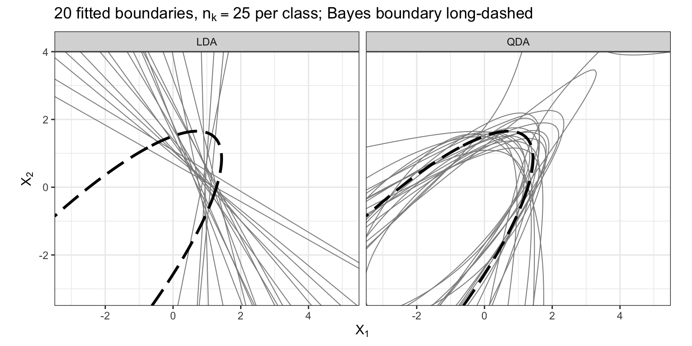
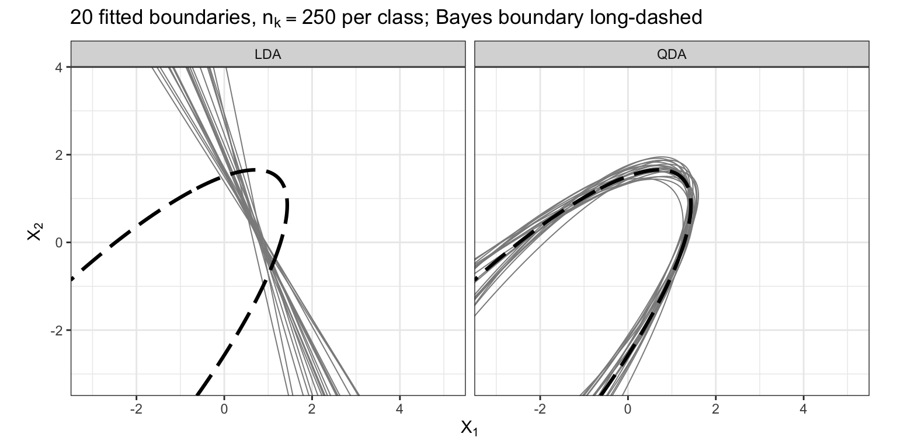

## Today

<!-- derived-from: 04-classification/60-qda-naive-bayes.qmd @ e347c90 -->

- QDA
- Bias-variance tradeoff
- Naive Bayes
- Classifier comparison

# Generative classifiers

## Credit card default data

ISLR2::Default · fit on a random half, test on the other half


::: notes
The data run through the whole lecture. The models are fit to the training half, so every error rate here is a test error rate, unlike the training rates of the LDA lecture. The defaulters' ellipse is narrower in balance, which one shared covariance matrix cannot describe. The same scatterplot returns at the start of QDA and of naive Bayes.
:::

## Bayes' theorem and LDA

$$p_k(x) = P(Y = k \mid X = x) = \frac{\pi_k f_k(x)}{\sum_{l=1}^K \pi_l f_l(x)}$$

::: {.fragment}
Generative classifiers differ only in the model for $f_k(x)$
:::

::: {.fragment}
- LDA: $X \mid Y = k \sim N_p\left(\mu_k, \Sigma\right)$, one $\Sigma$ shared
- QDA: class-specific $\Sigma_k$
- Naive Bayes: independent features
:::

::: notes
Recap of the LDA lecture. Every generative classifier estimates the prior by n_k / n. The next two sections change f_k(x) in the two directions the list names.
:::

# Quadratic Discriminant Analysis

## Class-specific covariance matrices

::: {style="font-size: 0.85em"}
$$P(Y = k) = \pi_k, \qquad X \mid Y = k \sim N_p\left(\mu_k, \Sigma_k\right), \qquad k = 1, \ldots, K$$
:::

Own $\Sigma_k$ in every class

::: {.fragment}
::: {style="font-size: 0.8em"}
$$\widehat\Sigma_k = \frac{1}{n_k - 1}\sum_{i:\, y_i = k}\left(x_i - \widehat\mu_k\right)\left(x_i - \widehat\mu_k\right)^\top$$
:::

Each $\Sigma_k$ from its own class alone, divisor $n_k - 1$; $\widehat\pi_k$ and $\widehat\mu_k$ as in LDA
:::

::: notes
The ellipses of the scatterplot now each get their own size, shape and orientation. The estimate is invertible only if n_k > p, which is why the defaulters' small class matters later.
:::

## Fitting QDA

:::: {.columns}
::: {.column width="52%"}
```r
set.seed(20261001)
train_id <- sample(nrow(Default),
                   nrow(Default) / 2)
train <- Default[train_id, ]

default_qda <- MASS::qda(
  default ~ balance + income,
  data = train)
default_qda
```
:::
::: {.column width="48%"}
```
Call:
qda(default ~ balance + income, data = train)

Prior probabilities of groups:
    No    Yes
0.9648 0.0352

Group means:
      balance   income
No   808.2541 33549.49
Yes 1732.5500 32482.56
```
:::
::::

::: notes
Same formula as MASS::lda(). The printout gives the priors and the class means, the same ones lda() reports for these training customers. The covariance matrices are not printed.
:::

## Estimated covariance matrices

Squared dollars: balance, income

::: {style="font-size: 0.9em"}
$$\widehat\Sigma_{\text{No}} = \begin{pmatrix} 210{,}058 & -917{,}043 \\ -917{,}043 & 178{,}743{,}544 \end{pmatrix}$$

$$\widehat\Sigma_{\text{Yes}} = \begin{pmatrix} 117{,}154 & -449{,}601 \\ -449{,}601 & 188{,}550{,}929 \end{pmatrix}$$
:::

::: notes
The matrices qda() does not print. The square-rooted diagonals are the standard deviations quoted with the scatterplot.
:::

## Quadratic discriminant {.smaller}

::: {style="font-size: 0.75em"}
$$\log\left[\pi_k f_k(x)\right] = \log \pi_k - \frac{p}{2}\log(2\pi) - \frac{1}{2}\log\left|\Sigma_k\right| - \frac{1}{2}\left(x - \mu_k\right)^\top \Sigma_k^{-1}\left(x - \mu_k\right)$$
:::

::: {.fragment}
Dropping the terms that do not involve $k$ gives the discriminant function

::: {style="font-size: 0.8em"}
$$\delta_k(x) = -\frac{1}{2}x^\top \Sigma_k^{-1} x + x^\top \Sigma_k^{-1}\mu_k - \frac{1}{2}\mu_k^\top \Sigma_k^{-1}\mu_k - \frac{1}{2}\log\left|\Sigma_k\right| + \log \pi_k$$
:::

Quadratic in $x$
:::

::: notes
For QDA the only term dropped is -(p/2) log(2 pi). Contrast LDA, where the x' Sigma^-1 x and log|Sigma| terms were the same in every class and dropped out. Here both survive because Sigma_k differs by class: the quadratic term is the new curvature, and -1/2 log|Sigma_k| penalizes a class spread over a larger volume. With a common Sigma both cancel and delta_k reduces to the LDA discriminant.
:::

## Quadratic decision boundary

::: {style="font-size: 0.85em"}
$$\begin{aligned}
\log\left[\frac{p_2(x)}{1 - p_2(x)}\right] &= \delta_2(x) - \delta_1(x) \\
&= \beta_0 + x^\top\left(\Sigma_2^{-1}\mu_2 - \Sigma_1^{-1}\mu_1\right) - \frac{1}{2}x^\top \left(\Sigma_2^{-1} - \Sigma_1^{-1}\right) x
\end{aligned}$$
:::

::: {.fragment}
Boundary: log posterior odds $= 0$, a conic section when $p = 2$; up to two points when $p = 1$
:::

::: notes
An intercept, p linear terms and p(p+1)/2 squares and cross-products. The boundary is a curve, not a line.
:::

## QDA log posterior odds

Estimated log posterior odds of default; income terms per \$1,000

|Term                                                   |      Coefficient       |
|:------------------------------------------------------|:----------------------:|
|Intercept $\widehat\beta_0$                            |        $-14.5$         |
|$\texttt{balance}$                                     |        $0.0108$        |
|$\texttt{income}$, per \$1,000                         | $-2.73 \times 10^{-3}$ |
|$\texttt{balance}^2$                                   | $-1.87 \times 10^{-6}$ |
|$\texttt{balance} \times \texttt{income}$, per \$1,000 | $4.44 \times 10^{-6}$  |
|$\texttt{income}^2$, per (\$1,000)$^2$                 | $1.85 \times 10^{-4}$  |

::: notes
With squares and cross-products no single coefficient is the effect of balance. The negative balance-squared coefficient is what bends the boundary back on the next slide.
:::

## QDA and LDA boundaries


::: notes
The shaded region is beyond the largest training balance, so the second branch is an extrapolation of Gaussian tails.
:::

## Second boundary branch

One feature: the class with the larger variance is assigned in both tails

::: {.panel-tabset}

### Prior-weighted densities


### Discriminant functions


:::

::: notes
With balance alone the discriminant functions are two downward parabolas that cross twice, where the LDA lecture's straight lines crossed once. The second crossing is past every customer in either half.
:::

## Bias-variance tradeoff

::: {style="font-size: 0.9em"}
$$\text{LDA: } Kp + \frac{p(p+1)}{2}, \qquad \text{QDA: } Kp + K\,\frac{p(p+1)}{2}$$
:::

::: {.fragment}
With $K = 2$ classes:

| Features $p$ |  LDA  |  QDA  |
|:------------:|:-----:|:-----:|
|      1       |   3   |   4   |
|      2       |   7   |  10   |
|      5       |  25   |  40   |
|      10      |  75   |  130  |
|      50      | 1,375 | 2,650 |

Shared $\Sigma$: bias · Class $\Sigma_k$: variance
:::

::: notes
The counts exclude the K - 1 free priors. QDA's count grows like K p^2 / 2 against LDA's p^2 / 2. LDA's shared Sigma makes its boundary the wrong shape however much data it sees. Each of QDA's covariance estimates comes from one class's observations alone and varies from one training set to the next. For the credit card data QDA estimates the defaulters' three covariance entries from only the training defaulters.
:::

## Boundary variability

LDA's bias stays; QDA's variance shrinks with $n$

::: {.panel-tabset}

### Small training sets



### Large training sets



:::

::: notes
Simulated data with a known Bayes boundary, since the credit card data cannot supply one: 20 fitted boundaries per panel. Small n_k: LDA lines vary in angle and miss the curvature, QDA curves follow the shape but scatter. Large n_k: LDA tightens around one line that still misses the curvature, QDA collapses onto the Bayes boundary. So LDA wins when n is small relative to the covariance parameters or the Sigma_k are close to equal, QDA when they clearly differ and n is large enough.
:::

# Naive Bayes

## Conditional independence

::: {style="font-size: 0.75em"}
$$P(Y = k) = \pi_k, \qquad X_1, \ldots, X_p \text{ are independent given } Y = k, \qquad X_j \mid Y = k \sim f_{kj}$$
:::

::: {.fragment}
::: {style="font-size: 0.85em"}
$$f_k(x) = f_{k1}(x_1) \times f_{k2}(x_2) \times \cdots \times f_{kp}(x_p) = \prod_{j=1}^p f_{kj}(x_j)$$
:::

Each $f_{kj}$ modeled and estimated on its own; features of different types, densities of different types
:::

::: notes
The same scatterplot as the first slide: the ellipses tilt only slightly, so ignoring the within-class correlation ignores only that tilt. The assumption is conditional on the class: features can be independent within each class and correlated overall.
:::

## Mixed feature types

- Quantitative: Gaussian, $X_j \mid Y = k \sim N\left(\mu_{kj}, \sigma_{kj}^2\right)$
- Binary: Bernoulli, $\theta_{kj} = P(X_j = 1 \mid Y = k)$
- Categorical: one probability per level in each class

::: {.fragment}
```
     student
Y            No       Yes
  No  0.7039801 0.2960199
  Yes 0.6363636 0.3636364
```
:::

::: notes
The second column of the student table is theta-hat_k, the share of students among each class's training customers: about 30% of non-defaulters and 36% of defaulters. No Gaussian assumption is made for student, but conditional independence still is, so the term ignores that students have much lower incomes.
:::

## Fitting naive Bayes

:::: {.columns}
::: {.column width="52%"}
```r
default_nb <- e1071::naiveBayes(
  default ~ balance + income,
  data = train)

default_nb
```
:::
::: {.column width="48%"}
::: {style="font-size: 0.8em"}
```

Naive Bayes Classifier for Discrete Predictors

Call:
naiveBayes.default(x = X, y = Y, laplace = laplace)

A-priori probabilities:
Y
    No    Yes
0.9648 0.0352

Conditional probabilities:
     balance
Y          [,1]     [,2]
  No   808.2541 458.3208
  Yes 1732.5500 342.2770

     income
Y         [,1]     [,2]
  No  33549.49 13369.50
  Yes 32482.56 13731.38
```
:::
:::
::::

::: notes
Same formula again; train is the split from the QDA fitting slide. A-priori probabilities are the pi-hat_k, the same as QDA's. Under Conditional probabilities the first column is each class's mean and the second its standard deviation, the Gaussian mu-hat_kj and sigma-hat_kj. The header "Naive Bayes Classifier for Discrete Predictors" is e1071's fixed label although both features are continuous.
:::

## Additive log posterior odds

::: {style="font-size: 0.75em"}
$$\log\left[\frac{p_2(x)}{1 - p_2(x)}\right] = \log\frac{\pi_2}{\pi_1} + \sum_{j=1}^p \log\frac{f_{2j}(x_j)}{f_{1j}(x_j)} = \log\frac{\pi_2}{\pi_1} + \sum_{j=1}^p g_j(x_j)$$
:::

::: {.fragment}
$g_j(x_j)$ — contribution of feature $j$
:::

::: {.fragment}
Additive model, no interactions
:::

::: notes
The log of a product is a sum, so each feature shifts the log odds by an amount that does not depend on the other features' values. Gaussian with class-specific variances makes g_j quadratic in x_j; with a shared variance it is linear; Bernoulli is linear.
:::

## Diagonal covariance

::: {style="font-size: 0.8em"}
$$\begin{aligned}
&\prod_{j=1}^p \frac{1}{\sqrt{2\pi}\,\sigma_{kj}}\exp\left[-\frac{\left(x_j - \mu_{kj}\right)^2}{2\sigma_{kj}^2}\right] \\
&= \frac{1}{(2\pi)^{p/2}\left|\Lambda_k\right|^{1/2}}\exp\left[-\frac{1}{2}\left(x - \mu_k\right)^\top \Lambda_k^{-1}\left(x - \mu_k\right)\right]
\end{aligned}$$
:::

::: {.fragment}
$$\Lambda_k = \text{diag}\left(\sigma_{k1}^2, \ldots, \sigma_{kp}^2\right)$$

Gaussian naive Bayes is QDA with every $\Sigma_k$ diagonal; shared variances, LDA with $\Sigma$ diagonal
:::

::: notes
For these customers the naive Bayes means are QDA's and its standard deviations are the square roots of the diagonals of QDA's covariance estimates. Lambda-hat_k is Sigma-hat_k with the within-class correlation set to zero.
:::

## Parameter count

$$\text{Gaussian naive Bayes: } 2Kp, \qquad \text{QDA: } Kp + Kp(p+1)/2$$

$K = 2$, $p = 50$: 200 against 2,650

Linear in $p$, each parameter from one feature in one class

::: notes
The saving is larger still for binary features: a joint probability mass function has 2^p cells per class, against p Bernoulli probabilities. The price is bias whenever features are dependent within a class, which only matters if it changes the side of the threshold.
:::

## Naive Bayes boundary


::: notes
The two boundaries stay close within the training balances. Naive Bayes's balance term is quadratic for the same reason as QDA's.
:::

# Classifier comparison

## KNN classification

$$\widehat p_{\text{Yes}}(x_0) = \frac{1}{K}\sum_{i \in \mathcal{N}_0}\mathrm{I}(y_i = \text{Yes})$$

$\mathcal{N}_0$ — the $K$ training points closest to $x_0$; assign Yes when the vote exceeds $0.5$

::: notes
The flexibility lecture's KNN, now with a vote. Features are standardized first. K is fixed at the smallest odd integer above the square root of n here: 71 for these 5,000 training customers, a rule of thumb, since choosing K from the data is the next unit. From here to the end of the comparison K is the number of neighbors, not the number of classes.
:::

## Fitted boundaries


::: notes
At middle incomes, near where most defaulters sit, the five boundaries lie close together. QDA and naive Bayes have second branches beyond the training balances; KNN's course out there is also an extrapolation.
:::

## Boundary shapes

::: {style="font-size: 0.85em"}
$$\begin{aligned}
\text{Logistic regression, LDA: } & \beta_0 + \sum_{j=1}^p \beta_j x_j, \\
\text{QDA: } & \beta_0 + \sum_{j=1}^p \beta_j x_j + \sum_{j \le l} \gamma_{jl} x_j x_l, \\
\text{Gaussian naive Bayes: } & \beta_0 + \sum_{j=1}^p \left(\beta_j x_j + \gamma_{jj} x_j^2\right)
\end{aligned}$$
:::

KNN: no formula, any shape

::: notes
Logistic regression and LDA share the linear form and differ only in estimation. Naive Bayes is the most restricted quadratic form, QDA's with only the squares. First to drop if time is short, since the next slide states the same assumptions.
:::

## Five classifiers

|Method               |Assumption                             |Estimation         |
|:--------------------|:--------------------------------------|:------------------|
|Logistic regression  |Linear log-odds                        |Iterative          |
|LDA                  |Gaussian, shared covariance            |Closed form        |
|QDA                  |Gaussian, class covariances            |Closed form        |
|Gaussian naive Bayes |Features independent within each class |Closed form        |
|KNN                  |Smooth class probabilities             |None (stores data) |

Increasing $n$ favors QDA and KNN · increasing $p$ favors naive Bayes and LDA

::: notes
Increasing n favors the more flexible methods, whose lower bias becomes affordable. Increasing p favors the more restricted ones, since naive Bayes's count grows linearly in p and LDA's like p^2 / 2 against QDA's p^2. KNN suffers most from the curse of dimensionality and has no coefficients to interpret.
:::

## Simulated scenarios

Each scenario makes a different method's assumptions hold

::: {.panel-tabset}

### Scenarios


### Test error rates


:::

::: notes
Four scenarios with equal priors: linear, quadratic, independent with p = 10, and non-linear (a sine boundary with 10% of labels flipped). 100 training sets of 100 observations per scenario, scored on one large test set. The dashed line is the Bayes error rate, the floor no classifier beats on average. The winner in the quadratic, independent and non-linear scenarios is the most restrictive method whose assumptions still hold. With K = 1 KNN's variance erases its non-linear advantage.
:::

## Test performance

Fit on the training half; scored on the test half at threshold $0.5$

|Model               | Training error | Test error | Test sensitivity | Test specificity | Test AUC |
|:-------------------|:--------------:|:----------:|:----------------:|:----------------:|:--------:|
|Logistic regression |     2.78%      |   2.46%    |      31.85%      |      99.67%      |  0.9551  |
|LDA                 |     2.96%      |   2.54%    |      24.84%      |      99.81%      |  0.9553  |
|QDA                 |     2.92%      |   2.52%    |      27.39%      |      99.75%      |  0.9550  |
|Naive Bayes         |     3.12%      |   2.46%    |      28.03%      |      99.79%      |  0.9533  |
|KNN, K = 1          |     0.00%      |   4.18%    |      29.94%      |      97.96%      |  0.6395  |
|KNN, K = 71         |     3.12%      |   2.88%    |      10.83%      |      99.92%      |  0.9326  |

::: notes
The four model-based classifiers have test error rates within a narrow range, only a few points better than predicting No for every customer, and differ more in sensitivity. KNN with K = 1 shows the optimism plainly: a training error rate of 0.00% against its test rate. To answer the opening question on this split, QDA and naive Bayes do no better than LDA and logistic regression, and both KNN classifiers do worse than every model-based classifier.
:::

## Student strata

Stratifying changes no test error rate by more than 0.14 percentage points

|Model                                        | Training error | Test error | Test sensitivity | Test AUC |
|:--------------------------------------------|:--------------:|:----------:|:----------------:|:--------:|
|QDA, single fit                              |     2.92%      |   2.52%    |      27.39%      |  0.9550  |
|QDA, by student stratum                      |     2.78%      |   2.66%    |      24.84%      |  0.9533  |
|Logistic regression, additive                |     2.78%      |   2.46%    |      31.85%      |  0.9551  |
|Logistic regression, interacted with student |     2.82%      |   2.56%    |      30.57%      |  0.9547  |

::: notes
An additional analysis: QDA fit separately to students and non-students beside a logistic regression interacted with student status. Each stratified model estimates twice as many parameters, which tends to make its training error rate more optimistic, so the test rates are the fair comparison.
:::

## Conclusion

- QDA
- Quadratic boundary
- Bias-variance tradeoff
- Naive Bayes
- Conditional independence
- Diagonal covariance
- Classifier comparison
