## Today

<!-- derived-from: 04-classification/60-qda-naive-bayes.qmd @ 45bb1b2 -->

- QDA
- Naive Bayes
- KNN
- Comparing methods

# Motivation

## Credit card default data

ISLR2::Default · fit on a random half, test on the other half

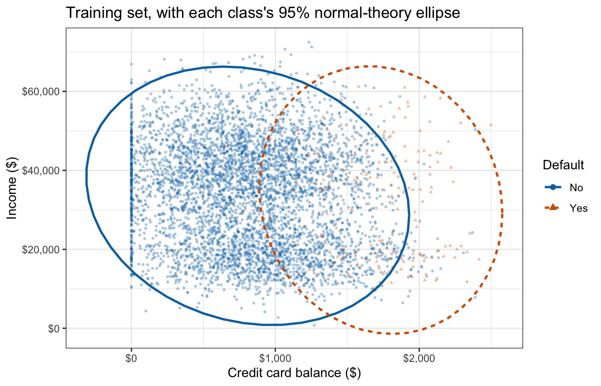

::: notes
The data run through the whole lecture. The models are fit to the training half, so every error rate here is a test error rate, unlike the training rates of the Classifier Evaluation lecture. The defaulters' ellipse is narrower in balance, which one shared covariance matrix cannot describe. The same scatterplot returns with the fitted QDA class contours and at the start of naive Bayes.
:::

## Generative classifiers

$$p_k(x) \propto \pi_k f_k(x)$$

$$Y_i \stackrel{ind}{\sim} \text{Categorical}\left(\pi_1, \ldots, \pi_K\right), \qquad i = 1, \ldots, n$$

::: {.fragment}
Generative classifiers differ only in the model for $f_k(x)$

::: {style="font-size: 0.8em"}
| Classifier           | Distribution                                                     |
|:---------------------|:-----------------------------------------------------------------|
| LDA                  | $X_i \mid Y_i = k \stackrel{ind}{\sim} N_p\left(\mu_k, \Sigma\right)$   |
| QDA                  | $X_i \mid Y_i = k \stackrel{ind}{\sim} N_p\left(\mu_k, \Sigma_k\right)$  |
| Naive Bayes          | $X_{ij} \mid Y_i = k \stackrel{ind}{\sim} f_{kj}, \quad j = 1, \ldots, p$  |
| Gaussian naive Bayes | $X_i \mid Y_i = k \stackrel{ind}{\sim} N_p\left(\mu_k, \Lambda_k\right)$ |
:::
:::

::: {.fragment}
$\Lambda_k$: diagonal covariance matrix
:::

::: notes
Recap of the LDA lecture. Every generative classifier estimates the prior by n_k / n. The next two sections change f_k(x) in the two directions the second and third models name: a covariance matrix for each class, and independent features.
:::

# Quadratic Discriminant Analysis

## Class-specific covariance matrices

::: {style="font-size: 0.75em"}
$$Y_i \stackrel{ind}{\sim} \text{Categorical}\left(\pi_1, \ldots, \pi_K\right), \qquad X_i \mid Y_i = k \stackrel{ind}{\sim} N_p\left(\mu_k, \Sigma_k\right), \qquad i = 1, \ldots, n$$
:::

Own $\Sigma_k$ in every class

::: {.fragment}
::: {style="font-size: 0.9em"}
$$\widehat\Sigma_k = \frac{1}{n_k - 1}\sum_{i:\, y_i = k}\left(x_i - \widehat\mu_k\right)\left(x_i - \widehat\mu_k\right)^\top$$
:::

Each $\Sigma_k$ from its own class alone, divisor $n_k - 1$; $\widehat\pi_k$ and $\widehat\mu_k$ as in LDA
:::

::: notes
The ellipses of the first scatterplot now each get their own size, shape and orientation. The estimate is invertible only if n_k > p.
:::

## Fitting QDA

:::: {.columns}
::: {.column width="52%"}
```r
set.seed(20261001)
train_id <- sample(nrow(Default),
                   nrow(Default) / 2)
train <- Default[train_id, ]

default_qda <- MASS::qda(
  default ~ balance + income,
  data = train)
default_qda
```
:::
::: {.column width="48%"}
```
Call:
qda(default ~ balance + income, data = train)

Prior probabilities of groups:
    No    Yes
0.9648 0.0352

Group means:
      balance   income
No   808.2541 33549.49
Yes 1732.5500 32482.56
```
:::
::::

::: notes
Same formula as MASS::lda(). The printout gives the priors and the class means, the same ones lda() reports for these training customers. The covariance matrices are not printed.
:::

## Fitted class contours

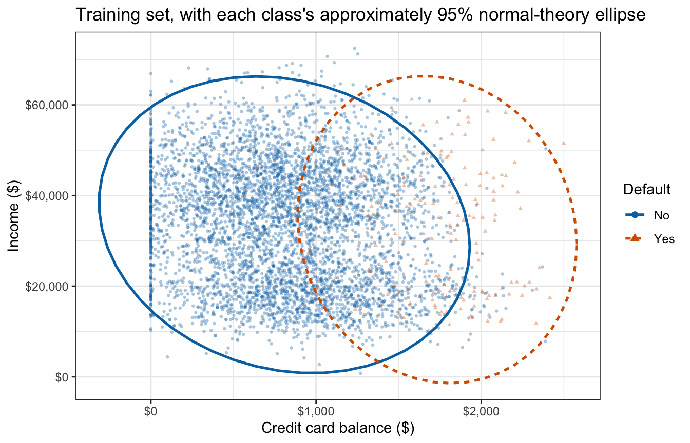

::: notes
This is QDA's fit: the two ellipses have their own size and orientation. qda() does not print the covariance matrices, but these contours are them. The square-rooted diagonals and correlations are the standard deviations and correlations quoted with the first scatterplot.
:::

## Quadratic discriminant

::: {style="font-size: 0.85em"}
$$\log\left[\pi_k f_k(x)\right] = \log \pi_k - \frac{p}{2}\log(2\pi) - \frac{1}{2}\log\left|\Sigma_k\right| - \frac{1}{2}\left(x - \mu_k\right)^\top \Sigma_k^{-1}\left(x - \mu_k\right)$$
:::

::: {.fragment}
Dropping the terms that do not involve $k$ gives the discriminant function

::: {style="font-size: 0.78em"}
$$\delta_k(x) = -\frac{1}{2}x^\top \Sigma_k^{-1} x + x^\top \Sigma_k^{-1}\mu_k - \frac{1}{2}\mu_k^\top \Sigma_k^{-1}\mu_k - \frac{1}{2}\log\left|\Sigma_k\right| + \log \pi_k$$
:::

Quadratic in $x$
:::

::: notes
For QDA the only term dropped is -(p/2) log(2 pi). Contrast LDA, where the x' Sigma^-1 x and log|Sigma| terms were the same in every class and dropped out. Here both survive because Sigma_k differs by class: the quadratic term is the new curvature, and -1/2 log|Sigma_k| penalizes a class spread over a larger volume. With a common Sigma both cancel and delta_k reduces to the LDA discriminant.
:::

## Quadratic decision boundary

::: {style="font-size: 0.85em"}
$$\begin{aligned}
\log\left[\frac{p_2(x)}{1 - p_2(x)}\right] &= \delta_2(x) - \delta_1(x) \\
&= \beta_0 + x^\top\left(\Sigma_2^{-1}\mu_2 - \Sigma_1^{-1}\mu_1\right) - \frac{1}{2}x^\top \left(\Sigma_2^{-1} - \Sigma_1^{-1}\right) x
\end{aligned}$$
:::

::: {.fragment}
Boundary: log posterior odds $= 0$

- Two features: a conic section
- One feature: up to two points
:::

::: notes
An intercept, p linear terms and p(p+1)/2 squares and cross-products. The boundary is a curve, not a line.
:::

## One feature

::: {.panel-tabset}

### Prior-weighted densities

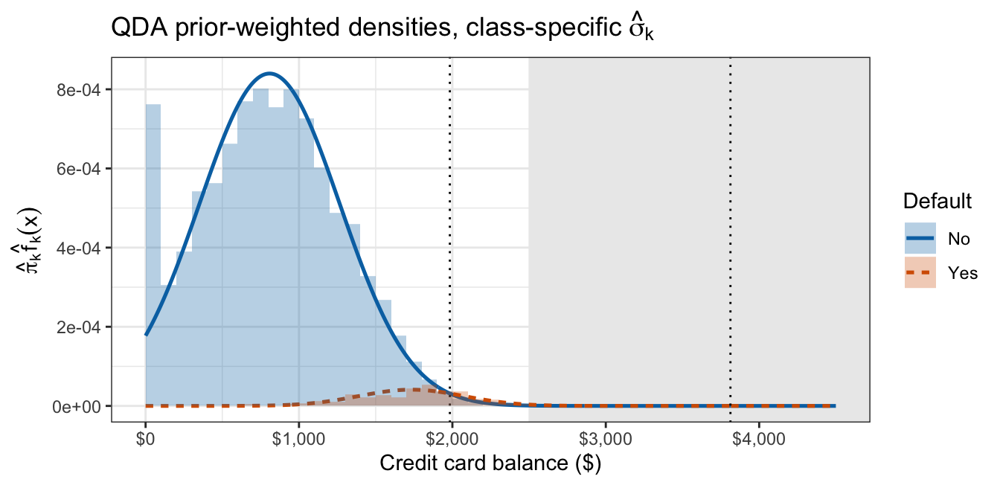

### Discriminant functions

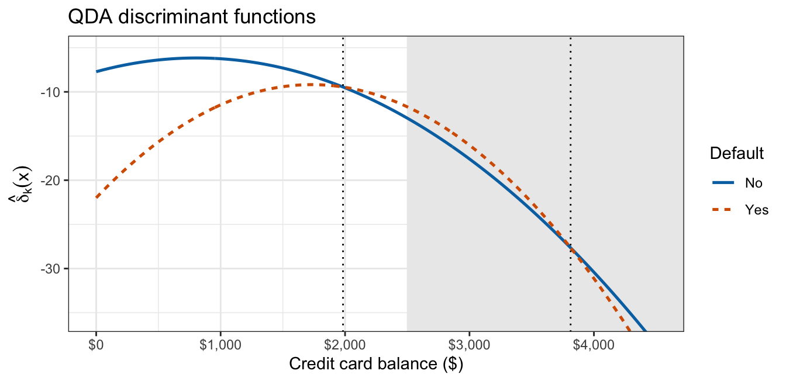

:::

The class with the larger variance is assigned in both tails

::: notes
With balance alone the discriminant functions are two downward parabolas that cross twice, where the LDA lecture's straight lines crossed once. The second crossing is past every customer in either half.
:::

## Two features

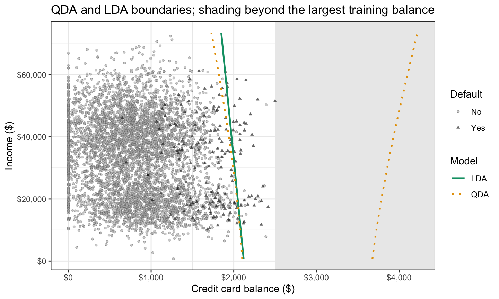

::: notes
The shaded region is beyond the largest training balance, so the second branch is an extrapolation of Gaussian tails.
:::

# Naive Bayes

## Conditional independence

::: {style="font-size: 0.7em"}
$$Y_i \stackrel{ind}{\sim} \text{Categorical}\left(\pi_1, \ldots, \pi_K\right), \qquad X_{ij} \mid Y_i = k \stackrel{ind}{\sim} f_{kj}, \qquad i = 1, \ldots, n, \quad j = 1, \ldots, p$$
:::

$\stackrel{ind}{\sim}$ — independent over observations $i$ and features $j$

::: {.fragment}
::: {style="font-size: 0.85em"}
$$f_k(x) = f_{k1}(x_1) \times f_{k2}(x_2) \times \cdots \times f_{kp}(x_p) = \prod_{j=1}^p f_{kj}(x_j)$$
:::

Each $f_{kj}$ modeled and estimated on its own; features of different types, densities of different types
:::

::: notes
The same scatterplot as the first slide: the ellipses tilt only slightly, so ignoring the within-class correlation ignores only that tilt. Independence over observations is what LDA and QDA also assume; independence over features given the class is the naive assumption. The assumption is conditional on the class: features can be independent within each class and correlated overall.
:::

## Mixed feature types

::: {style="font-size: 0.85em"}
- Quantitative: Gaussian, $X_{ij} \mid Y_i = k \stackrel{ind}{\sim} N\left(\mu_{kj}, \sigma_{kj}^2\right)$
- Binary: Bernoulli, $X_{ij} \mid Y_i = k \stackrel{ind}{\sim} \text{Bernoulli}\left(\theta_{kj}\right)$, with $\theta_{kj} = P(X_{ij} = 1 \mid Y_i = k)$
- Categorical: $X_{ij} \mid Y_i = k \stackrel{ind}{\sim} \text{Categorical}\left(\theta_{kj1}, \ldots, \theta_{kjM_j}\right)$
:::

::: notes
Each f_kj describes one feature in one class, so a feature of any type enters through its own density. naiveBayes() keeps the Gaussian densities for balance and income and adds a probability table for student. No Gaussian assumption is made for student, but conditional independence still is, so the term ignores that students have much lower incomes.
:::

## Fitting naive Bayes

:::: {.columns}
::: {.column width="52%"}
```r
default_nb <- e1071::naiveBayes(
  default ~ balance + income,
  data = train)

default_nb
```
:::
::: {.column width="48%"}
::: {style="font-size: 0.8em"}
```

Naive Bayes Classifier for Discrete Predictors

Call:
naiveBayes.default(x = X, y = Y, laplace = laplace)

A-priori probabilities:
Y
    No    Yes
0.9648 0.0352

Conditional probabilities:
     balance
Y          [,1]     [,2]
  No   808.2541 458.3208
  Yes 1732.5500 342.2770

     income
Y         [,1]     [,2]
  No  33549.49 13369.50
  Yes 32482.56 13731.38
```
:::
:::
::::

::: notes
Same formula again; train is the split from the QDA fitting slide. A-priori probabilities are the pi-hat_k, the same as QDA's. Under Conditional probabilities the first column is each class's mean and the second its standard deviation, the Gaussian mu-hat_kj and sigma-hat_kj. The header "Naive Bayes Classifier for Discrete Predictors" is e1071's fixed label although both features are continuous.

laplace = 0 in the printed call is e1071's default, meaning no smoothing. A positive value adds that count to every level of a categorical feature when estimating the class-conditional probabilities, so an unseen level does not get probability 0. It has no effect on numeric features such as balance and income.
:::

## Additive log posterior odds

::: {style="font-size: 0.85em"}
$$\log\left[\frac{p_2(x)}{1 - p_2(x)}\right] = \log\frac{\pi_2}{\pi_1} + \sum_{j=1}^p \log\frac{f_{2j}(x_j)}{f_{1j}(x_j)}$$
:::

::: {.fragment}
Feature $j$ contributes its own log ratio, $\log\left(f_{2j}(x_j)/f_{1j}(x_j)\right)$, a function of $x_j$ alone
:::

::: {.fragment}
Additive model, no interactions
:::

::: notes
The log of a product is a sum, so each feature shifts the log odds by an amount that does not depend on the other features' values. Gaussian with class-specific variances makes each log ratio quadratic in x_j; with a shared variance it is linear; Bernoulli is linear.
:::

## Diagonal covariance

::: {style="font-size: 0.85em"}
$$X_{ij} \mid Y_i = k \stackrel{ind}{\sim} N\left(\mu_{kj}, \sigma_{kj}^2\right)$$
:::

Given $Y_i = k$: a product of $p$ independent normal densities

::: {.fragment}
Equivalent to a multivariate normal with a diagonal covariance matrix

::: {style="font-size: 0.75em"}
$$Y_i \stackrel{ind}{\sim} \text{Categorical}\left(\pi_1, \ldots, \pi_K\right), \qquad X_i \mid Y_i = k \stackrel{ind}{\sim} N_p\left(\mu_k, \Lambda_k\right), \qquad i = 1, \ldots, n$$
:::

::: {style="font-size: 0.85em"}
$$\Lambda_k = \text{diag}\left(\sigma_{k1}^2, \ldots, \sigma_{kp}^2\right)$$
:::
:::

::: {.fragment}
Gaussian naive Bayes is QDA with every $\Sigma_k$ diagonal; shared variances, LDA with $\Sigma$ diagonal
:::

::: notes
The product of the p independent marginals is the same distribution as the multivariate normal with diagonal covariance. The independence over features appears as the zero off-diagonal entries of Lambda_k. For these customers the naive Bayes means are QDA's and its standard deviations are the square roots of the diagonals of QDA's covariance estimates. Lambda-hat_k is Sigma-hat_k with the within-class correlation set to zero.
:::

## Naive Bayes boundary

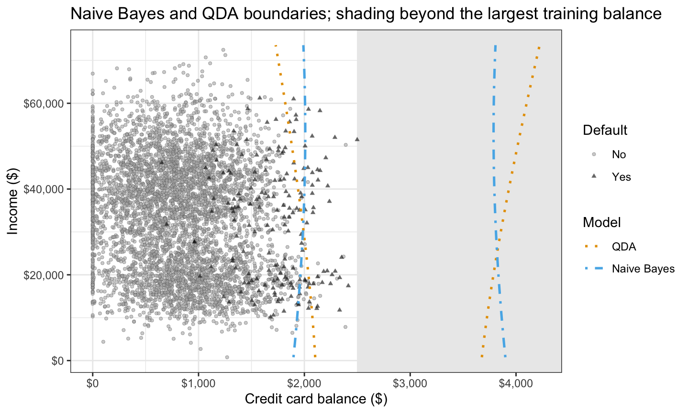

::: notes
The two boundaries stay close within the training balances. Naive Bayes's balance term is quadratic for the same reason as QDA's.
:::

# K-Nearest Neighbors

## KNN classification

$$\widehat p_k(x_0) = \frac{1}{K}\sum_{i \in \mathcal{N}_0}\mathrm{I}(y_i = k)$$

- $x_0$ — feature vector to classify
- $\mathcal{N}_0$ — the $K$ training points closest to $x_0$
- $K$ — number of neighbors (not the number of classes)

::: {.fragment}
Neighbors vote!
:::

::: {.fragment}
Assign $x_0$ to the class with the largest $\widehat p_k(x_0)$
:::

::: notes
The flexibility lecture's KNN, now with a vote. Features are standardized first. K is fixed at the smallest odd integer above the square root of n here: 71 for these 5,000 training customers, a rule of thumb, since choosing K from the data is the next unit. From here to the end of the comparison K is the number of neighbors, not the number of classes.
:::

## Fitting KNN

:::: {.columns}
::: {.column width="52%"}
::: {style="font-size: 0.8em"}
```r
k_default <-
  odd_above_sqrt(nrow(train))

standardize <- function(d) {
  cbind(
    (d$balance -
       mean(train$balance)) /
      sd(train$balance),
    (d$income -
       mean(train$income)) /
      sd(train$income))
}

new_customers <- tibble(
  balance = c(1000, 2000, 2500),
  income = 40000)
knn_new <- class::knn(
  train = standardize(train),
  test = standardize(new_customers),
  cl = train$default,
  k = k_default, prob = TRUE)
knn_new
```
:::
:::
::: {.column width="48%"}
```
[1] No  Yes Yes
attr(,"prob")
[1] 1.0000000 0.5352113 0.7183099
Levels: No Yes
```
:::
::::

::: notes
class::knn() fits and classifies in one call. It takes the standardized training features, the standardized features of the customers to classify, the training classes and the number of neighbors; with prob = TRUE it also returns the winning class's share of the vote. Three customers with the same income and increasing balances: No with every neighbor in the vote, then Yes with 0.535, then Yes with 0.718. The estimate p-hat_Yes(x_0) is the vote share when the class is Yes and one minus it when the class is No.

Sources: k_default and standardize() are the chapter's knn-fit chunk (the Code callout under KNN boundary); k_default is 71 here. odd_above_sqrt() is defined in the chapter's setup chunk and is not on the slide. standardize() has its two long expressions wrapped. new_customers and the class::knn() call are the chapter's visible knn-new-customers chunk, and the printout is its frozen console output, verbatim. train is the split from the Fitting QDA slide.
:::

## KNN boundary

The boundary follows no formula: a jagged curve traced by the vote of the nearest training customers

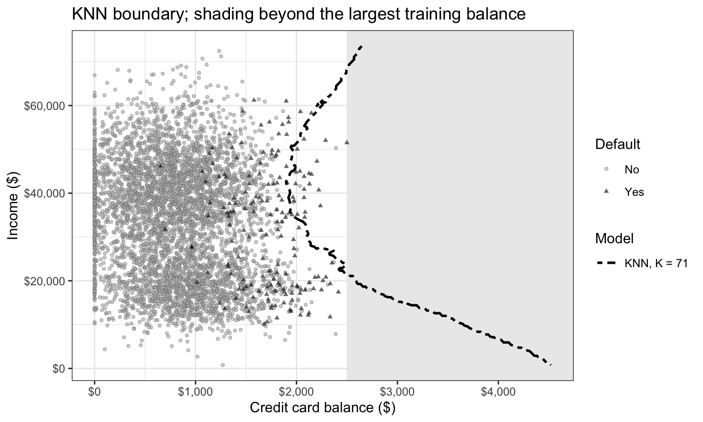

::: notes
Optional. The KNN-only boundary, K = 71 as in Fitting KNN. It is the chapter's own description: the boundary follows no formula, it is traced by the vote of the nearest training customers, and beyond the largest training balance it is still a vote among the same customers at the edge of the data. The Fitted boundaries slide draws this same curve beside the other four.
:::

# Comparing methods

## Fitted boundaries

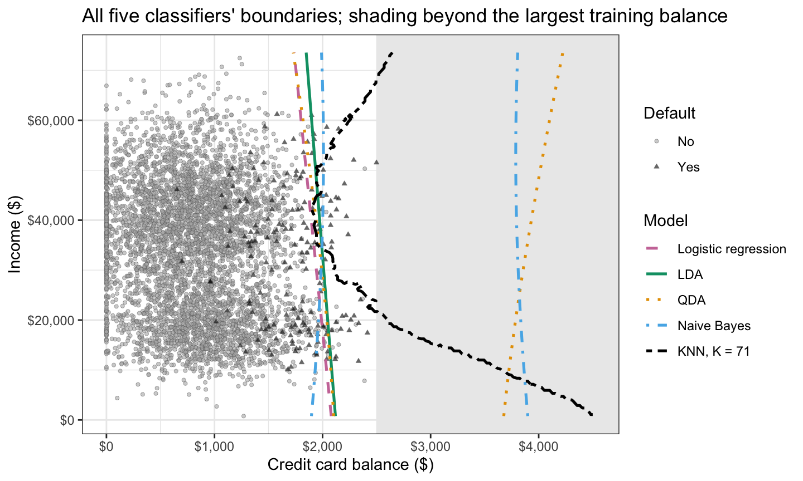

::: notes
At middle incomes, near where most defaulters sit, the five boundaries lie close together. QDA and naive Bayes have second branches beyond the training balances; KNN's course out there is also an extrapolation.
:::

## Boundary shapes

::: {style="font-size: 0.85em"}
$$\begin{aligned}
\text{LDA: } & \beta_0 + \sum_{j=1}^p \beta_j x_j, \\
\text{QDA: } & \beta_0 + \sum_{j=1}^p \beta_j x_j + \sum_{j \le l} \gamma_{jl} x_j x_l, \\
\text{Gaussian naive Bayes: } & \beta_0 + \sum_{j=1}^p \left(\beta_j x_j + \gamma_{jj} x_j^2\right)
\end{aligned}$$
:::

KNN: no formula, any shape

::: notes
LDA's log odds are linear in x, QDA's quadratic with squares and cross-products, and Gaussian naive Bayes's additive, quadratic in each feature. Logistic regression is the next slide's point. Second to drop if time is short, since the next slide states the same forms.
:::

## Boundary shapes: pairs

Logistic regression: linear in whatever features it is given

|Log-odds form                       |Generative classifier |       Its parameters       | Logistic regression features |     Its coefficients      |
|:-----------------------------------|:---------------------|:--------------------------:|:----------------------------:|:-------------------------:|
|Linear                              |LDA                   | $1 + 2p + p(p+1)/2$<br>(8) |            $x_j$             |      $1 + p$<br>(3)       |
|Additive, quadratic in each feature |Gaussian naive Bayes  |      $1 + 4p$<br>(9)       |        $x_j$, $x_j^2$        |      $1 + 2p$<br>(5)      |
|Quadratic                           |QDA                   | $1 + 2p + p(p+1)$<br>(11)  |  $x_j$, $x_j^2$, $x_j x_l$   | $1 + p + p(p+1)/2$<br>(6) |

Parameter counts for two classes; below each formula, in parentheses, $p = 2$

::: notes
Logistic regression is linear in whatever features it is given, so with squares among its features it has naive Bayes's form, and with squares and the product, QDA's. Each generative classifier and the logistic regression of its form can produce exactly the same boundaries. The difference is estimation, joint likelihood against conditional likelihood, and the generative classifier has more free parameters because it also describes the features' distribution within each class.
:::

## Boundary shapes: fitted pairs

Each pair's fitted $0.5$ boundary; beyond the training balances the pairs part

::: {.panel-tabset}

### Linear

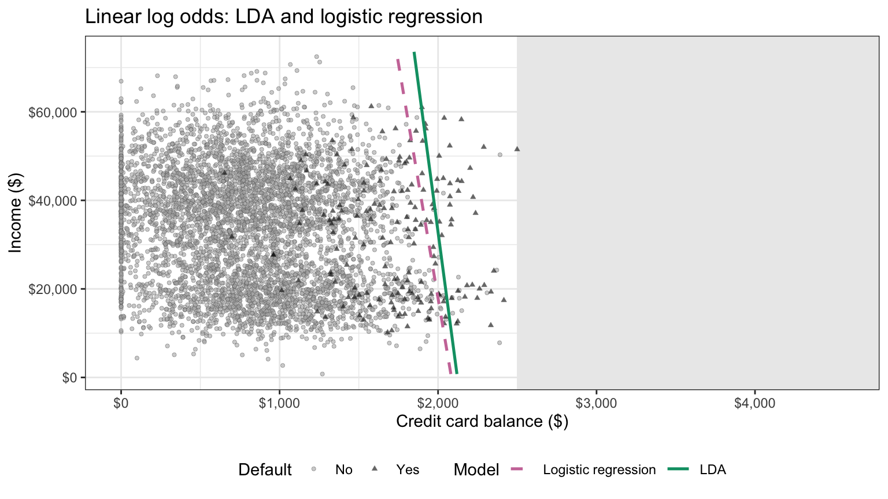

### Squares

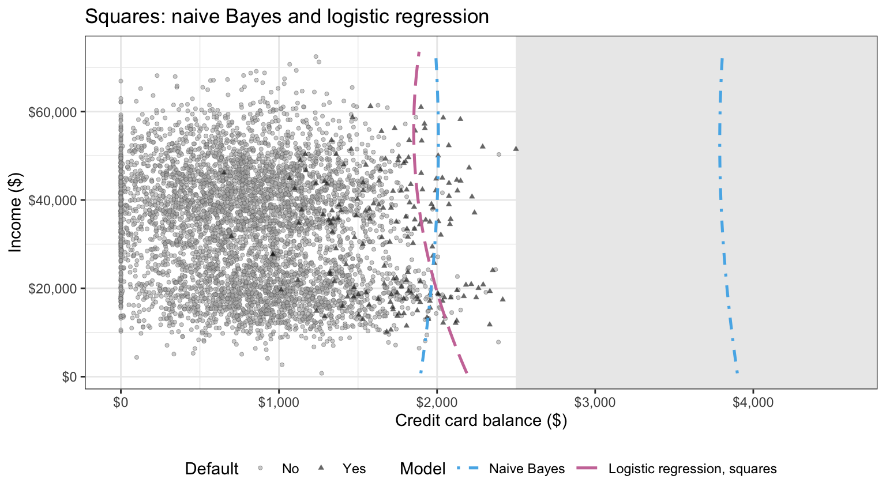

### Squares and product

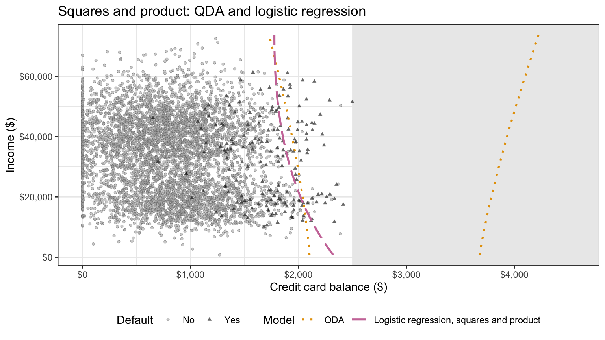

:::

::: notes
Within the training balances each pair's two boundaries cross 0.5 at nearly the same balances. Beyond them the pairs part: naive Bayes and the logistic regression with squares both bend back below 0.5, naive Bayes near $3,800 and the logistic regression only near $21,900; of QDA and the logistic regression with squares and product, only QDA crosses back. The pairs agree where there are data and part where there are none.
:::

## Simulated scenarios

Each scenario makes a different method's assumptions hold

::: {.panel-tabset}

### Scenarios

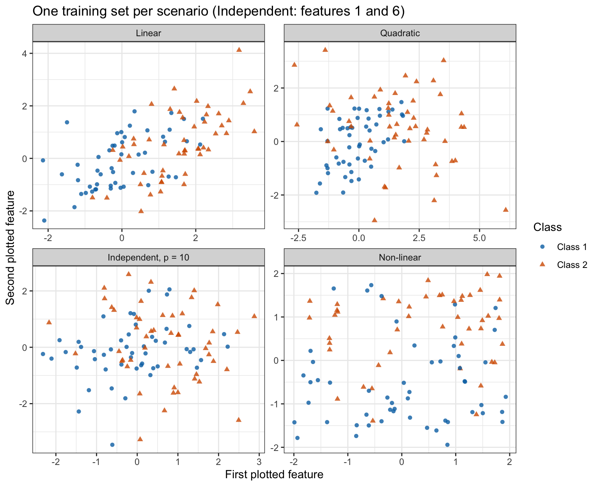

### Test error rates

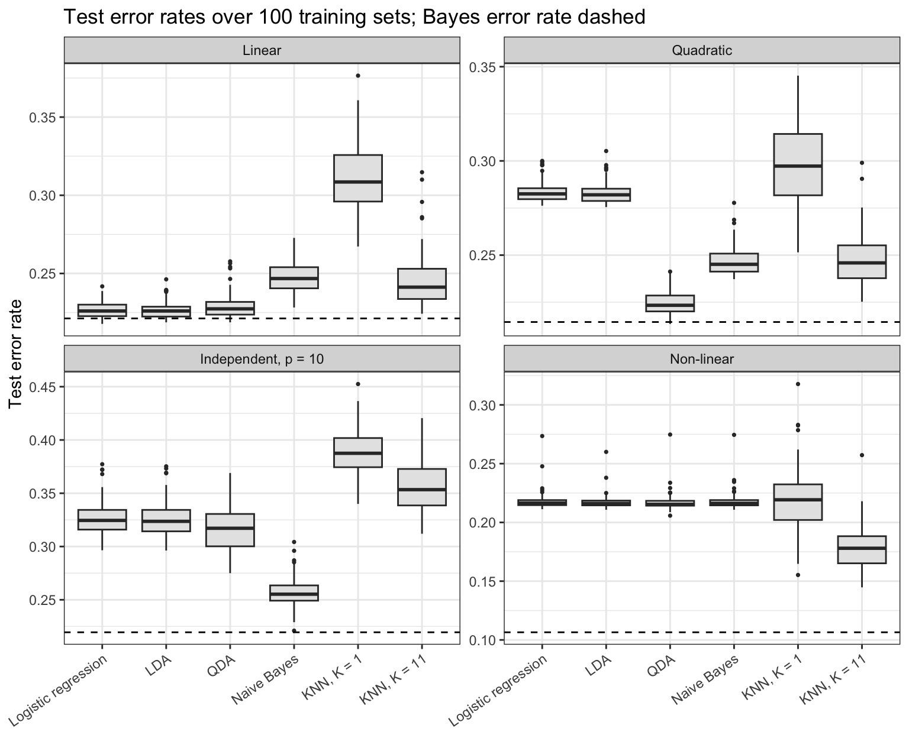

:::

::: notes
Four scenarios with equal priors: linear, quadratic, independent with p = 10, and non-linear (a sine boundary with 10% of labels flipped). 100 training sets of 100 observations per scenario, scored on one large test set. The dashed line is the Bayes error rate, the floor no classifier beats on average. The winner in the quadratic, independent and non-linear scenarios is the most restrictive method whose assumptions still hold. With K = 1 KNN's variance erases its non-linear advantage.
:::

## Test performance

Fit on the training half; scored on the test half at threshold $0.5$

|Model               | Training error | Test error | Test sensitivity | Test specificity | Test AUC |
|:-------------------|:--------------:|:----------:|:----------------:|:----------------:|:--------:|
|Logistic regression |     2.78%      |   2.46%    |      31.85%      |      99.67%      |  0.9551  |
|LDA                 |     2.96%      |   2.54%    |      24.84%      |      99.81%      |  0.9553  |
|QDA                 |     2.92%      |   2.52%    |      27.39%      |      99.75%      |  0.9550  |
|Naive Bayes         |     3.12%      |   2.46%    |      28.03%      |      99.79%      |  0.9533  |
|KNN, K = 1          |     0.00%      |   4.18%    |      29.94%      |      97.96%      |  0.6395  |
|KNN, K = 71         |     3.12%      |   2.88%    |      10.83%      |      99.92%      |  0.9326  |

::: notes
The four model-based classifiers have test error rates within a narrow range, only a few points better than predicting No for every customer, and differ more in sensitivity. KNN with K = 1 shows the optimism plainly: a training error rate of 0.00% against its test rate. To answer the opening question on this split, QDA and naive Bayes do no better than LDA and logistic regression, and both KNN classifiers do worse than every model-based classifier.
:::

## Student strata

::: {style="font-size: 0.7em"}
Stratifying changes test error by at most 0.14 percentage points

Adding student to naive Bayes: test error rises 0.10 points, AUC falls 0.0022
:::

|Model                                        | Training error | Test error | Test sensitivity | Test AUC |
|:--------------------------------------------|:--------------:|:----------:|:----------------:|:--------:|
|QDA, single fit                              |     2.92%      |   2.52%    |      27.39%      |  0.9550  |
|QDA, by student stratum                      |     2.78%      |   2.66%    |      24.84%      |  0.9533  |
|Logistic regression, additive                |     2.78%      |   2.46%    |      31.85%      |  0.9551  |
|Logistic regression, interacted with student |     2.82%      |   2.56%    |      30.57%      |  0.9547  |
|Naive Bayes, balance and income              |     3.12%      |   2.46%    |      28.03%      |  0.9533  |
|Naive Bayes, student as a feature            |     3.28%      |   2.56%    |      28.66%      |  0.9511  |

::: notes
An additional analysis: QDA fit separately to students and non-students beside a logistic regression interacted with student status. Each stratified model estimates twice as many parameters, which tends to make its training error rate more optimistic, so the test rates are the fair comparison. The 0.14 is the largest change in test error rate from stratifying QDA or logistic regression. Naive Bayes can instead take student as one more feature, a Bernoulli term assumed independent of balance and income given default, so students and non-students share one set of balance and income densities; this costs 2 parameters (one student proportion per class) against its 8 means and standard deviations. Its two rows are the fit with balance and income alone and the fit with student added; the numbers on the slide are the change from the first to the second.
:::

## Conclusion

- QDA
- Quadratic boundary
- Naive Bayes
- Conditional independence
- Diagonal covariance
- K-nearest neighbors
- Comparing methods
