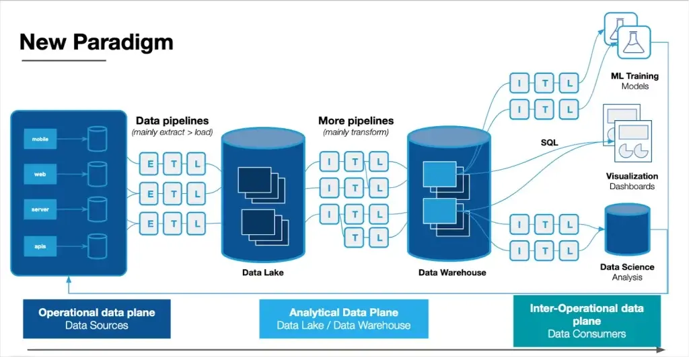

# Overview

## Outline

- Data Pipelines
- Data Roles
- Statistical Learning

## Tidyverse - Data Science Pipeline

[](https://tidyverse.tidyverse.org/articles/paper.html)

## Altexsoft - ETL Pipeline

[](https://www.altexsoft.com/blog/data-pipeline-components-and-types/)

## MonteCarlo.AI - Data Pipeline

[](https://montecarlo.ai/blog-data-pipeline-architecture-explained)

## Geeks for Geeks - Data Science Pipeline

[](https://www.geeksforgeeks.org/data-science/whats-data-science-pipeline/)

## Data Analyst vs Scientist vs Engineer

[{width=80%}](https://techedo.com/blog/data-analyst-vs-data-scientist-vs-data-engineer/)

## BLS - Data Scientist Outlook

[{width=60%}](https://www.bls.gov/ooh/math/data-scientists.htm#tab-6)


## Statistical Learning

|Learning|Response|
|--------|:--------|
|Supervised|Observed|
|Unsupervised|Not observed|
|Semi-supervised|Observed for some data|


## Supervised learning

|            | Regression         | Classification | 
|------------|:-------------------|:-----------------------|
| Response   | Quantitative       | Qualitative            |
| Prediction | Number             | Category               |
| Assessment | Mean squared error | Misclassification rate |


## Bias-variance tradeoff

```{r, echo=FALSE, message=FALSE, warning=FALSE}
#| label: bias-variance-tradeoff
library("tidyverse")

d <- tibble(
  x = seq(0, 1, length.out = 100),
  `Irreducible Error` = 0.3
) |>
  mutate(
    Bias = x^2,
    Variance = rev(Bias),
    `Expected Test Error` = Bias + Variance + `Irreducible Error`
  ) |>
  pivot_longer(
    cols = -x,
    names_to = "Error Type",
    values_to = "Error"
  )

ggplot(
  d,
  aes(x = x, y = Error, color = `Error Type`, linetype = `Error Type`)
) +
  geom_line(linewidth = 2) +
  labs(
    x = "Model Flexibility",
    y = "Error"
  ) +
  scale_linetype_manual(
    values = c(
      "Expected Test Error" = "solid",
      "Bias" = "dotdash",
      "Variance" = "dashed",
      "Irreducible Error" = "dotted"
    )
  ) +
  theme_bw(base_size = 20) +
  theme(
    # Remove tick marks and labels
    axis.ticks.x = element_blank(),
    axis.text.x = element_blank(),
    axis.ticks.y = element_blank(),
    axis.text.y = element_blank()
  )
```

