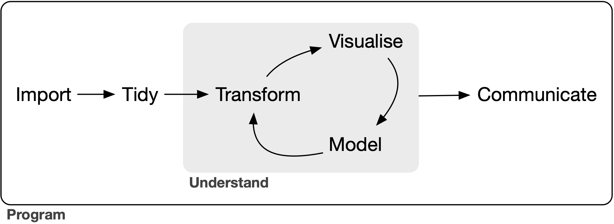
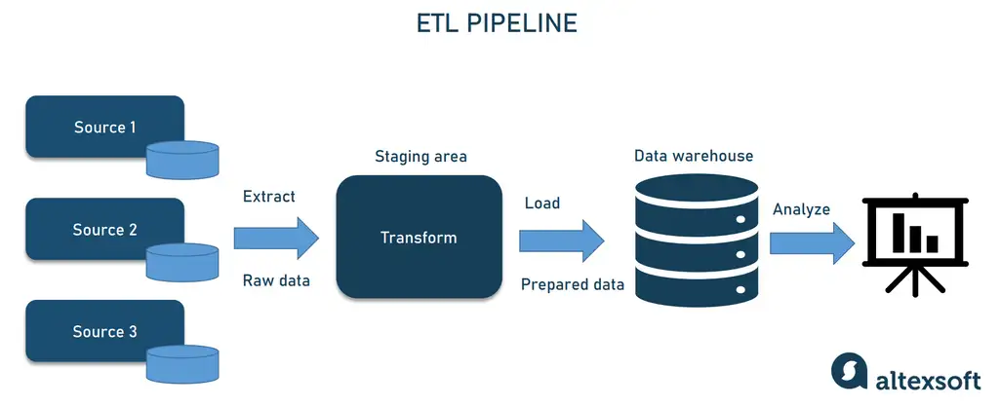
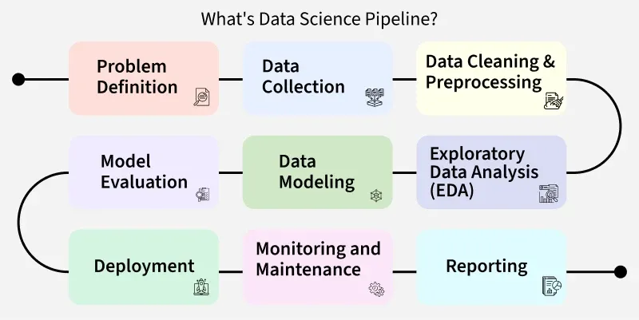
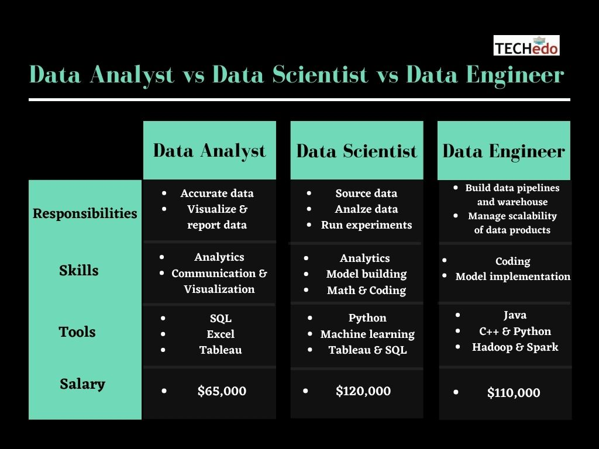

## Outline

- Data Pipelines
- Data Roles
- Statistical Learning

## Tidyverse - Data Science Pipeline

## Altexsoft - ETL Pipeline

## MonteCarlo.AI - Data Pipeline

## Geeks for Geeks - Data Science Pipeline

## Data Analyst vs Scientist vs Engineer

[{width=80%}](https://techedo.com/blog/data-analyst-vs-data-scientist-vs-data-engineer/)

## BLS - Data Scientist Outlook

[{width=60%}](https://www.bls.gov/ooh/math/data-scientists.htm#tab-6)

## Statistical Learning

|Learning|Response|
|--------|:--------|
|Supervised|Observed|
|Unsupervised|Not observed|
|Semi-supervised|Observed for some data|

## Supervised learning

|            | Regression         | Classification | 
|------------|:-------------------|:-----------------------|
| Response   | Quantitative       | Qualitative            |
| Prediction | Number             | Category               |
| Assessment | Mean squared error | Misclassification rate |
