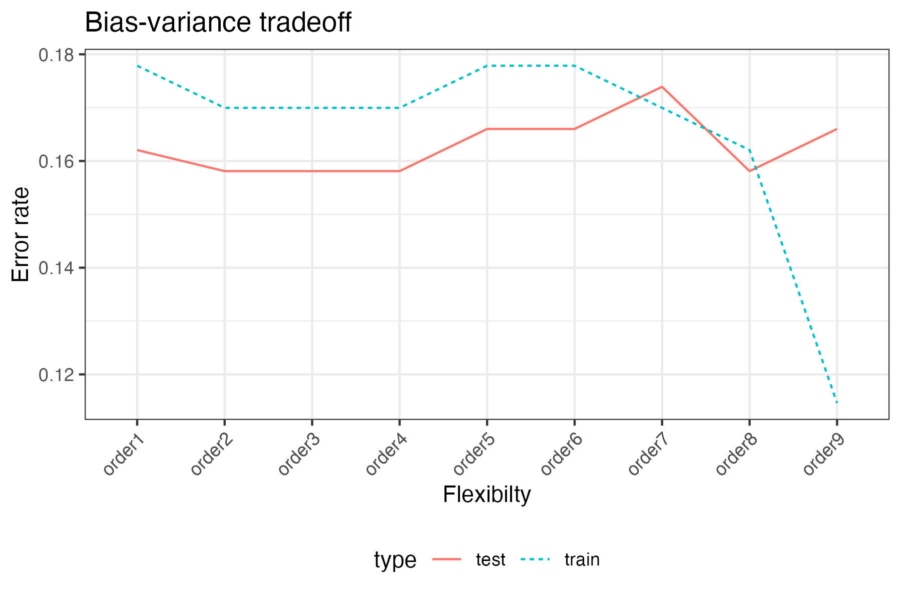

## Response variables

For classification models, our response variable is qualitative, categorical 
value, 

::: {.callout-note collapse="true"}
### for example,
- Yes/No
- Male/Female
- Democrat/Republican/Independent
- Dog Breed
:::

## True Model

For $c = 1, \ldots, C$, let

$$p_{ic} = P(Y_i = c | X_i)$$
 and 
$$p_i = (p_{i1},p_{i2},\ldots,p_{iC}) = f(X_i).$$

where, for observation $i$,

- $Y_i$ is the response variable and
- $X_i = (X_{i1},\ldots,X_{ip})$ is the collection of explanatory variables.

### Goal

Based on data $(x_i, y_i)$ for $i=1,\ldots,n$, 
obtain an estimate of the function, $\hat{f}()$.

## Prediction vs Understanding

Prediction: we don't care about interpretation, we just want the model that fits the best

Understanding: we would like the model to fit well, but are willing to sacrifice
some fit to have a model that is simple to understand

::: {.callout-note collapse="true"}
### Examples 
- The log odds of initial job placement for those with a high school diploma are not statistically significantly different from those with a bachelor's degree.
:::

## Model Evaluation

When prediction is the goal, 
we evaluate the model through its error rate:

$$\text{Training Error Rate}
= \frac{1}{n} \sum_{i=1}^n \mathrm{I}(y_i \ne \hat{y}_i)$$
where $\mathrm{I}(A)$ is an indicator function that is 1 if $A$ is true and 0 otherwise.

As written, this is the *training error rate* since we used the same data to estimate
$\hat{f}$ as we used to compute the error rate.

We are actually more interested in how well our model fits *test* data, 
i.e. data that were not used to estimate $\hat{f}$. 
Thus, we typically estimate the *expected test MSE*:

$$\text{Test Error Rate}
= \frac{1}{m} \sum_{i=1}^m \mathrm{I}(\tilde{y}_i \ne \hat{\tilde{y}}_i)$$
and we refer to this simply as the *test MSE*.

::: {.callout-note collapse="true"}
## Alternative metrics

Here are some alternative metrics for evaluating classification models:

$$\text{Accuracy} = 1 - \text{Error Rate} = \frac{1}{n} \sum_{i=1}^n \mathrm{I}(y_i = \hat{y}_i)$$

We will stick with Error Rate so that all metrics are constructed with larger
values indicating worse performance.

### Log-Loss

So far these metrics do not account for the probabilities assigned to each class.
An alternative metric is the *log loss*: 
$$\text{Log Loss} = -\frac{1}{n} \sum_{i=1}^n \sum_{c=1}^C \mathrm{I}(y_i = c) \log(\hat{p}_{ic})$$
where $\hat{p}_{ic}$ is the predicted probability that observation $i$ belongs to class $c$.

### Confusion Matrix

A table of predicted vs actual values is called a *confusion matrix*.

#### 2 x 2

For two classes, the confusion matrix is a 2x2 table:

|Truth |Predicted Positive|Predicted Negative|
|---|---|---|
|Positive|True Positive (TP)|False Negative (FN)|
|Negative|False Positive (FP)|True Negative (TN)|

$$\text{Specificity}  = \frac{TN}{TN + FP}$$
Specificity is also called *true negative rate*.
$$\text{Sensitivity} = \frac{TP}{TP + FN}.$$
Sensitivity is also called *recall* or the *true positive rate*.

$$\text{Precision} = \frac{TP}{TP + FP}.$$
Precision is also called the *positive predictive value*.

### C x C

For $C$ classes, the confusion matrix is a $C \times C$ table:

|Truth |Predicted Class 1|Predicted Class 2|...|Predicted Class C|
|---|---|---|---|---|
|Class 1|TP_1|FP_2|...|FP_C|
|Class 2|FP_1|TP_2|...|FP_C|
|...|...|...|...|...|
|Class C|FP_1|FP_2|...|TP_C|

:::

## Bias-variance Tradeoff

Using this [classification script](02-3-classification.R),
we create this plot that has the model flexibility on the x-axis and the test 
error rate on the y-axis.

